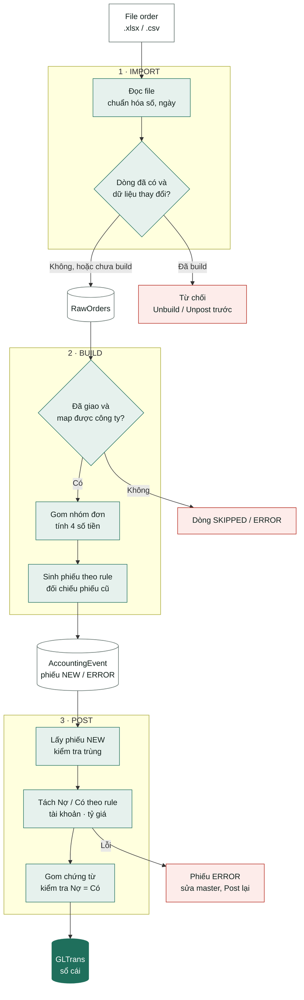

# Đặc tả nghiệp vụ – Từ Order đến GLTrans

> Tài liệu BA ngắn (bản trình chiếu: artifact "Luồng Orders → GLTrans"). Chi tiết kỹ thuật: [`DEVELOPER_GUIDE.md`](DEVELOPER_GUIDE.md) §6.1–6.4 · Ví dụ từng cột: [`MAPPING_ORDERS_TO_GLTRANS.md`](MAPPING_ORDERS_TO_GLTRANS.md) · Yêu cầu gốc: [`tai lieu du an.md`](../tai%20lieu%20du%20an.md) §7–9.

| Phiên bản | Ngày | Trạng thái | Nguồn dữ liệu |
|---|---|---|---|
| 1.1 | 2026-09-17 | Draft | `ORDERS` |

File order đi qua 3 bước **Import → Build → Post** mới vào sổ cái, không bao giờ ghi thẳng từ file. Mỗi bước có nhật ký riêng và làm lại được.

## Sơ đồ luồng

Kế toán thao tác theo thứ tự trên các trang 1. Raw Orders → 2. AccountingEvent → 3. Posting, hoặc bấm "Chạy full cycle" để Build + Post một lần. Mỗi bước ghi nhật ký: `ImportBatch`, `BuildBatch`, `PostingBatch`; lỗi Import nằm trong `ImportBatch`, lỗi Build/Post ghi vào `ExceptionLog`.

## Mỗi bước làm gì

| Bước | Vào → Ra | Quy tắc chính |
|---|---|---|
| **1. Import** | File order → **RawOrders** | Mỗi dòng nhận diện bằng `ItemCode`. Dòng giống hệt → bỏ qua; đổi khi chưa build → thay thế. Dòng đã build (hoặc còn nằm trong phiếu) mà dữ liệu đổi → từ chối, phải Unbuild trước (phiếu đã post thì Unpost + Unbuild). File thiếu cột bắt buộc → cả file không được nhận. |
| **2. Build** | RawOrders → **AccountingEvent** (phiếu) | Chỉ lấy dòng `FULFILLED` có ngày giao; cổng thanh toán quyết định công ty (ComCode). Gom theo công ty + đơn + ngày giao, tính 4 số tiền, mỗi số tiền ≠ 0 thành 1 phiếu. Tài khoản chép từ JournalType. Không tìm được seller → riêng phiếu lợi nhuận chia seller bị ERROR, chưa post được; 3 phiếu doanh thu vẫn NEW. Build lại không nhân đôi; phiếu đã ghi sổ không bị ghi đè. |
| **3. Post** | AccountingEvent → **GLTrans** (sổ cái) | Lấy phiếu NEW; mỗi phiếu tách thành 1 dòng Nợ + 1 dòng Có theo JournalLineRule, kiểm tra tài khoản có trong CoA, quy đổi tỷ giá nếu công ty không dùng USD. Loại **Bulk**: gom phiếu cùng công ty, nghiệp vụ, ngày, tiền tệ, đối tượng thành 1 chứng từ `ASB-yyyyMMdd-…` và cộng dồn; loại Single: 1 phiếu 1 chứng từ. Mỗi chứng từ phải Nợ = Có; ghi tất cả trong 1 transaction, phiếu chuyển POSTED. |

## 4 nghiệp vụ được ghi sổ

| Nghiệp vụ | Số tiền | Nợ | Có | Đối tượng |
|---|---|---|---|---|
| Doanh thu sản phẩm `ORD_REV_PRODUCT_FULFILLED` | Σ SL × Đơn giá | 13122001 Người mua trả tiền trước | 51112001 Doanh thu bán hàng | INDIVIDUALS |
| Doanh thu ship `ORD_REV_SHIPADD_FULFILLED` | Σ ShippingFee + AdditionalCost | 13122001 Người mua trả tiền trước | 51131001 Doanh thu dịch vụ – Shipping | INDIVIDUALS |
| Thuế thu hộ `ORD_REV_TAX_FULFILLED` | Σ TaxFee | 13122001 Người mua trả tiền trước | 33302001 Thuế phải nộp CA | INDIVIDUALS |
| Lợi nhuận chia seller `ORD_SELLER_PROFIT_FULFILLED` | Σ Profit | 63202001 Giá vốn – SellerCost | 33102001 Phải trả Seller | Seller |

## Ví dụ: một đơn đi hết luồng

| 1 · RawOrders | 2 · AccountingEvent | 3 · GLTrans |
|---|---|---|
| Đơn `QVAJV-191125-Q1Z3V`, giao 21/11/2025, cổng ZeniroxPay Inc. → ZENIROXPAY (USD), kỳ 202511 | | |
| SL × Giá: 1 × 34.99 | PRODUCT **34.99** – NEW | Chứng từ `ASB-20251121-106`: Nợ 13122001 / Có 51112001 |
| Ship + AdditionalCost: 4.99 + 3.00 | SHIPADD **7.99** – NEW | Chứng từ `ASB-20251121-107`: Nợ 13122001 / Có 51131001 |
| TaxFee: 0.00 | TAX 0.00 – bỏ qua | — |
| Profit: 19.32 | SELLER_PROFIT **19.32** – NEW (seller FFT-JJC) | Chứng từ `ASB-20251121-144`: Nợ 63202001 / Có 33102001 |

PRODUCT và SHIPADD được cộng dồn với các phiếu cùng ngày (23 phiếu mỗi chứng từ); SELLER_PROFIT tách chứng từ riêng vì mỗi seller là một đối tượng.

Cả file mẫu: **64** dòng → **174** phiếu → **21** chứng từ, **42** dòng GL, tổng Nợ = Có = **6,339.70**.

## Làm lại và chống ghi sổ trùng

- **Unpost:** xóa dòng GL theo cả chứng từ, phiếu quay về NEW. **Unbuild:** xóa phiếu chưa post, dòng raw về chưa build. Cả hai đều cho xem trước số lượng.
- **Phiếu đã ghi sổ không bị ghi đè.** File sửa dòng đã ghi sổ bị Import từ chối (Unpost + Unbuild trước); thêm item hoặc đổi master chỉ tạo cảnh báo, cập nhật bằng Unpost → Build → Post.
- **Chống ghi sổ trùng theo từng item, nhiều lớp:** Import từ chối sửa dòng còn trong phiếu; Build chặn phiếu có item đã ghi sổ ở công ty / ngày giao khác; Post kiểm tra trùng lần cuối trước khi ghi.

## Lỗi thường gặp

| Mã lỗi | Bước | Nghĩa là | Cách xử lý |
|---|---|---|---|
| `MISSING_COMCODE` | Build | Cổng thanh toán chưa map sang công ty | Thêm GatewayCompanyMapping → Build lại |
| `MISSING_PARTNER` | Build | Không tìm được seller; phiếu lợi nhuận chia chưa post được | Bổ sung Partners trên Google Sheet → Sync → Build lại |
| `POSTED_KEY_CHANGED` | Build | Item của phiếu đã ghi sổ ở công ty / ngày giao khác | Unpost công ty + kỳ cũ → Build → Post |
| `MISSING_FX` | Post | Thiếu tỷ giá của kỳ cho công ty không dùng USD | Thêm dòng Exrate → Post lại |
| `ACCOUNT_NOT_IN_COA` | Post | Tài khoản trên phiếu không có trong danh mục CoA | Sửa CoA hoặc JournalType → Build lại → Post |
| `DUPLICATE_ITEM` | Post | Item đã / đang chờ ghi sổ ở phiếu khác ngày giao hoặc khác công ty | Phiếu kia chưa ghi sổ: Build lại (gồm cả phiếu kia) → Post; đã ghi sổ: Unpost phiếu kia → Build → Post |

## Câu hỏi mở

> ⚠️ Cần kế toán chốt.

1. **AdditionalCost** đang cộng vào doanh thu ship, nhưng dữ liệu thật cho thấy khách không trả khoản này (TotalPrice không bao gồm) – nhiều khả năng là chi phí.
2. Partner tên dạng `VICBEA-{Store}` chưa được nhận khi dò store, nên lợi nhuận chia của các seller này chưa lên sổ.
3. Cột **TaxID** trên order là mã của người mua nhưng đang được ưu tiên số 1 khi tìm seller.
4. Một số store có 2 partner `FFT-FFT X` và `FFT-OLD X`, hệ thống không chọn được.
