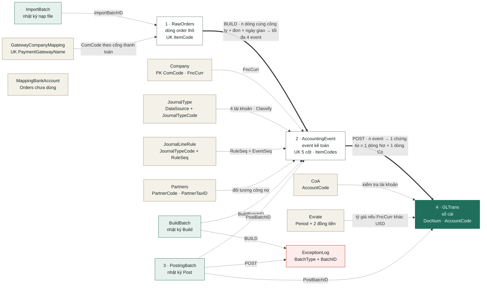
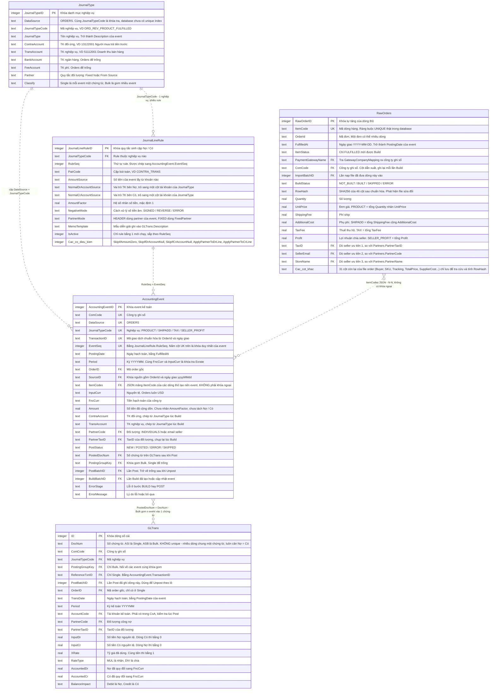

# Đặc tả nghiệp vụ – Từ Order đến GLTrans

> Tài liệu BA ngắn (bản trình chiếu: artifact "Luồng Orders → GLTrans"). Chi tiết kỹ thuật: [`DEVELOPER_GUIDE.md`](DEVELOPER_GUIDE.md) §4.2, §6.1–6.4 · Ví dụ từng cột: [`MAPPING_ORDERS_TO_GLTRANS.md`](MAPPING_ORDERS_TO_GLTRANS.md) · Yêu cầu gốc: [`tai lieu du an.md`](../tai%20lieu%20du%20an.md) §7–9.

| Phiên bản | Ngày | Trạng thái | Nguồn dữ liệu |
|---|---|---|---|
| 1.2 | 2026-09-20 | Draft | `ORDERS` |

## Tổng quan dự án

Công ty bán hàng theo mô hình dropshipping: seller bên ngoài mở store và bán, công ty đứng tên thu tiền của người mua qua các cổng thanh toán, rồi trả lại phần lợi nhuận đã thỏa thuận cho seller.

Một dòng order vì thế mang bốn khoản khác hẳn nhau về bản chất kế toán: tiền hàng, phí ship, thuế thu hộ và lợi nhuận phải trả seller. Việc ghi sổ vướng ba chỗ:

- **Khối lượng.** Đo trên file order thật: 55.111 dòng → 156.233 event → 3.350 chứng từ.
- **Pháp nhân ghi sổ không có sẵn trên file**, phải suy ra từ cổng thanh toán của từng dòng.
- **Đối tượng công nợ phải chính xác.** Mỗi đồng lợi nhuận phải về đúng seller thì số dư `33102001 Phải trả Seller` mới phản ánh đúng — danh mục hiện có 1.879 seller.

Hệ thống nhận file order, gom nhóm, sinh bút toán theo quy tắc kế toán đã khai báo, ghi vào sổ cái và lưu nhật ký từng lần chạy để truy ngược mọi dòng sổ về dòng order gốc. Sai thì làm lại bằng Unpost / Unbuild, không sửa tay vào sổ cái.

**Phạm vi hiện tại**

| Hạng mục | Trạng thái |
|---|---|
| Nguồn `ORDERS` | Đã làm trọn luồng, gồm tra cứu sổ cái và xuất Excel |
| Nguồn PayPal, Stripe, AccountingSource | Chưa làm. Danh mục đã có sẵn 53 `JournalType` (PayPal 32, AccountingSource 16, Stripe 5) |
| Nguồn PIPO, nhập liệu thủ công | Chưa làm, và chưa có `JournalType` nào |
| Đăng nhập, phân quyền | Chưa có. Ai mở được web thì chạy được mọi thao tác |
| Khóa kỳ kế toán OPEN / LOCKED | Chưa có. Kỳ đã ghi sổ vẫn Unpost và ghi lại được |
| Công ty cha – con, nhật ký thao tác người dùng | Chưa có |

Nguyên tắc thiết kế cốt lõi, theo đúng yêu cầu gốc §2.3 *"rule-driven engine"*: **quy tắc ghi sổ nằm ở danh mục do kế toán khai báo, không viết cứng trong mã nguồn.** Sáu bảng danh mục đồng bộ từ Google Sheet — 222 tài khoản `CoA`, 57 `JournalType`, 137 `JournalLineRule`, 1.939 dòng `Partners`, 63 dòng `Exrate`, 10 dòng `MappingBankAccount`. Đổi tài khoản hạch toán, thêm seller, bổ sung tỷ giá: sửa trên sheet rồi Build lại, không cần sửa mã nguồn.

> ⚠️ **Trước khi bấm Sync.** 45 dòng `Exrate` và 12 dòng `Partners` đang dùng hiện chỉ có trong hệ thống, **chưa có trên Google Sheet**. Sync ghi đè toàn bộ danh mục nên phải đưa các dòng này lên sheet trước, nếu không sẽ mất.

## Sơ đồ luồng

File order đi qua 3 bước **Import → Build → Post** mới vào sổ cái, không bao giờ ghi thẳng từ file. Mỗi bước có nhật ký riêng và làm lại được.

Kế toán thao tác theo thứ tự trên các trang 1. Raw Orders → 2. AccountingEvent → 3. Posting, hoặc bấm "Chạy full cycle" để Build + Post một lần. Mỗi bước ghi nhật ký: `ImportBatch`, `BuildBatch`, `PostingBatch`; lỗi Import nằm trong `ImportBatch`, lỗi Build/Post ghi vào `ExceptionLog`.

## Mỗi bước làm gì

| Bước | Vào → Ra | Quy tắc chính |
|---|---|---|
| **1. Import** | File order → **RawOrders** | Mỗi dòng nhận diện bằng `ItemCode`. Dòng giống hệt → bỏ qua; đổi khi chưa build → thay thế. Dòng đã build (hoặc còn nằm trong event) mà dữ liệu đổi → từ chối, phải Unbuild trước (event đã post thì Unpost + Unbuild). File thiếu cột bắt buộc → cả file không được nhận. |
| **2. Build** | RawOrders → **AccountingEvent** (event) | Chỉ lấy dòng `FULFILLED` có ngày giao; cổng thanh toán quyết định công ty (ComCode). Gom theo công ty + đơn + ngày giao, tính 4 số tiền, mỗi số tiền ≠ 0 thành 1 event. Tài khoản chép từ JournalType. Không tìm được seller → riêng event lợi nhuận chia seller bị ERROR, chưa post được; các event doanh thu vẫn NEW. Build lại không nhân đôi; event đã ghi sổ không bị ghi đè. |
| **3. Post** | AccountingEvent → **GLTrans** (sổ cái) | Lấy event NEW; mỗi event tách thành 1 dòng Nợ + 1 dòng Có theo JournalLineRule, kiểm tra tài khoản có trong CoA, quy đổi tỷ giá nếu công ty không dùng USD. Loại **Bulk**: gom event cùng công ty, nghiệp vụ, ngày, tiền tệ, đối tượng thành 1 chứng từ `ASB-yyyyMMdd-…` và cộng dồn; loại Single: 1 event 1 chứng từ. Mỗi chứng từ phải Nợ = Có; ghi tất cả trong 1 transaction, event chuyển POSTED. |

## Vì sao cần tầng AccountingEvent

Câu hỏi hợp lý: đọc file order rồi ghi thẳng vào sổ cái cho nhanh, đẻ thêm một bảng ở giữa làm gì. Yêu cầu gốc §2.1 chốt nguyên tắc **"không ghi thẳng từ raw source vào GLTrans"**, và §8 gọi tầng này là **lớp kiểm soát trung gian**. Một event trả lời đúng một câu: *"từ dữ liệu gốc này, cần ghi nhận khoản gì, bao nhiêu tiền, cho ai"* — đã có đủ ngày, kỳ, số tiền, tài khoản và đối tượng, nhưng **chưa tách vế Nợ / vế Có và chưa gom chứng từ**.

Ba lý do giữ tầng này:

**1. Kiểm soát trước khi ghi sổ.** Event hỏng dừng lại ở `ERROR`, sổ cái không bị bẩn. Giả sử một đơn có seller chưa khai trong `Partners`: event lợi nhuận chia seller dừng ở `ERROR` ngay bước Build và không được ghi sổ, nhưng các event doanh thu của chính đơn đó vẫn `NEW` và lên sổ bình thường. Dòng raw vẫn `BUILT`. Bổ sung seller rồi Build lại là xong — không phải đụng vào sổ cái.

**2. Giữ chi tiết từng đơn.** Sổ cái gom Bulk chỉ còn số tổng, và dòng GL Bulk **không mang mã đơn** (`OrderID` để trống). Muốn biết đơn nào đóng góp bao nhiêu trong một dòng sổ thì bắt buộc phải đi qua event — mỗi event giữ `OrderID` và danh sách `ItemCode` của các dòng thô tạo nên nó. Xem mục *Ví dụ* ngay dưới.

**3. Build lại an toàn.** Build lại đối chiếu với event cũ theo khóa 5 cột: event chưa ghi sổ bị thay thế, event đã ghi sổ giữ nguyên. Số thật trên file mẫu: Build lần 2 khi chưa post cho `EventsCreated 0 · EventsReplaced 174`; Build lại sau khi **đã** post cho `EventsUnchangedPosted 174` — không dòng sổ cái nào bị đụng tới.

| `PostStatus` | Nghĩa là | Post có lấy? |
|---|---|---|
| `NEW` | Build xong, chờ ghi sổ | Có |
| `POSTED` | Đã vào sổ cái, số chứng từ ở `PostedDocNum` | Không — sai thì Unpost, event quay về `NEW` |
| `ERROR` (bước Build) | Không tìm được seller, hoặc item đã ghi sổ dưới khóa khác | Không |
| `ERROR` (bước Post) | Thiếu tỷ giá, tài khoản không có trong `CoA`, item trùng | Có — tự thử lại mỗi lần Post |
| `SKIPPED` | Bị bỏ qua lúc Post: số tiền × hệ số = 0, hoặc tài khoản trống có cờ Skip | Không. **Unpost không đưa `SKIPPED` về `NEW`** — muốn ghi sổ lại phải Unbuild rồi Build lại |

Cách xử lý từng mã lỗi xem mục [Lỗi thường gặp](#lỗi-thường-gặp). Với file mẫu, cả 174 event đều `POSTED`, không có `ERROR` hay `SKIPPED`.

## 4 nghiệp vụ được ghi sổ

| Nghiệp vụ | Số tiền | Nợ | Có | Đối tượng |
|---|---|---|---|---|
| Doanh thu sản phẩm `ORD_REV_PRODUCT_FULFILLED` | Σ SL × Đơn giá | 13122001 Người mua trả tiền trước | 51112001 Doanh thu bán hàng | INDIVIDUALS |
| Doanh thu ship `ORD_REV_SHIPADD_FULFILLED` | Σ ShippingFee + AdditionalCost | 13122001 Người mua trả tiền trước | 51131001 Doanh thu dịch vụ – Shipping | INDIVIDUALS |
| Thuế thu hộ `ORD_REV_TAX_FULFILLED` | Σ TaxFee | 13122001 Người mua trả tiền trước | 33302001 Thuế phải nộp CA | INDIVIDUALS |
| Lợi nhuận chia seller `ORD_SELLER_PROFIT_FULFILLED` | Σ Profit | 63202001 Giá vốn – SellerCost | 33102001 Phải trả Seller | Seller |

## Ví dụ: một đơn đi hết luồng

| 1 · RawOrders | 2 · AccountingEvent | 3 · GLTrans |
|---|---|---|
| Đơn `QVAJV-191125-Q1Z3V`, giao 21/11/2025, cổng ZeniroxPay Inc. → ZENIROXPAY (USD), kỳ 202511 | | |
| SL × Giá: 1 × 34.99 | PRODUCT **34.99** – NEW | Chứng từ `ASB-20251121-106`: Nợ 13122001 / Có 51112001 |
| Ship + AdditionalCost: 4.99 + 3.00 | SHIPADD **7.99** – NEW | Chứng từ `ASB-20251121-107`: Nợ 13122001 / Có 51131001 |
| TaxFee: 0.00 | TAX 0.00 – bỏ qua | — |
| Profit: 19.32 | SELLER_PROFIT **19.32** – NEW (seller FFT-JJC) | Chứng từ `ASB-20251121-144`: Nợ 63202001 / Có 33102001 |

PRODUCT và SHIPADD được cộng dồn với các event cùng ngày (23 event mỗi chứng từ); SELLER_PROFIT tách chứng từ riêng vì mỗi seller là một đối tượng.

Cả file mẫu: **64** dòng → **174** event → **21** chứng từ, **42** dòng GL, tổng Nợ = Có = **6,339.70**.

## Sơ đồ quan hệ dữ liệu

Toàn bộ hệ thống nằm trong **15 bảng**, chia 3 nhóm: **Danh mục** – kế toán khai báo, quyết định ghi sổ thế nào; **Nguồn** – dữ liệu thô đọc từ file; **Kết quả & nhật ký** – event, sổ cái và lịch sử mỗi lần chạy. Ba bảng `RawOrders` → `AccountingEvent` → `GLTrans` chính là 3 bước Import → Build → Post ở trên; các bảng còn lại hoặc nuôi dữ liệu cho 3 bảng đó, hoặc ghi lại ai chạy gì lúc nào.

**Nét liền đậm** = dữ liệu được tạo ra theo thứ tự Import → Build → Post. **Nét chấm** = bảng bên trái cấp giá trị hoặc kiểm tra cho bảng bên phải. **Màu:** be = danh mục kế toán khai báo · xanh nhạt = nhật ký các lần chạy · trắng = dữ liệu đang xử lý · xanh đậm = sổ cái, kết quả cuối · đỏ nhạt = nhật ký lỗi. `MappingBankAccount` không có đường nối nào vì luồng Orders chưa dùng tới nó.

| Bảng | Nhóm | Vai trò | Ai tạo / sửa |
|---|---|---|---|
| `Partners` | Danh mục | Danh mục seller và đối tượng công nợ; dò ra `FFT-{Store}` để ghi event lợi nhuận chia | Kế toán nhập Google Sheet → Sync |
| `JournalType` | Danh mục | Mỗi nghiệp vụ dùng tài khoản nào, gom Bulk hay Single | Kế toán nhập Google Sheet → Sync |
| `JournalLineRule` | Danh mục | Tách một event thành vế Nợ và vế Có | Kế toán nhập Google Sheet → Sync |
| `CoA` | Danh mục | Hệ thống tài khoản; Post chỉ ghi khi tài khoản có trong đây | Kế toán nhập Google Sheet → Sync |
| `Exrate` | Danh mục | Tỷ giá theo kỳ. Chỉ dùng khi công ty hạch toán bằng đồng tiền khác USD (hiện có CAD, VND) | Kế toán nhập Google Sheet → Sync |
| `MappingBankAccount` | Danh mục | Số tài khoản ngân hàng → tài khoản sổ cái. **Luồng Orders chưa dùng**, để dành cho nguồn PayPal / Stripe | Kế toán nhập Google Sheet → Sync |
| `Company` | Danh mục | Công ty ghi sổ và đồng tiền hạch toán (`FncCurr`) | Nhập trên trang Master của web |
| `GatewayCompanyMapping` | Danh mục | Cổng thanh toán trên file order → công ty nào | Nhập trên trang Master của web |
| `ImportBatch` | Nguồn | Nhật ký mỗi lần nạp file: tên file, số dòng nhận / lỗi / bỏ qua | Hệ thống ghi khi Import |
| `RawOrders` | Nguồn | Dữ liệu thô: 1 dòng file = 1 dòng, khóa `ItemCode` | Hệ thống ghi khi Import |
| `BuildBatch` | Kết quả | Nhật ký mỗi lần Build | Hệ thống ghi khi Build |
| `AccountingEvent` | Kết quả | Event kế toán: đã có số tiền, tài khoản, đối tượng — chưa vào sổ | Hệ thống ghi khi Build |
| `PostingBatch` | Kết quả | Nhật ký mỗi lần Post; Unpost làm batch chuyển `UNPOSTED` | Hệ thống ghi khi Post |
| `GLTrans` | Kết quả | Sổ cái: mỗi dòng là một vế Nợ hoặc một vế Có | Hệ thống ghi khi Post |
| `ExceptionLog` | Kết quả | Mọi cảnh báo và lỗi của Build / Post, tra ngược được về từng batch | Hệ thống ghi khi Build, Post |

### Năm bảng lõi và các cột dùng để nối

Sơ đồ dưới dành cho người cần tra từng cột. `RawOrders` thực tế có 46 cột file order cộng 6 cột hệ thống; ở đây chỉ hiện các cột mà Build thực sự đọc.

Cách đọc các mối nối chính:

| Từ | Sang | Nối bằng | Quan hệ |
|---|---|---|---|
| `ImportBatch` | `RawOrders` | `ImportBatchID` | 1 lần nạp → n dòng |
| `RawOrders` | `AccountingEvent` | `ComCode` + `OrderId` + `FulfilledAt` (lưu thành `SourceID`); danh sách `ItemCode` gốc nằm ở `AccountingEvent.ItemCodes` | n dòng → tối đa 4 event |
| `BuildBatch` | `AccountingEvent` | `BuildBatchID` | 1 lần Build → n event |
| `AccountingEvent` | `GLTrans` | `PostedDocNum` = `DocNum` | Bulk: n event → 1 chứng từ · Single: 1 → 1 |
| `PostingBatch` | `GLTrans` | `PostBatchID` | 1 lần Post → n dòng sổ |
| `GLTrans` | `GLTrans` | cùng `DocNum` | 1 chứng từ = 1 dòng Nợ + 1 dòng Có, luôn cân |

**Database không có một khóa ngoại nào — mọi đường nối ở trên là liên kết theo giá trị do phần mềm tự đối chiếu.** Vì thế cả sơ đồ chi tiết toàn nét đứt, và `UK` chỉ được đánh ở ba chỗ có ràng buộc duy nhất thật: `RawOrders.ItemCode`, `GatewayCompanyMapping.PaymentGatewayName`, và khóa 5 cột của event. Hệ quả: xóa hay sửa một dòng danh mục **không bị database chặn**, sai sót chỉ lộ ra khi Build/Post báo `MISSING_COMCODE`, `MISSING_PARTNER`, `ACCOUNT_NOT_IN_COA`, `MISSING_FX`. Việc giữ cho ba tầng khớp nhau là do **Unpost** và **Unbuild** đảm nhiệm — đó là lý do phải đi đúng thứ tự thay vì sửa thẳng dữ liệu (mục ngay sau).

Riêng `RawOrders` ↔ `AccountingEvent` là quan hệ **n-n qua một ô text JSON**, không có bảng trung gian: muốn tìm dòng order gốc của một event phải đọc mảng `ItemCodes` rồi tra ngược. Chính mảng này là cơ sở để hệ thống chặn ghi sổ trùng theo từng item.

> Danh sách cột đầy đủ của cả 15 bảng: [`DEVELOPER_GUIDE.md` §4.2](DEVELOPER_GUIDE.md) · Quan hệ số lượng giữa các tầng: [`MAPPING_ORDERS_TO_GLTRANS.md` §2.2](MAPPING_ORDERS_TO_GLTRANS.md).

## Làm lại và chống ghi sổ trùng

- **Unpost:** xóa dòng GL theo cả chứng từ, event quay về NEW. **Unbuild:** xóa event chưa post, dòng raw về chưa build. Cả hai đều cho xem trước số lượng.
- **Event đã ghi sổ không bị ghi đè.** File sửa dòng đã ghi sổ bị Import từ chối (Unpost + Unbuild trước); thêm item hoặc đổi master chỉ tạo cảnh báo, cập nhật bằng Unpost → Build → Post.
- **Chống ghi sổ trùng theo từng item, nhiều lớp:** Import từ chối sửa dòng còn trong event; Build chặn event có item đã ghi sổ ở công ty / ngày giao khác; Post kiểm tra trùng lần cuối trước khi ghi.

## Lỗi thường gặp

| Mã lỗi | Bước | Nghĩa là | Cách xử lý |
|---|---|---|---|
| `MISSING_COMCODE` | Build | Cổng thanh toán chưa map sang công ty | Thêm GatewayCompanyMapping → Build lại |
| `MISSING_PARTNER` | Build | Không tìm được seller; event lợi nhuận chia chưa post được | Bổ sung Partners trên Google Sheet → Sync → Build lại |
| `POSTED_KEY_CHANGED` | Build | Item của event đã ghi sổ ở công ty / ngày giao khác | Unpost công ty + kỳ cũ → Build → Post |
| `MISSING_FX` | Post | Thiếu tỷ giá của kỳ cho công ty không dùng USD | Thêm dòng Exrate → Post lại |
| `ACCOUNT_NOT_IN_COA` | Post | Tài khoản trên event không có trong danh mục CoA | Sửa CoA hoặc JournalType → Build lại → Post |
| `DUPLICATE_ITEM` | Post | Item đã / đang chờ ghi sổ ở event khác ngày giao hoặc khác công ty | Event kia chưa ghi sổ: Build lại (gồm cả event kia) → Post; đã ghi sổ: Unpost event kia → Build → Post |

## Câu hỏi mở

> ⚠️ Cần kế toán chốt.

1. **AdditionalCost** đang cộng vào doanh thu ship, nhưng dữ liệu thật cho thấy khách không trả khoản này (TotalPrice không bao gồm) – nhiều khả năng là chi phí.
2. Partner tên dạng `VICBEA-{Store}` chưa được nhận khi dò store, nên lợi nhuận chia của các seller này chưa lên sổ.
3. Cột **TaxID** trên order là mã của người mua nhưng đang được ưu tiên số 1 khi tìm seller.
4. Một số store có 2 partner `FFT-FFT X` và `FFT-OLD X`, hệ thống không chọn được.
