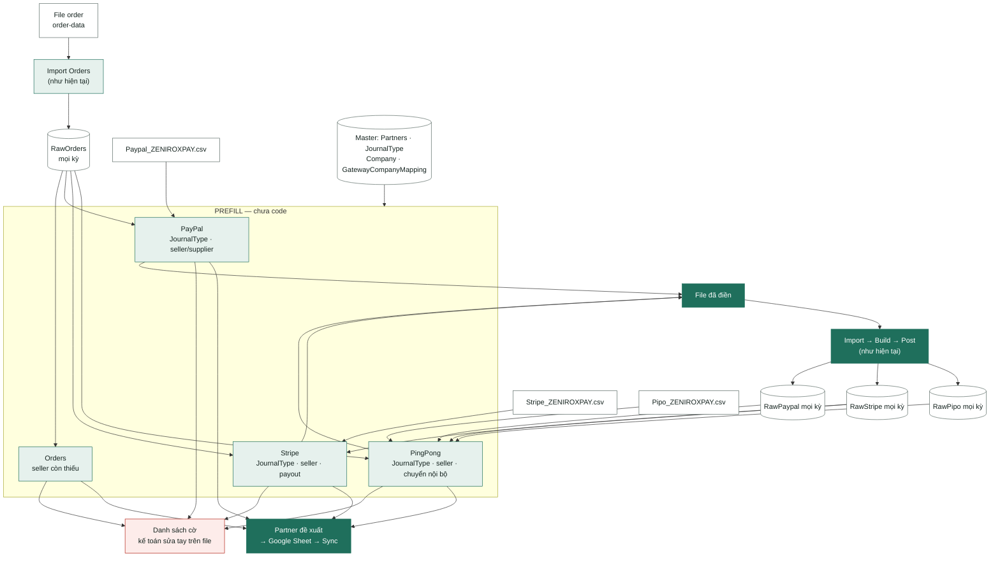

# Đặc tả nghiệp vụ – Điền trước JournalType, Partner, ComCode cho file thô (PayPal · Stripe · PingPong · Orders)

> Tài liệu này vừa là **đặc tả BA** vừa là **đặc tả để AI/dev viết code** cho bước **PREFILL**. Bước này **chưa có trong code**: nó tự điền các cột phân loại vào file sao kê thô trước khi Import, và đề xuất partner còn thiếu cho master.
>
> - Bản đặc tả nghiệp vụ để mọi người đọc và duyệt (không có phần kỹ thuật, không có số liệu đo): [`BRD_PREFILL.md`](Docs-BA/BRD_PREFILL.md).
> - Sau khi Import, dữ liệu đi tiếp theo luồng mô tả ở: [`BA_ACCOUNTING_ENGINE.md`](Docs-BA/BA_ACCOUNTING_ENGINE.md) · [`MAPPING_PAYPAL_TO_GLTRANS.md`](Mapping/MAPPING_PAYPAL_TO_GLTRANS.md) · [`MAPPING_STRIPE_TO_GLTRANS.md`](Mapping/MAPPING_STRIPE_TO_GLTRANS.md) · [`MAPPING_PIPO_TO_GLTRANS.md`](Mapping/MAPPING_PIPO_TO_GLTRANS.md).
> - Bản kỹ thuật của engine: [`DEVELOPER_GUIDE.md`](DEVELOPER_GUIDE.md) §6.2.1 (resolve seller), §6.11 (3 nguồn ngân hàng).
> - Nguồn yêu cầu: quy tắc điền cột, tra store qua Bettamax, `idStore`, payout Stripe → `Pingpong ZeniroxPay` là **yêu cầu của kế toán ngày 2026-09-24**. Tài liệu gốc `tai lieu du an.md` §7.3–7.6 chỉ mô tả engine sau Import, không có phần điền cột.

| Phiên bản | Ngày | Trạng thái | Nguồn dữ liệu |
|---|---|---|---|
| 1.0 | 2026-09-24 | Draft, chờ kế toán chốt [§9](#9-câu-hỏi-mở) | `PAYPAL`, `STRIPE`, `PIPO`, `ORDERS` |

## Mục lục

- [0. Tổng quan](#0-tổng-quan)
- [1. Sơ đồ luồng](#1-sơ-đồ-luồng)
- [2. Quy tắc chung cho cả 4 nguồn](#2-quy-tắc-chung-cho-cả-4-nguồn)
- [3. PayPal](#3-paypal)
- [4. Stripe](#4-stripe)
- [5. PingPong (PIPO)](#5-pingpong-pipo)
- [6. Orders](#6-orders)
- [7. Yêu cầu cho người viết code](#7-yêu-cầu-cho-người-viết-code)
- [8. Danh sách cờ](#8-danh-sách-cờ)
- [9. Câu hỏi mở](#9-câu-hỏi-mở)
- [Phụ lục A. Pseudo-code tổng](#phụ-lục-a-pseudo-code-tổng)
- [Phụ lục B. Thuật ngữ](#phụ-lục-b-thuật-ngữ)

---

## 0. Tổng quan

### 0.1 Bài toán

File sao kê tải về từ PayPal, Stripe, PingPong chỉ có các cột gốc của nhà cung cấp. Để engine ghi sổ được, kế toán đang phải **tự thêm và điền tay** các cột sau vào cuối file rồi mới Import:

`JournalType` · `StoreName` · `PartnerCode` · `ComCode` · `BankAccoutNumber`

Ba file `data/samples/Bank_Paypal.csv`, `Bank_Stripe.csv`, `Bank_Pipo.csv` chính là file thô **sau khi đã điền tay**. Tài liệu này:

1. Suy ngược từ 3 file mẫu ra **công thức tất định** cho từng cột, kèm độ phủ đo trên toàn bộ file.
2. Áp các quyết định nghiệp vụ đã chốt với kế toán (2026-09-24). Chỗ nào quyết định khác với cách điền tay trong mẫu thì ghi rõ số dòng lệch và lý do.
3. Thêm cột mới **`PartnerTaxID`** (mã store / mã đối tượng), và quy tắc **đề xuất partner mới** khi master chưa có.

Riêng **Orders** không cần điền cột: JournalType cố định 4 mã, ComCode suy từ cổng thanh toán, đúng như code hiện tại. Phần Orders chỉ đặc tả việc bổ sung partner (seller) còn thiếu.

### 0.2 Các cột được điền và engine dùng chúng thế nào

Hành vi dưới đây là của **code hiện tại** (`src/lib/engine/build-bank.ts`, `resolve-partner.ts`, `masters.ts`). PREFILL không đổi hành vi này; nó chỉ cung cấp giá trị cho cột.

| Cột | Engine dùng thế nào | Hệ quả cho PREFILL |
|---|---|---|
| `JournalType` | Ghi **mã** (`JournalTypeCode`). Có giá trị thì dùng, trống thì engine thử suy theo tên gốc (`JournalType.JournalType` trong master): PayPal theo `Description`, Stripe và PIPO theo `Type`. Không ra thì dòng lỗi `MISSING_JOURNAL_TYPE`, không ghi sổ. | Fallback của engine chỉ đủ cho PayPal (142.658/142.659 dòng). Stripe chỉ ra `charge` và `reserved_funds` (1.296/1.413). PIPO ra **0/952** vì tên gốc trong master chính là mã `BANK_*`. Nên **Stripe và PIPO bắt buộc phải điền**. |
| `PartnerCode` | Chỉ được đọc khi `JournalType.Partner = From Source`. Loại `Fixed = X` luôn ghi partner cố định X và bỏ qua cột. | PayPal: 4/32 mã là From Source (`PP_GENERAL_PAYMENT`, `PP_MASS_PAY_PAYMENT`, `PP_MOBILE_PAYMENT`, `PP_PAYMENT_REVERSAL`). Stripe: 0/7. PIPO: 10/10. Với loại Fixed, PREFILL **vẫn điền** để truy vết seller, nhưng giá trị không lên GL. |
| `StoreName` | Chỉ dùng để chọn đúng store khi một `PartnerCode` có nhiều partner. | Ghi **tên store đầy đủ** (§2.5). |
| `PartnerTaxID` | **Chưa có cột này** trong file, trong bảng `RawPaypal/RawStripe/RawPipo` và trong code. Header lạ khi import bị bỏ im lặng. Engine lấy `PartnerTaxID` từ master Partners. | Cột mới. Cần sửa code (§7) mới có tác dụng khi ghi sổ; trước đó dùng để kế toán đối chiếu và để tạo partner mới. |
| `ComCode` | Header **bắt buộc** ở cả 3 nguồn; giá trị phải có trong `Company`. | Lấy từ tên file (§2.2). |
| `BankAccoutNumber` | Trống thì dùng mặc định `PAYPAL1` / `Stripe1` / `PINGPONG1` (tra `MappingBankAccount`). | Để trống (§2.3). Tên cột giữ đúng typo của sheet. |

### 0.3 Kết quả trên file mẫu

| Nguồn | Dòng | `JournalType` | Partner | Dòng cần kế toán xử lý | Partner mới đề xuất |
|---|---:|---|---|---|---|
| PayPal | 142.659 | 142.658 tự điền, cả 142.658 đều khớp mẫu | 142.564 dòng có `PartnerCode`; 141.511 dòng có `PartnerTaxID` | 1 dòng không có mã JournalType · 7 dòng không tìm thấy đơn | `VICBEA-Nattozyme` (seller), `TREASURY@FRESHWORKS.COM` (supplier) |
| Stripe | 1.413 | 1.413 tự điền (mẫu để trống 70 dòng `reserved_funds`) | 1.325 dòng có partner; 88 dòng không cần partner | 0 | 0 |
| PingPong | 952 | 926 tự điền, cả 926 đều khớp mẫu | 926 dòng có `PartnerCode`; 812 dòng có `PartnerTaxID` | 26 dòng chuyển tiền không có mã store | 0 |
| Orders | 52.437 dòng được Build | 4 mã cố định (như hiện tại) | 52.434 dòng tìm ra seller | 0 | `VICBEA-Nattozyme` (trùng với PayPal) |

**Tổng cộng chỉ 2 partner mới.** Phần lệch lớn giữa quy tắc và mẫu **không phải lỗi quy tắc** mà do quyết định nghiệp vụ khác với cách điền tay. Cụ thể:

- Mẫu ghi email nhận payout, quy tắc ghi email store trong master.
- Mẫu ghi tên store rút gọn, quy tắc ghi tên đầy đủ.
- Mẫu để trống partner ở dòng giữ tiền (Reserve Hold/Release, giữ tiền tranh chấp) và ghi `PAYPAL` ở dòng tranh chấp/phí (Chargeback, Dispute Fee…); quy tắc điền seller của đơn cho cả hai loại.

Chi tiết từng nguồn ở §3–§6.

**Ảnh hưởng tới sổ cái** (với master hiện tại):

- **3 nguồn ngân hàng:** số event, số chứng từ, Σ Nợ = Σ Có **không đổi** so với baseline, với điều kiện 26 dòng PingPong bị cờ được kế toán điền tay như mẫu. Nếu Import nguyên thì 26 dòng đó lỗi `MISSING_JOURNAL_TYPE` và không lên sổ.
- Chỉ đổi đối tượng (partner) trên các dòng mà JournalType là `From Source`:
  - PayPal: 81 dòng (65 Mass Pay, 16 Payment Reversal).
  - PingPong: 408 dòng trả seller.
- **Orders:** 2.385/2.388 event lợi nhuận đang lỗi `MISSING_PARTNER` sẽ tìm ra seller và post được, **nhưng chỉ sau khi sửa hàm so tên store** (§6.3, §7). Khi đó baseline Orders tăng và phải đo lại (quy tắc 9).

### 0.4 Số liệu lấy từ đâu

- Dữ liệu: `data/samples/{order-data,Bank_Paypal,Bank_Stripe,Bank_Pipo}.csv` và master `data/seed/*.csv` tại commit `3cf05d9` (nhánh `feat/dif-order`).
- Cách đo: script Node (papaparse) chỉ đọc, cài đúng quy tắc trong tài liệu này và so với giá trị điền tay trong mẫu. **Mỗi con số được hai lần cài đặt độc lập tính lại và khớp nhau.**
- **Cách dựng lại số liệu (dùng cho test):**
  - Xóa trắng 5 cột `JournalType`, `StoreName`, `PartnerCode`, `ComCode`, `BankAccoutNumber` của file mẫu. Nếu không xóa, quy tắc "ô đã có giá trị thì giữ" (§2.1) sẽ giữ nguyên giá trị tay.
  - Chạy PREFILL với tên file `Paypal_ZENIROXPAY.csv` / `Stripe_ZENIROXPAY.csv` / `Pipo_ZENIROXPAY.csv`.
  - So kết quả với giá trị gốc của mẫu.
- So sánh dùng `trim + uppercase` (quy tắc 2 của `CLAUDE.md`). Các nhóm so sánh:

| Nhóm | Nghĩa |
|---|---|
| `SAME` | Quy tắc cho cùng giá trị với mẫu |
| `SAME_EXCEPT_FFT` | Chỉ khác chữ `FFT ` đứng đầu tên store (quy tắc ghi tên đầy đủ, mẫu ghi tên rút gọn) |
| `FILL` | Mẫu để trống, quy tắc điền được |
| `MISS` | Mẫu có giá trị, quy tắc để trống (dòng bị gắn cờ) |
| `DIFF` | Hai bên đều có giá trị nhưng khác nhau |

---

## 1. Sơ đồ luồng

PREFILL đứng **trước** Import. Nó **không ghi** vào sổ cái hay bảng raw; nó đọc file thô cùng dữ liệu đã Import trước đó, và trả ra 3 thứ. Bảng raw chỉ có dữ liệu sau khi kế toán Import file đã điền.



**Thứ tự bắt buộc trong một kỳ:**

1. Import Orders, rồi chạy PREFILL Orders (`proposeOrderSellers` trên RawOrders, §6.2). Bước này chỉ ra cờ và đề xuất seller.
2. PREFILL PayPal và Stripe → kế toán sửa cờ → **Import** PayPal và Stripe.
3. PREFILL PingPong → sửa cờ → Import PingPong.

Lý do:

- PayPal và Stripe tra seller qua đơn hàng (`Invoice ID` → `OrderId`). PingPong cũng dùng đơn hàng khi một mã store có nhiều seller (§5.3).
- Stripe tra charge gốc của refund trong RawStripe (§4.2).
- PingPong cần payout của Stripe và lệnh rút của PayPal **đã Import** để biết khoản nhận về đến từ đâu, và cần RawPipo các kỳ trước để không ghép lại một payout đã dùng (§5.3).

**Mọi phép tra cứu phải đọc dữ liệu lịch sử trong DB** (các bảng raw của mọi kỳ), không chỉ file đang xử lý. Đo trên mẫu, tách mỗi file theo tháng (PayPal theo ngày thật, tức cột `Date` đã sửa đảo ngày/tháng §3.5; Stripe theo `Created (UTC)`; PingPong theo `Time`; Orders theo `PaidDateAt`), 7 tháng 10/2025–04/2026:

| Cách chạy | Ô lệch so với chạy cả file |
|---|---|
| Mỗi tháng thấy dữ liệu tháng đó + các tháng trước | **0** |
| Mỗi tháng chỉ thấy dữ liệu tháng đó | **100.403 ô trên 33.470 dòng**: PayPal 100.299 ô / 33.434 dòng, Stripe 102 / 34, PingPong 2 / 2, Orders 0. Cột `JournalType` và `ComCode` không bao giờ lệch |

Nguyên nhân lệch khi thiếu lịch sử:

- PayPal: 31.679 dòng Reserve Release nhả tiền giữ của đơn tháng trước, cùng chargeback, refund, tranh chấp của đơn tháng trước. Thêm 12 dòng thanh toán (6 Express Checkout + 6 Reserve Hold) PayPal ghi nhận sang tháng sau ngày trả tiền của đơn (vd `ZAAIC-251225-AYOY2`: đơn 25/12, PayPal 03/01).
- Stripe: 27 charge cuối tháng. `Created (UTC)` = giờ trả tiền theo Los Angeles + 8 giờ, nên rơi sang tháng sau so với đơn.
- Stripe: 6 refund có invoice của đơn tháng trước, và 1 refund không có invoice trỏ về charge ngày 27/01.
- PingPong: 2 payout Stripe về tháng sau (30/01 → 02/02, 27/02 → 02/03).

**Ba đầu ra:**

1. **File đã điền:** file thô cộng thêm 6 cột `JournalType`, `StoreName`, `PartnerCode`, `PartnerTaxID`, `ComCode`, `BankAccoutNumber`, sẵn sàng Import. (Orders không có file đầu ra; chỉ có cờ và đề xuất, §6.)
2. **Danh sách cờ** (§8): các dòng không tự điền được hoặc cần kế toán xem lại. Kế toán sửa tay trên file rồi mới Import.
3. **Danh sách partner đề xuất** (§2.6): partner chưa có trong master. Kế toán duyệt, đưa lên Google Sheet, rồi Sync.

---

## 2. Quy tắc chung cho cả 4 nguồn

### 2.1 Chuẩn hóa

| Hàm | Định nghĩa |
|---|---|
| `norm(x)` | `trim(x).toUpperCase()`. Chuỗi rỗng và chữ `NULL` coi là **trống**. |
| `ws(x)` | `norm(x)` rồi gom mọi khoảng trắng (dấu cách, xuống dòng, tab) thành 1 dấu cách. Dùng cho cột có xuống dòng như `From/To` của PingPong. |

- Mọi phép so khớp mã, email, tên dùng `norm`.
- **Số tiền** (so khớp khoản nhận PingPong với payout/lệnh rút, §5.3) đọc bằng `parseNumber` (`src/lib/engine/parse.ts`, cùng hàm Import dùng, bóc được đuôi `USD`), đổi sang `Decimal`, làm tròn 2 số lẻ `ROUND_HALF_UP`, so bằng nhau trên giá trị tuyệt đối (quy tắc 2 của `CLAUDE.md`).
- PREFILL **không được sửa** bất kỳ cột gốc nào của nhà cung cấp. Đặc biệt không sửa `Date`, `Time`, `Transaction ID` (PayPal), `id` (Stripe), `TransactionId` (PIPO): đây là thành phần của `SourceKey`, sửa sẽ làm hệ thống coi là dòng mới và **ghi sổ trùng** (guide §6.11.3).

**Giá trị có sẵn trong file khi chạy lại.** Kế toán sửa file sau lần PREFILL trước rồi chạy lại. Mục tiêu: không mất phần sửa tay, không tạo bộ partner tự mâu thuẫn, và chạy lại trên chính kết quả của PREFILL thì ra đúng như cũ. PREFILL không phân biệt được ô do nó điền với ô do người gõ, nên luôn **tính kết quả quy tắc trước** rồi so:

| Cột | Quy tắc |
|---|---|
| `JournalType`, `ComCode`, `BankAccoutNumber` | Xét **từng ô**: ô có giá trị thì giữ, ô trống thì điền theo quy tắc. |
| `PartnerCode`, `StoreName`, `PartnerTaxID` | Xét **cả khối 3 ô**, so với kết quả quy tắc của dòng đó (tính theo JournalType hiệu lực). Chi tiết ở 3 dòng dưới. |
| · Mọi ô có giá trị đều bằng giá trị quy tắc (so `norm`); gồm cả trường hợp 3 ô trống | Coi là **kết quả quy tắc**: điền các ô trống theo quy tắc, giữ mọi cờ và đề xuất của nhánh. Chạy lại trên file PREFILL đã điền cho ra đúng file đó. |
| · Có ô khác giá trị quy tắc, và `PartnerCode` có giá trị | Coi là **điền tay**. Giữ các ô đã có. Ô còn trống điền từ partner mà chính `PartnerCode` tay tra ra được đúng 1 (partner active, theo `norm(PartnerCode)`, lọc thêm storeKey nếu `StoreName` có giá trị): `StoreName` = `fullStoreName(p)` nếu p là Seller, còn lại trống (riêng Stripe payout ghi mã, như §4.2); `PartnerTaxID` = `p.PartnerTaxID`, NULL thì trống + cờ `SELLER_NO_TAXID`/`PARTNER_NO_TAXID`. Không ra đúng 1 → để trống, cờ `PARTNER_MANUAL_UNRESOLVED` (WARNING). |
| · Có ô khác giá trị quy tắc, và `PartnerCode` trống | Không điền gì, cờ `PARTNER_MANUAL_UNRESOLVED`. |

Hệ quả cho các bước sau:

- **JournalType hiệu lực** = giá trị tay nếu có, ngược lại giá trị quy tắc. Mọi nhánh phụ thuộc JournalType chọn theo giá trị này: PayPal nhánh B và C, Stripe payout và tra charge qua `Source`, 4 loại của PingPong.
- **Cờ JournalType** (`UNKNOWN_DESCRIPTION`, `UNKNOWN_STRIPE_TYPE`, `PIPO_UNCLASSIFIED`) chỉ gắn khi ô `JournalType` **vẫn trống** sau PREFILL.
- Không có dòng JournalType nào với (`DataSource` của nguồn, mã đó) → cờ `JT_NOT_IN_MASTER` (ERROR). Mã do người điền thì vẫn giữ. Mã do quy tắc sinh ra (vd Sync làm mất mã chỉ có trong seed) thì **để trống**.
- Khối partner coi là điền tay thì **bỏ** mọi cờ và đề xuất của nhánh partner: `ORDER_NOT_FOUND`, `CHARGE_NOT_FOUND`, `STOREID_NOT_FOUND`, `STORE_NOT_FOUND`, `STORE_NAME_MISSING`, `SELLER_*`, `STORE_EMAIL_MISMATCH`, `NEW_SELLER`, `NEW_SUPPLIER`, `INTERNAL_PARTNER_UNDEFINED`, `TRANSFER_*`, `PARTNER_EMPTY_FROM_SOURCE`. Riêng `COMCODE_MISMATCH` vẫn chạy, vì nó kiểm file chứ không kiểm partner.
- Ví dụ PingPong: kế toán điền tay 1 trong 26 dòng R6 là `BANK_PAYMENT_SELLER` + `hungm1171@gmail.com`. Lần chạy sau giữ nguyên 2 ô đó, không gắn `PIPO_UNCLASSIFIED`. Quy tắc SELLER không tách được mã store từ Note nên ra trống, khác ô tay, nên khối coi là điền tay. Email này không có trong master nên gắn `PARTNER_MANUAL_UNRESOLVED`.

### 2.2 `ComCode`: lấy từ tên file

```
base    = tên file bỏ đuôi ".csv"                       VD "Paypal_ZENIROXPAY"
ComCode = norm(phần sau dấu "_" cuối cùng của base)     VD "ZENIROXPAY"
```

- **Chỉ nhận file `.csv`**, mỗi file một nguồn. Đuôi khác → 400 (`BadRequestError`).
- Kết quả **phải có trong bảng `Company`** (hiện có `MESSIPAY`, `ONTARIO`, `VICBEA`, `ZENIROXPAY`). Không có → từ chối cả file, trả lỗi 400, không điền dòng nào (cờ `COMCODE_INVALID`).
- Ghi cùng 1 giá trị cho mọi ô `ComCode` còn trống.
- File đã có cột `ComCode` mà giá trị ở một dòng **khác** ComCode của tên file → từ chối cả file, trả 400: không đoán được bên nào đúng.
- Quy ước đặt tên file thô: **`<Nguồn>_<ComCode>.csv`**, ví dụ `Paypal_ZENIROXPAY.csv`, `Stripe_ZENIROXPAY.csv`, `Pipo_ZENIROXPAY.csv`. Không được thêm hậu tố sau ComCode (`Paypal_ZENIROXPAY_2026-04.csv`, `Paypal_ZENIROXPAY (1).csv` sẽ ra sai).
- Trên mẫu: cột `ComCode` là `ZENIROXPAY` ở 100% dòng của cả 3 file (142.659 / 1.413 / 952).

> ⚠️ **Tên file mẫu không theo quy ước.** `Bank_Paypal.csv`, `Bank_Stripe.csv`, `Bank_Pipo.csv` (cả trong test `tests/integration/bank-sources.test.ts`) sẽ ra `PAYPAL`, `STRIPE`, `PIPO`, không phải công ty. Quy tắc này áp cho **file thô tải về từ nhà cung cấp**, không áp cho file mẫu đã điền. Workbook `.xlsx` gộp 3 sheet trong 1 file cũng không mang được ComCode theo tên, nên PREFILL chỉ nhận file CSV riêng từng nguồn.

**Kiểm tra chéo (cảnh báo, không chặn):** với mọi dòng PayPal, Stripe có invoice tìm được đơn hàng, ComCode suy từ `order.PaymentGatewayName` qua `GatewayCompanyMapping` phải trùng ComCode của file. Lệch → cờ `COMCODE_MISMATCH`. Invoice ở đây gồm cả invoice lấy qua `Source` của Stripe. Riêng dòng Stripe đi nhánh `storeId` vẫn tra đơn, nhưng chỉ để kiểm tra này. Trên mẫu: PayPal khớp 142.434/142.434, Stripe khớp 1.308/1.308.

### 2.3 `BankAccoutNumber`: để trống

Để trống ở cả 3 nguồn, đúng như file mẫu (trống 100%). Engine tự dùng tài khoản mặc định của nguồn: `PAYPAL1` → `11202051`, `Stripe1` → `11202081`, `PINGPONG1` → `11202061`.

`MappingBankAccount` hiện chỉ khai cho `ZENIROXPAY` và `ONTARIO`. File của `MESSIPAY` / `VICBEA` sẽ lấy tài khoản mặc định của JournalType mà không báo lỗi. Cần bổ sung mapping trước khi nhận file của 2 công ty này (§9).

### 2.4 `JournalType`: luôn ghi mã có trong master

- Giá trị ghi ra là **`JournalTypeCode`** (vd `PP_RESERVE_HOLD`), không phải tên gốc.
- Mã phải tồn tại trong `JournalType` với **đúng `DataSource`** của nguồn (quy tắc 11 của `CLAUDE.md`). Nếu không, Build báo `MISSING_JOURNAL_TYPE` (engine tra theo `DataSource|JournalTypeCode`) và không sinh event.
- **Không tự sinh mã.** Không suy ra được thì để trống và gắn cờ, không ghép chuỗi kiểu `PP_` + tên. Mẫu PayPal có 1 dòng người điền tự ghép mã không có trong master (§3.2).

### 2.5 Tra seller (dùng chung cho PayPal, Stripe, PingPong, Orders)

**Tên store có nhiều dạng.** Cùng một store có thể xuất hiện như sau:

| Nơi | Ví dụ | Ghi chú |
|---|---|---|
| Partners master, `PartnerName` | `FFT-FFT NAC`, `FFT-YTV`, `VICBEA-Lausan`, `MESI PAY-MS007`, `WFF-RKS`, `FFT-OLD ACZ` | Luôn có tiền tố nền tảng `FFT-`, `VICBEA-`, `WFF-`, `MESI PAY-` |
| Order, `StoreName` | `BSO` (2.070 đơn trước 01/04/2026), `FFT BSO` (451 đơn từ 01/04/2026), `Lausan` | 43 seller đổi tên store từ `X` sang `FFT X` ngày 2026-04-01 |
| Stripe, `storeName (metadata)` | `FFT BSO`, `Lausan` | Tên hiện tại của store |
| Ghi chú PingPong, `Note` | `GGP payout den ngay 08.12.2025` | Mã rút gọn |
| Mẫu điền tay | `NAC`, `GGP`, `Vicbea` | Mã rút gọn; nhóm Vicbea bị gộp thành `Vicbea` |

**Ba hàm chuẩn hóa** (đây là điểm dễ sai nhất, phải cài đúng):

```
PLATFORM_PREFIX = /^(FFT|WFF|VICBEA|MESI PAY)-/i

storeKeyOfPartner(p) = norm(p.PartnerName).replace(PLATFORM_PREFIX, "").trim().replace(/^FFT /, "")
storeKeyOfName(s)    = norm(s).replace(/^FFT /, "")          // phía order / file ngân hàng
fullStoreName(p)     = trim(p.PartnerName).replace(PLATFORM_PREFIX, "").trim()   // giữ hoa thường gốc
```

| `PartnerName` | `storeKeyOfPartner` | `fullStoreName` (ghi vào cột `StoreName`) |
|---|---|---|
| `FFT-FFT NAC` | `NAC` | `FFT NAC` |
| `FFT-YTV` | `YTV` | `YTV` |
| `VICBEA-Lausan` | `LAUSAN` | `Lausan` |
| `MESI PAY-MS007` | `MS007` | `MS007` |
| `FFT-OLD ACZ` | `OLD ACZ` | `OLD ACZ` |

- Tiền tố nền tảng **chỉ bỏ ở phía `PartnerName`**. Tên store phía order/file ngân hàng không bao giờ mang tiền tố nền tảng (0/55.111 đơn). Không được cắt tên theo dấu `-` bằng bất kỳ cách nào khác: cắt theo dấu `-` đầu tiên sẽ biến `LUXEBARE - N` thành `N`.
- **So bằng tuyệt đối**, không dùng "kết thúc bằng". Hàm `storeNameMatches` hiện tại dùng `endsWith(" " + store)` nên `ACZ` khớp nhầm cả `FFT-OLD ACZ`, và không nhận tiền tố `VICBEA-` (đây là nguyên nhân chính của 2.388 lỗi Orders, §6.3).

**Thuật toán `findSeller(email, storeKey, order?)`:**

```
0. storeKey trống (đơn không có StoreName) → cờ STORE_NAME_MISSING, không điền, không đề xuất.
1. email trống, hoặc order được biết và norm(email) = norm(order.BuyerEmail):
     → email không dùng được (đơn nhập tay ghi nhầm email người mua).
     ứng viên = Seller có storeKeyOfPartner = storeKey
     đúng 1  → FOUND_BY_STORE (cờ SELLER_EMAIL_INVALID, mức INFO)
     khác 1  → cờ SELLER_EMAIL_INVALID (không điền được seller)
2. ngược lại:
     ứng viên = Seller đang active có norm(PartnerCode) = norm(email)
                và storeKeyOfPartner = storeKey
     đúng 1  → FOUND
     > 1     → cờ SELLER_AMBIGUOUS, KHÔNG đề xuất partner mới
     0       → nếu đã có Seller mang storeKey này nhưng email khác → cờ STORE_EMAIL_MISMATCH, KHÔNG đề xuất
               còn lại → NEW_SELLER: đề xuất partner mới (§2.6), cờ NEW_SELLER
```

**Điền cột theo kết quả:**

| Kết quả | `PartnerCode` | `StoreName` | `PartnerTaxID` |
|---|---|---|---|
| `FOUND`, `FOUND_BY_STORE` | `p.PartnerCode` | `fullStoreName(p)` | `p.PartnerTaxID`. Master để NULL thì để trống + cờ `SELLER_NO_TAXID` (INFO) |
| `NEW_SELLER` | email viết thường | `latestStoreName` (dưới đây) | trống (export order chưa có mã store, §6.4) |
| `SELLER_AMBIGUOUS`, `STORE_EMAIL_MISMATCH` (từ `findSeller`) | email viết thường | `latestStoreName` | trống |
| `SELLER_EMAIL_INVALID` (không tìm được) | trống | `trim(order.StoreName)` | trống |

`SELLER_AMBIGUOUS` phát sinh ngoài `findSeller` (Stripe `storeId` ra nhiều seller, mã store PingPong ra nhiều seller, xung đột chỉ mục đơn §3.3) thì để trống cả 3 ô.

**Mọi phép tra partner trong tài liệu này chỉ xét partner `IsActive = 1`** (Seller, Supplier, OTHER, kể cả tra theo `PartnerCode` tay ở §2.1).

`latestStoreName(email, storeKey)` là `StoreName` (đã trim) của đơn có `PaidAt` lớn nhất trong RawOrders mọi kỳ, cùng email (không phân biệt hoa thường) và cùng storeKey; bằng nhau thì lấy `OrderId` nhỏ hơn. Không lấy `StoreName` của từng đơn, vì store đổi tên `X` → `FFT X` sẽ làm cùng một seller ra 2 cách ghi, và lần chạy sau (khi seller đã vào master) sẽ đổi ô.

Theo quyết định đã chốt, **`PartnerCode` của seller là `SellerEmail` của đơn hàng, tức email đăng nhập store có trong Partners master.** Không dùng email nhận payout mà người điền tay đã ghi trong mẫu (xem §3.3 về số dòng lệch).

### 2.6 Đề xuất partner mới

PREFILL **không ghi thẳng vào bảng Partners**. Nó trả danh sách đề xuất; kế toán duyệt rồi đưa lên Google Sheet và Sync (lý do ở cuối mục).

| Cột Partners | Seller mới | Supplier mới (chỉ từ PayPal Mass Pay, §3.3) |
|---|---|---|
| `PartnerID` | **để trống**; cấp khi dán lên Google Sheet (max + 1 theo thứ tự trên sheet). Không để PREFILL cấp, vì thứ tự đề xuất đổi theo cách chia kỳ chạy | như Seller |
| `PartnerType` | `Seller` | `Supplier` |
| `PartnerCode` | email **viết thường** | email **viết hoa** (theo quy ước các supplier có sẵn, vd `1033556454@QQ.COM`) |
| `PartnerName` | `{nền tảng}-{latestStoreName}`, vd `VICBEA-Nattozyme` | **Tạm** lấy cột `Name` của dòng Mass Pay sớm nhất của email đó, tìm trong file + RawPaypal mọi kỳ, sắp theo (`Date`, `Time`, `SourceKey`). Vd `Freshworks, Inc.` |
| `PartnerTaxID` | **mã store** (`idStore`). Export order chưa có cột này nên tạm để trống (§6.4) | Bằng `PartnerName` (quy ước supplier có sẵn: TaxID = tên pháp nhân) |
| `BankType` | `PingPong` (1.879/1.879 seller hiện có) | Để trống, kế toán điền (§9) |
| `BankAccount`, `RelatedParties`, `AddDate`, `ModifiedDate`, `CreatedDate` | trống | trống |
| `IsActive` | `1` | `1` |

> ⚠️ **`Name` của PayPal chỉ là tên tạm.** Thử ngược với 5 supplier Mass Pay đã có: `Name` trùng tên pháp nhân trong master **0/5**. Có 3/5 dòng `Name` là tên người, vd `江涛 潘` so với `Xi an 10 Billion JIAYE Trading Co Ltd`. Kế toán phải thay bằng tên pháp nhân trước khi dán lên sheet. Các dòng cùng email dùng **cùng** `PartnerTaxID` của đề xuất, không lấy `Name` từng dòng.

Không có quy tắc nào tự đề xuất partner loại OTHER. Các đối tượng nội bộ (§2.8) phải có sẵn trong master.

**Mỗi đề xuất kèm:** khóa chống trùng, lý do (`NEW_SELLER` / `NEW_SUPPLIER`), danh sách dòng nguồn (nguồn + số dòng), để kế toán kiểm tra.

**Tiền tố nền tảng cho seller mới** (export order không có cột nền tảng): lấy tiền tố của Seller có `PartnerID` lớn nhất cùng email; email mới hoàn toàn thì `MESI PAY` nếu storeKey khớp `/^MS\d{3}$/`, còn lại `FFT`. Đây là mặc định tạm, chờ chốt (§9). Không kiểm chứng được trên mẫu vì chỉ có 1 seller mới. Thử ngược trên 266 cặp đã có trong master thì đúng 266/266, nhưng phép thử này thiên lệch vì partner đúng nằm sẵn trong tập tham chiếu.

**`StoreName` trong `PartnerName` mới:** dùng `latestStoreName` (§2.5), vì store có thể đổi tên `X` → `FFT X`. Vd đơn mới nhất ghi `FFT BSO` thì ra `FFT-FFT BSO`, đúng quy ước master.

**Quy tắc chống trùng:**

- Khóa của Seller đề xuất: `(email viết thường, storeKey)`. Khóa của Supplier: `norm(PartnerCode)`. Cùng khóa chỉ đề xuất 1 lần.
- Các nguồn chạy trong cùng kỳ **gộp chung một danh sách đề xuất**. Vd `VICBEA-Nattozyme` được cả Orders lẫn PayPal đề xuất nhưng chỉ ra 1 dòng. Khi dán lên sheet, kế toán kiểm tra lại khóa với các dòng đã có.
- **Không đề xuất** khi kết quả tra là `SELLER_AMBIGUOUS`, `STORE_EMAIL_MISMATCH` hoặc `SELLER_EMAIL_INVALID`. Những dòng này cần người xem.
- Không đề xuất Seller mà email trùng `BuyerEmail` của đơn. Trên mẫu, 2 đơn nhập tay `#MS0061001`, `#MS0091001` ghi `SellerEmail` = email người mua; tạo seller cho các email này là sai.
- Chạy lại PREFILL sau khi đã nạp partner đề xuất **nguyên văn** vào master thì **không sinh thêm đề xuất nào và không đổi ô nào**. Nhờ `latestStoreName` và `PartnerTaxID` chung cho supplier mới, điều này đúng theo cách thiết kế, không phụ thuộc dữ liệu.
  - Nếu kế toán **sửa** đề xuất trước khi dán (đổi `PartnerName`/`PartnerTaxID` sang tên pháp nhân, thêm StoreId từ Bettamax), ô `PartnerTaxID` của các dòng đó sẽ đổi ở lần chạy sau. Phải chạy lại PREFILL trước khi Import; dòng đã Build thì phải Unbuild.
  - Đo trên file mẫu đã xóa trắng 5 cột (§0.4), sau khi nạp 2 đề xuất: 0/725.120 ô của 3 nguồn ngân hàng đổi (145.024 dòng × 5 cột). Seller của 52.437 dòng Orders không đổi. 0 đề xuất mới. Chỉ cờ đổi: `NEW_SELLER` chuyển thành `SELLER_NO_TAXID` (PayPal 982 → 988, Orders 482 → 485), `NEW_SUPPLIER` 1 → 0.

> ⚠️ **Partner tự thêm sẽ mất khi Sync.** Nút Sync (`syncMastersFromGoogleSheet` → `replaceMasters`) **xóa toàn bộ bảng Partners rồi nạp lại từ Google Sheet**, đồng thời ghi đè `data/seed/partners.csv`. `npm run db:export-seed` không xuất Partners. Hiện cũng không có API/UI nào thêm được partner. Vì vậy mặc định là: PREFILL xuất danh sách đề xuất (CSV đúng cột của sheet Partners), kế toán dán lên Google Sheet rồi Sync. Phương án đổi Sync thành "merge" nằm ở §7 và §9.

### 2.7 Tính tất định, RowHash và thời điểm chạy

- Import tính `RowHash` trên **mọi cột**, kể cả các cột điền. Dòng đã Build mà `RowHash` đổi sẽ bị từ chối khi import lại (*"Unbuild … trước khi import lại"*).
- Vì vậy PREFILL phải chạy **trước khi Import** và phải **tất định**: cùng file thô + cùng master + cùng dữ liệu lịch sử → cùng kết quả.
  - Mọi phép chọn khi có nhiều ứng viên đều có quy tắc hòa rõ ràng; không phụ thuộc thứ tự đọc file.
  - Đã kiểm trên mẫu: chạy 2 lần lệch 0 ô; chạy tách từng tháng (có lịch sử) so với chạy cả file lệch 0 ô (§1).
- Dòng bị cờ phải được kế toán sửa tay **trên file** trước khi Import. Nếu Import luôn:
  - `JournalType` trống và không suy được → dòng lỗi `MISSING_JOURNAL_TYPE`, không ghi sổ.
  - `PartnerCode` trống ở loại From Source → vẫn ghi sổ, partner trống, cảnh báo `MISSING_PARTNER`.
  - Muốn sửa sau khi đã Build/Post phải Unpost/Unbuild rồi import lại.
- `SourceKey` không phụ thuộc cột điền (quy tắc 12), nên PREFILL không phá cơ chế chống ghi sổ trùng.

### 2.8 Đối tượng nội bộ theo công ty

Các khoản chuyển tiền giữa tài khoản của chính công ty (PayPal → PingPong, Stripe → PingPong, PingPong → thẻ, PingPong → ngân hàng) ghi đối tượng là **tài khoản nội bộ của công ty đó**. Master hiện chỉ có các đối tượng này cho `ZENIROXPAY`, nên quy tắc đọc từ bảng cấu hình theo ComCode chứ không viết cứng:

| ComCode | Vai trò | Giá trị |
|---|---|---|
| `ZENIROXPAY` | Tên người gửi của khoản nhận PingPong (R1, §5.2) | bắt đầu bằng `PAYPAL` hoặc `ZENIROXPAY INC` |
| `ZENIROXPAY` | Tài khoản PayPal | `Paypal ZeniroxPay` (1943) |
| `ZENIROXPAY` | Tài khoản Stripe | `Stripe ZeniroxPay` (1944) |
| `ZENIROXPAY` | Tài khoản PingPong | `Pingpong ZeniroxPay` (1945) |
| `ZENIROXPAY` | Thẻ MasterCard (nạp qua `PING PONG GLOBAL HOLDINGS`) | `MasterCard ZENIROXPAY` (1946) |
| `ZENIROXPAY` | Ngân hàng rút về (`ROYAL BANK`) | `Royal Bank` (1951) |
| `MESSIPAY`, `ONTARIO`, `VICBEA` | – | **chưa khai** |

- File của công ty chưa khai trong bảng này: các dòng cần đối tượng nội bộ để trống partner, gắn cờ `INTERNAL_PARTNER_UNDEFINED` (WARNING).
- Khoản nhận PingPong không khớp R1 thì rơi xuống R6 (`PIPO_UNCLASSIFIED`).
- Bổ sung bảng cho công ty khác là câu hỏi mở (§9).

---

## 3. PayPal

### 3.1 Cột đầu vào dùng

| Cột | Dùng để |
|---|---|
| `Description` | Suy `JournalType` |
| `Invoice ID` | Tìm đơn hàng → seller |
| `Transaction ID` | Tìm đơn hàng (dự phòng, so với `order.TransactionId`) |
| `From Email Address`, `Name` | Partner của dòng không có Invoice ID |

### 3.2 `JournalType`: tra `Description` trong master

```
map = {}
với mỗi dòng master JournalType có norm(DataSource) = "PAYPAL":
    với mỗi alias trong JournalType.split(","):
        map[norm(alias)] = JournalTypeCode
JournalType = map[norm(Description)]   // không có → trống + cờ UNKNOWN_DESCRIPTION
```

- **Phải tách alias theo dấu phẩy.** Dòng master `PP_PROTECTION_BONUS_PAYOUT` có tên gốc gộp 3 mô tả: `PayPal Protection Bonus, Payout for PayPal Buyer Protection, Payout for Full Protection with PayPal Buyer Credit`. Fallback hiện tại của engine dùng cả chuỗi làm khóa nên không bao giờ khớp (bug, xem guide §13.3). Đây là dòng master duy nhất có dấu phẩy.
- **Không sinh mã kiểu `PP_` + tên.** Cách đó chỉ khớp 142.493/142.659 dòng, vì master rút gọn 5 mã, vd `Hold on Available Balance` → `PP_HOLD_AVAILABLE_BALANCE`, `Instant Payment Review (IPR) reversal` → `PP_IPR_REVERSAL`.

**Kết quả: khớp mẫu 142.658/142.659 dòng.** Mẫu có đúng 22 giá trị `Description`, mỗi giá trị ra đúng 1 mã, không cần điều kiện phụ (dấu tiền, Currency…).

| # | `Description` | `JournalType` | Số dòng |
|---|---|---|---:|
| 1 | Reserve Hold | `PP_RESERVE_HOLD` | 53.854 |
| 2 | Reserve Release | `PP_RESERVE_RELEASE` | 32.203 |
| 3 | Express Checkout Payment | `PP_EXPRESS_CHECKOUT_PAYMENT` | 27.497 |
| 4 | Direct Credit Card Payment | `PP_DIRECT_CREDIT_CARD_PAYMENT` | 26.384 |
| 5 | Payment Refund | `PP_PAYMENT_REFUND` | 923 |
| 6 | Chargeback | `PP_CHARGEBACK` | 612 |
| 7 | Chargeback Fee | `PP_CHARGEBACK_FEE` | 541 |
| 8 | Chargeback Reversal | `PP_CHARGEBACK_REVERSAL` | 122 |
| 9 | Fee Reversal | `PP_FEE_REVERSAL` | 117 |
| 10 | User Initiated Withdrawal | `PP_USER_INITIATED_WITHDRAWAL` | 65 |
| 11 | Mass Pay Payment | `PP_MASS_PAY_PAYMENT` | 65 |
| 12 | Reversal of General Account Hold | `PP_REVERSAL_GENERAL_ACCOUNT_HOLD` | 65 |
| 13 | Dispute Fee | `PP_DISPUTE_FEE` | 64 |
| 14 | Hold on Balance for Dispute Investigation | `PP_HOLD_DISPUTE_INVESTIGATION` | 41 |
| 15 | Cancellation of Hold for Dispute Resolution | `PP_CANCEL_HOLD_DISPUTE_RESOLUTION` | 36 |
| 16 | Partner Fee | `PP_PARTNER_FEE` | 23 |
| 17 | Hold on Available Balance | `PP_HOLD_AVAILABLE_BALANCE` | 22 |
| 18 | Payment Reversal | `PP_PAYMENT_REVERSAL` | 16 |
| 19 | Payment Review Hold | `PP_PAYMENT_REVIEW_HOLD` | 3 |
| 20 | Payment Review Release | `PP_PAYMENT_REVIEW_RELEASE` | 3 |
| 21 | Instant Payment Review (IPR) reversal | `PP_IPR_REVERSAL` | 2 |
| 22 | General Currency Conversion | **trống + cờ** `UNKNOWN_DESCRIPTION` (mẫu ghi `PP_GENERAL_CURRENCY_CONVERSION`, mã **không có** trong master) | 1 |

**11 mã có trong master nhưng chưa xuất hiện trong mẫu** (bảng tra vẫn phải có, vì file sau có thể gặp): `General Account Correction` → `PP_GENERAL_ACCOUNT_CORRECTION`, `General Bonus` → `PP_GENERAL_BONUS`, `General Hold` → `PP_GENERAL_HOLD`, `General Hold Release` → `PP_GENERAL_HOLD_RELEASE`, `General Payment` → `PP_GENERAL_PAYMENT`, `Mobile Payment` → `PP_MOBILE_PAYMENT`, `Payment Fee` → `PP_PAYMENT_FEE`, 3 alias → `PP_PROTECTION_BONUS_PAYOUT`, `Tax Hold` → `PP_TAX_HOLD`, `Tax Release` → `PP_TAX_RELEASE`, `User Initiated Currency Conversion` → `PP_USER_INITIATED_CURRENCY_CONVERSION`.

**Dòng lệch duy nhất:** `2025-11-19`, `General Currency Conversion`, `Transaction ID` `12R672799P8899428`, Gross `-400`. Master chỉ có `User Initiated Currency Conversion`. Hiện dòng này cố ý để lỗi `MISSING_JOURNAL_TYPE` (guide §13.1). Kế toán cần chọn: thêm mã `PP_GENERAL_CURRENCY_CONVERSION` vào master, hay gộp vào `PP_USER_INITIATED_CURRENCY_CONVERSION` (§9).

**Currency:** mẫu 100% USD. PREFILL vẫn điền JournalType cho mọi Currency; việc loại dòng khác USD để engine làm (`SOURCE_ROW_SKIPPED`).

### 3.3 Partner

Áp cho **mọi JournalType** (quyết định đã chốt: có Invoice ID thì luôn điền seller, kể cả dòng giữ tiền, tranh chấp, phí).

```
Chỉ mục đơn hàng (từ RawOrders mọi kỳ):
    orderByOrderId[norm(OrderId)]          bỏ OrderId trống
    orderByTxn[norm(TransactionId)]        bỏ TransactionId trống và "0"

Chỉ mục gồm MỌI dòng RawOrders, không lọc ItemStatus/FulfilledAt (đơn nhập tay UNFULFILLED vẫn cần).
Một khóa có nhiều dòng (đơn nhiều item) → lấy dòng PaidAt lớn nhất, bằng nhau → ItemCode nhỏ nhất.
Các dòng của khóa khác nhau SellerEmail/StoreName → để trống 3 ô, cờ SELLER_AMBIGUOUS,
không chạy findSeller, không đề xuất. (Mẫu: mỗi đơn 1 dòng, 0 xung đột.)

A. Invoice ID có giá trị:
     order = orderByOrderId[norm(Invoice ID)]
          ?? orderByTxn[norm(Invoice ID)]          // đơn nhập tay: Invoice là mã giao dịch 25 ký tự
          ?? orderByTxn[norm(Transaction ID)]      // dự phòng
     không có order → 3 cột để trống, cờ ORDER_NOT_FOUND
     có order       → findSeller(order.SellerEmail, storeKeyOfName(order.StoreName), order)   (§2.5)

B. Không Invoice ID, JournalType hiệu lực = PP_MASS_PAY_PAYMENT, có From Email Address:
     p = partner có norm(PartnerCode) = norm(email); nhiều dòng → Supplier trước, rồi PartnerID nhỏ nhất
     có   → PartnerCode = p.PartnerCode, StoreName = "",
            PartnerTaxID = p.PartnerTaxID (NULL → trống + cờ PARTNER_NO_TAXID)
     không → PartnerCode = UPPER(email), StoreName = "", PartnerTaxID = PartnerTaxID của đề xuất,
             đề xuất Supplier mới (§2.6), cờ NEW_SUPPLIER

C. Không Invoice ID, còn lại:  bảng cố định theo JournalType hiệu lực
     PP_USER_INITIATED_WITHDRAWAL → PartnerCode = tài khoản PingPong của ComCode (§2.8),
                                    ZENIROXPAY: "Pingpong ZeniroxPay"; StoreName = "",
                                    PartnerTaxID = của master (đang NULL → trống + cờ PARTNER_NO_TAXID)
     JournalType khác             → để trống; nếu JournalType đó là From Source → cờ PARTNER_EMPTY_FROM_SOURCE
                                    (gồm cả Mass Pay không có From Email Address)
```

- Nhánh B **chỉ áp cho Mass Pay** (trả tiền cho nhà cung cấp). Các loại From Source khác như `PP_GENERAL_PAYMENT`, `PP_MOBILE_PAYMENT` là tiền **nhận vào** từ người trả. Gán người trả thành Supplier sẽ đưa sai đối tượng lên tài khoản phải thu. Gặp các loại đó mà không có invoice thì để trống + cờ để kế toán xử lý.
- Nhánh B **không** dùng `Transaction ID` làm `StoreName`/`PartnerTaxID` (quyết định đã chốt). Làm vậy sẽ tạo 1 partner cho mỗi giao dịch: 65 partner, trong đó 64 trùng 5 supplier đã có.
- Rút tiền (`User Initiated Withdrawal`) chuyển sang tài khoản PingPong của công ty, nên đối tượng là `Pingpong ZeniroxPay` (PartnerID 1945). Đã kiểm chéo: 65/65 lệnh rút khớp số tiền với 65 khoản nhận bên PingPong (§5.3).
- Nhánh C để trống 2 loại giữ tiền chung (`Hold on Available Balance`, `Reversal of General Account Hold`), vì JournalType là `Fixed = General Account Hold` và mẫu cũng để trống. 65/65 dòng `Reversal of General Account Hold` có `Reference Txn ID` trỏ về 1 giao dịch Mass Pay; có thể lấy supplier theo liên kết này nếu sau này cần, nhưng hiện JournalType là Fixed nên không đổi GL.

**Kết quả từng nhánh trên mẫu:**

| Nhánh | Kết quả | Dòng |
|---|---|---:|
| A · tìm đơn theo `OrderId` | | 142.430 |
| A · tìm đơn theo `order.TransactionId = Invoice ID` | đơn nhập tay `#MS0061001` | 4 |
| A · `FOUND` | seller có trong master | 142.424 |
| A · `FOUND_BY_STORE` | `#MS0061001` ghi SellerEmail = email người mua → tra theo store ra `MESI PAY-MS006` | 4 |
| A · `NEW_SELLER` | store `Nattozyme` của `vicbeamanager@gmail.com` (3 đơn) | 6 |
| A · `ORDER_NOT_FOUND` | 3 Invoice ID (bảng dưới) | 7 |
| A · `SELLER_AMBIGUOUS`, `STORE_EMAIL_MISMATCH` | | 0 |
| B · supplier có sẵn | 5 supplier (`1033556454@QQ.COM`, `MARCHEN@VIP.163.COM`, `15279523722@163.COM`, `UNVARYSAM@163.COM`, `AKEN990@HOTMAIL.COM`) | 64 |
| B · `NEW_SUPPLIER` | `treasury@freshworks.com`, "Freshworks, Inc." | 1 |
| C · `Pingpong ZeniroxPay` | | 65 |
| C · để trống | Hold on Available Balance 22, Reversal of General Account Hold 65, General Currency Conversion 1 | 88 |

**3 Invoice ID không tìm thấy đơn (7 dòng, cờ `ORDER_NOT_FOUND`):**

| Invoice ID | Dòng | Vì sao | Gợi ý cho kế toán |
|---|---:|---|---|
| `aYWJPsWeHWAF8z2EXSKz0FzUA` | 3 | Đơn nhập tay `#BDU1084` có `TransactionId` khác và `SellerEmail` trống | Store `BDU` → `FFT-FFT BDU` / `canhlx29@gmail.com` |
| `rv4qADteg4UjF6CzWAoFJXJkw` | 2 | Đơn nhập tay `#MS0091001` có `TransactionId` trống | Store `MS009` chưa có trong master |
| `4VFHB-230426-VH5KN` | 2 | Không có trong export. Đơn `4VFHB-230426-C7GTS` (trả ngày 23/04) cùng người mua `wyatt_2006@yahoo.com`, cùng 65.97; dòng PayPal ghi 30/04. Nhiều khả năng là invoice tạo lại khi khách trả lại | Store `FFT NAC` / `qhoang1112@gmail.com` |

Cả 3 đều tìm được đơn tương ứng bằng `From Email Address` = `BuyerEmail` + cùng số tiền (2 invoice đầu còn cùng ngày). Tài liệu **không** đưa cách nối này vào quy tắc tự động vì dễ khớp nhầm; chỉ dùng làm gợi ý khi kế toán xử lý tay.

**So với mẫu:**

| Cột | SAME (cùng giá trị) | SAME (cùng trống) | SAME_EXCEPT_FFT | FILL | MISS | DIFF |
|---|---:|---:|---:|---:|---:|---:|
| `JournalType` | 142.658 | 0 | – | 0 | 1 | 0 |
| `StoreName` | 17.600 | 222 | 35.494 | 87.632 | 3 | 1.708 |
| `PartnerCode` | 19.960 | 92 | – | 86.585 | 3 | 36.019 |
| `PartnerTaxID` (mẫu không có cột) | 141.511 dòng có giá trị · 1.148 dòng trống | | | | | |

**`PartnerCode` DIFF 36.019 dòng, 3 nguyên nhân:**

| Nguyên nhân | Dòng | Ví dụ |
|---|---:|---|
| Mẫu ghi `PAYPAL` ở dòng tranh chấp/phí, quy tắc ghi seller của đơn (quyết định 4) | 1.379 | Chargeback 612, Chargeback Fee 541, Chargeback Reversal 116, Dispute Fee 64, Fee Reversal 28, Payment Reversal 16, IPR Reversal 2 |
| Mẫu ghi **email nhận payout**, email này **không có** trong Partners (quyết định 1) | 31.572 | Store `FFT NAC`: mẫu `dang.q.hoang@gmail.com`, master `qhoang1112@gmail.com` (7.468 dòng). Store `DEV`: mẫu `pingpong@nova8x.com`, master `nguyendev1105@gmail.com` (2.749). Store HUQ/HUR/HUI: mẫu đều ghi `hungm1171@gmail.com`, master có 3 email khác nhau. Store `Lausan`: mẫu `ngocsonbuilc@gmail.com`, master `vicbeamanager@gmail.com` (1.792) |
| Mẫu ghi email nhận payout, email này **là seller của store khác** | 3.068 | Store `LNK`: mẫu `cong2672000@gmail.com` (chủ store `ARG`), master `fanpagecongnga@gmail.com` (816 dòng) |

Nhận xét: trong mẫu mỗi store luôn đi với đúng 1 email, và email này trùng email mẫu PingPong ghi cho cùng store ở 143/144 store. Có thể người điền tay đã dùng một bảng "store → email nhận payout" riêng. Nếu kế toán vẫn cần theo dõi email này thì phải thêm cột riêng (§9); không dùng làm `PartnerCode`.

**`PartnerCode` FILL 86.585 dòng:**

- 86.253 dòng JournalType loại Fixed mà mẫu để trống: Reserve Hold 53.851, Reserve Release 32.201, Fee Reversal 89, Hold Dispute 41, Cancel Hold 36, Partner Fee 23, Chargeback Reversal 6, Review Hold 3, Review Release 3.
- 267 dòng thanh toán mẫu quên điền, vd store `Extra Fee` 148 dòng, `NLZ` 47, `Test FFT` 18, `ZVX` 12.
- 65 dòng Mass Pay (nhánh B).

**`PartnerCode` MISS 3 dòng:**

- `12R672799P8899428` (General Currency Conversion): mẫu ghi `Royalbank ZeniroxPay`, mã này không có trong master.
- `37K03737520892919` và `8VF93378K7053300P`: không tìm thấy đơn.

**`StoreName`:**

- `SAME_EXCEPT_FFT` 35.494 dòng: partner dạng `FFT-FFT X` nên quy tắc ghi `FFT X`, mẫu ghi `X`. Ví dụ `06L351017M6526445`: mẫu `DWF`, quy tắc `FFT DWF`.
- `DIFF` 1.708 dòng:
  - 1.706 dòng mẫu gộp các store của nhóm Vicbea thành `Vicbea`, quy tắc ghi tên store thật: Lausan 1.698, Mr.Oakly 7, `LUXEBARE - N` 1.
  - 2 dòng mẫu gõ `MS0006` thay vì `MS006`.
- `FILL` 87.632 dòng: dòng giữ tiền, tranh chấp, phí mà mẫu để trống `StoreName`. Gồm Reserve Hold 53.851, Reserve Release 32.201, Chargeback 612, Chargeback Fee 541, Chargeback Reversal 122, Fee Reversal 117, Dispute Fee 64, Hold Dispute 41, Cancel Hold 36, Partner Fee 23, Payment Reversal 16 (loại From Source), Review Hold 3, Review Release 3, IPR Reversal 2.
- `MISS` 3 dòng: không tìm thấy đơn (mẫu ghi `BDU`, `MS009`, `NAC`).

**`PartnerTaxID` trống 1.148 dòng:**

| Lý do | Dòng |
|---|---:|
| 12 seller trong master có TaxID NULL (PartnerID 1931–1942; nhiều nhất `FFT-ZVI` 263, `FFT-ZVQ` 166, `FFT-ZVP` 164, `FFT-CBX` 138), cờ `SELLER_NO_TAXID` | 982 |
| Seller mới (chưa có mã store) | 6 |
| Không tìm thấy đơn | 7 |
| `Pingpong ZeniroxPay` có TaxID NULL | 65 |
| Nhánh C để trống | 88 |

**Ví dụ lần theo:**

| Nhánh | Dòng PayPal | Lần theo | Kết quả `PartnerCode` / `StoreName` / `PartnerTaxID` | Mẫu |
|---|---|---|---|---|
| A · FOUND | `06L351017M6526445`, Express Checkout 44.88, Invoice `G2A22-171125-1IM2M` | Đơn: store `DWF`, `lyndylutz@gmail.com` → partner 946 `FFT-FFT DWF` | `lyndylutz@gmail.com` / `FFT DWF` / `KPAEBUDIPFWWQTB2CQ5` | `lyndylutz@gmail.com` / `DWF` |
| A · FOUND (dòng giữ tiền) | `7T515538F8392021G`, Reserve Hold, cùng Invoice trên | như trên | như trên | trống / trống |
| A · FOUND (tranh chấp) | `3EF15228GE621415M`, Chargeback, Invoice `IL57A-191125-NBBHG` | Đơn: `DEV`, `nguyendev1105@gmail.com` → 1156 `FFT-FFT DEV` | `nguyendev1105@gmail.com` / `FFT DEV` / `NZKVST4SKU1ZSVDOQGL` | `PAYPAL` / trống |
| A · FOUND (Vicbea) | `37X70596G9318861G`, Express Checkout, Invoice `09P6U-301225-72XRB` | Đơn: `Lausan`, `vicbeamanager@gmail.com` (20 seller) → chỉ 1870 `VICBEA-Lausan` có storeKey `LAUSAN` | `vicbeamanager@gmail.com` / `Lausan` / `XTXCSGXPNEY2CRCNN48` | `ngocsonbuilc@gmail.com` / `Vicbea` |
| A · FOUND_BY_STORE | `62143432W5867915S`, Invoice `rc2mktTV7l5U2tCF3q916Yep8` | Khớp `order.TransactionId` → `#MS0061001`, SellerEmail = BuyerEmail → store `MS006` chỉ có 1834 `MESI PAY-MS006` | `vietvann1911@gmail.com` / `MS006` / `TQXTNSL0ZOQRTHXGTPHW` | trống / `MS0006` |
| A · NEW_SELLER | `3190027734245400J`, Invoice `09P6U-070426-0O2FP` | Đơn: `Nattozyme`, `vicbeamanager@gmail.com`; không seller nào có storeKey `NATTOZYME` | `vicbeamanager@gmail.com` / `Nattozyme` / trống | `ngocsonbuilc@gmail.com` / `Nattozyme` |
| B · có sẵn | `217157945F4023020`, Mass Pay -7000, `1033556454@qq.com` | → 1881 Supplier | `1033556454@QQ.COM` / trống / `Xi an 10 Billion JIAYE Trading Co Ltd` | trống / trống |
| B · mới | `8NY77449TU124292J`, Mass Pay -594, `treasury@freshworks.com` | Không có trong master | `TREASURY@FRESHWORKS.COM` / trống / `Freshworks, Inc.` | trống / trống |
| C | `33J857262U787224F`, User Initiated Withdrawal -500 | Bảng cố định | `Pingpong ZeniroxPay` / trống / trống | `Pingpong ZeniroxPay` / trống |

### 3.4 Ảnh hưởng tới sổ cái

Engine chỉ đọc `PartnerCode` với 4 JournalType `From Source`. Trên mẫu có **81 dòng** thuộc loại này; 142.577 dòng còn lại là loại Fixed nên giá trị điền không lên GL.

| JournalType | Dòng | Theo mẫu | Theo quy tắc |
|---|---:|---|---|
| `PP_MASS_PAY_PAYMENT` | 65 | `PartnerCode` trống → partner trên GL trống, cảnh báo `MISSING_PARTNER` (1 exception gộp, đếm 65 dòng) | 64 dòng ra đúng supplier có TaxID; 1 dòng Freshworks chờ duyệt đề xuất |
| `PP_PAYMENT_REVERSAL` | 16 | `PAYPAL` | Seller của đơn (12 seller). **Đối tượng công nợ 13122001 đổi từ PayPal sang seller** |

- Số chứng từ (4.778), dòng GL (10.260) và Σ (6.986.394,87) không đổi; chỉ 162 dòng GL đổi partner (130 Mass Pay + 32 Payment Reversal).
- ⚠️ Nếu **chưa sửa** hàm so tên store: 2 dòng Payment Reversal của store Lausan (`73397745H28891435`, `2JC08490X63991406`) sẽ bị engine gắn nhầm vào partner 522 `FFT-PMH-InfluencePick`. Lý do: engine tra lại theo `PartnerCode` + `StoreName`, không nhận `VICBEA-Lausan` và khi mơ hồ thì lấy partner đầu tiên có TaxID (bug guide §13.3 #18).
- Cùng lỗi đó sẽ ảnh hưởng nếu sau này chuyển thêm loại sang `From Source`. Ví dụ Express Checkout / Direct Credit Card: **1.770 dòng** Express Checkout của `vicbeamanager@gmail.com` bị gắn nhầm vào 522 (Lausan 1.754, Mr.Oakly 13, Nattozyme 3 kể cả sau khi đã duyệt `VICBEA-Nattozyme`); các store này không có dòng Direct Credit Card nào. Nếu mọi loại có invoice đều là From Source thì con số là 4.921 dòng (Lausan 4.887, Mr.Oakly 28, Nattozyme 6). Đây là lý do phải sửa hàm so tên, hoặc cho engine đọc cột `PartnerTaxID` trước (§7).

### 3.5 Chất lượng dữ liệu file mẫu (PREFILL không sửa)

Các lỗi dưới đây có trong `Bank_Paypal.csv` mẫu, nhiều khả năng do file đã qua Excel. PREFILL **không sửa** (§2.1), nhưng người code cần biết để không dựa vào các cột này:

| Lỗi | Số dòng | Ví dụ |
|---|---:|---|
| `Date` đảo ngày/tháng | 13.264 | 11.347 dòng liền nhau (dòng dữ liệu 23.761–35.107, đếm từ 1, không tính header) mang `2026-02-01` … `2026-12-01`, thực ra là ngày 02–12/01/2026 (vd `2026-12-01` = 12/01/2026); 940 dòng `2026-04-02` ở dòng 56.975–57.914 thực ra là 04/02; 977 dòng `2026-04-03` ở dòng 79.222–80.198 thực ra là 04/03. Các dòng `2026-04-02` (782) và `2026-04-03` (679) ngoài 2 khoảng này là ngày thật |
| `Transaction ID` hỏng | 12 | `0` (3 dòng); 8 số bị Excel làm tròn: 3 số đủ 17 chữ số (vd `13800000000000000`) và 5 số còn 16 chữ số (vd `3974530000000000`); 1 số mất số 0 đầu `400466157228727` |
| `Reference Txn ID` hỏng | 10 | `0` (2 dòng); 8 số bị làm tròn |
| `Net` ≠ `Gross` + `Fee` (cột Net lệch 1 dòng) | 900 | `9P735279EV3207840`: Gross 3.81, Net -21.98 |

Hệ quả:

- Khi đối chiếu với cột `Date` của PayPal (§5.3) phải thử thêm ngày đảo ngày/tháng nếu không có ứng viên.
- ID bị làm tròn làm hỏng việc tra `orderByTxn`, nên chỉ mục đơn phải bỏ khóa `0`.
- Nên cấm mở rồi lưu file thô bằng Excel.

---

## 4. Stripe

### 4.1 `JournalType`: bảng `Type` → mã

Master Stripe ghi tên gốc kiểu `Stripe Refund`, `Stripe Payout`, trong khi file ghi `refund`, `payout`. Nên **không tra được theo tên gốc** (engine chỉ tự suy được `charge` và `reserved_funds`) mà phải dùng bảng cố định:

| `norm(Type)` | `JournalType` | Số dòng mẫu | Mẫu điền |
|---|---|---:|---|
| `CHARGE` | `STRIPE_RECEIPT_CUSTOMER` | 1.226 | giống |
| `RESERVED_FUNDS` | `STRIPE_RESERVE` | 70 | **để trống** (engine tự suy ra cùng mã nên kết quả ghi sổ như nhau) |
| `ADJUSTMENT` | `STRIPE_ADJUSTMENT` | 47 | giống |
| `STRIPE_FEE` | `STRIPE_FEE` | 39 | giống |
| `PAYOUT` | `STRIPE_PAYOUT` | 17 | giống |
| `REFUND` | `STRIPE_REFUND` | 14 | giống |
| khác | trống + cờ `UNKNOWN_STRIPE_TYPE` | 0 | |

- **Khớp mẫu 1.343/1.413**; tính theo mã engine thực dùng thì 1.413/1.413. 70 dòng lệch đều là `reserved_funds` mẫu để trống.
- Không phân biệt theo dấu tiền: `adjustment` có 13 dòng dương / 34 âm, `stripe_fee` 12 / 27, `reserved_funds` 35 / 35, vẫn cùng mã.
- Mã `STRIPE_CHARGE` (tên gốc `Stripe Charge`) có trong master nhưng không dùng; `charge` đi vào `STRIPE_RECEIPT_CUSTOMER`.
- `STRIPE_RECEIPT_CUSTOMER` và `STRIPE_RESERVE` là 2 mã **dự án tự thêm vào seed**, chưa có trên Google Sheet (guide §6.11.8). Sync trước khi đưa lên sheet sẽ làm bảng trên mất tác dụng.
- ⚠️ **Lệch với tài liệu gốc.** `tai lieu du an.md` §7.6 chọn phương án PA1: master `JournalType.JournalType` của Stripe phải lưu đúng loại gốc (`charge`, `refund`, `payout`, `stripe_fee`, `adjustment`), và `charge` → `STRIPE_CHARGE`. Nếu làm theo PA1 thì engine tự suy được và không cần bảng cố định trên. `STRIPE_CHARGE` đã có trên sheet, cùng tài khoản, cùng partner và rule tương đương `STRIPE_RECEIPT_CUSTOMER`. Bảng trên đang theo mẫu điền tay; chọn bên nào là câu hỏi mở (§9).

### 4.2 Partner

Stripe có sẵn 2 cột metadata tốt hơn việc tra đơn: `storeId (metadata)` **chính là mã store**, trùng `PartnerTaxID` của seller trong master; và `storeName (metadata)` là tên store đầy đủ.

```
inv = invoiceId (metadata)
nếu inv trống và Source có giá trị và norm(Type) ≠ CHARGE và JournalType hiệu lực ≠ STRIPE_PAYOUT:
    ứng viên = dòng Type "charge" có cùng norm(Source) VÀ có invoiceId
               (tìm trong file đang xử lý VÀ RawStripe mọi kỳ; charge có thể ở tháng trước)
    có → inv = invoiceId của ứng viên có Created (UTC) sớm nhất, bằng nhau → id nhỏ hơn
    không có mà Source bắt đầu bằng "ch_" hoặc "py_" → cờ CHARGE_NOT_FOUND (WARNING)

nếu inv có giá trị:
    1. storeId (metadata) có giá trị:
         Seller có norm(PartnerTaxID) = norm(storeId):
           đúng 1 → FOUND (điền như §2.5)
           > 1    → cờ SELLER_AMBIGUOUS, để trống 3 ô, KHÔNG làm bước 2
           0      → cờ STOREID_NOT_FOUND, rồi làm tiếp bước 2
    2. order = orderByOrderId[norm(inv)]
         không có → cờ ORDER_NOT_FOUND, để trống
         có       → findSeller(order.SellerEmail, storeKeyOfName(order.StoreName), order)   (§2.5)
    (dù đi nhánh 1 hay 2, vẫn tra order để kiểm COMCODE_MISMATCH, §2.2)
ngược lại, nếu JournalType hiệu lực = STRIPE_PAYOUT:
    PartnerCode = StoreName = PartnerTaxID = tài khoản PingPong của ComCode (§2.8)
    // ZENIROXPAY: "Pingpong ZeniroxPay", PartnerType OTHER, PartnerID 1945
ngược lại:
    để trống cả 3 cột (adjustment, stripe_fee, reserved_funds không có invoice: không cần partner)
```

- `storeId (metadata)` chỉ xét khi có invoice. Trên mẫu cả 102 dòng có `storeId` đều có invoice.
- Nhánh payout làm đúng yêu cầu "3 cột đều là `Pingpong ZeniroxPay`". Có căn cứ: cả 17 payout Stripe đều có khoản nhận tương ứng bên PingPong 1–5 ngày sau (§5.3). Lưu ý: master để `PartnerTaxID` của 1945 là NULL, mẫu để trống `StoreName`; cần kế toán xác nhận (§9).

**Kết quả từng nhánh trên mẫu:**

| Nhánh | Dòng | charge | refund | reserved_funds | payout | adjustment | stripe_fee |
|---|---:|---:|---:|---:|---:|---:|---:|
| 1 · theo `storeId` | 102 | 34 | | 68 | | | |
| 2 · theo đơn (`invoiceId` trên dòng) | 1.205 | 1.192 | 13 | | | | |
| 2 · theo đơn (`invoiceId` lấy từ charge cùng `Source`) | 1 | | 1 | | | | |
| Payout | 17 | | | | 17 | | |
| Để trống | 88 | | | 2 | | 47 | 39 |
| **Tổng** | **1.413** | 1.226 | 14 | 70 | 17 | 47 | 39 |

- 1.308/1.308 dòng có invoice (1.307 có sẵn trên dòng + 1 lấy qua `Source`) tìm thấy đơn; `findSeller` ra `FOUND` cả 1.206 lần. **0 cờ, 0 partner mới.** 13 seller liên quan đều có sẵn trong master và đều có TaxID.
- 2 mã store trong `storeId`: `XTXCSGXPNEY2CRCNN48` → 1870 `VICBEA-Lausan` (99 dòng), `A4KDIPDLEM1XJMP7V` → 1854 `VICBEA-LUXEBARE - N` (3 dòng). Đi theo nhánh đơn hàng cũng ra đúng partner đó ở 102/102 dòng.
- **Refund lấy invoice qua `Source`:** `txn_3SuEATK3ZXYJSkRp0ZfvoJcw` (refund ngày 11/03/2026) có `Source` `ch_3SuEATK3ZXYJSkRp07rG3Wh7` trỏ tới charge `txn_3SuEATK3ZXYJSkRp0Gi6xfmz` ngày 27/01/2026 (cách 43 ngày), invoice `TGCFP-270126-M66R0` → `VICBEA-Lausan`. 7/14 refund nằm khác tháng với charge gốc: 6 dòng có sẵn invoice nên cần **RawOrders lịch sử**; riêng dòng trên không có invoice nên **bắt buộc tra RawStripe lịch sử**. Nếu thiếu lịch sử, dòng đó gắn cờ `CHARGE_NOT_FOUND`.
- `adjustment` (47 dòng, `Source` dạng `du_…`) là tranh chấp, không có metadata nào nối về đơn. Muốn biết seller phải gọi Stripe API; ngoài phạm vi.
- Vì sao cần khóa `(email, store)`: 807/1.308 dòng seller thuộc email có nhiều store trong master (`vicbeamanager@gmail.com` có 20 store). Nếu chỉ tra theo email, 705 dòng đi qua nhánh đơn hàng sẽ không xác định được store.

**So với mẫu:**

| Cột | SAME (cùng giá trị) | SAME (cùng trống) | SAME_EXCEPT_FFT | FILL | MISS | DIFF |
|---|---:|---:|---:|---:|---:|---:|
| `JournalType` | 1.343 | 0 | – | 70 | 0 | 0 |
| `PartnerCode` | 17 | 88 | – | 1.308 | 0 | 0 |
| `StoreName` | 403 | 88 | 95 | 99 | 0 | 728 |
| `PartnerTaxID` (mẫu không có cột) | 1.325 dòng có giá trị · 88 dòng trống | | | | | |

- `PartnerCode` FILL 1.308: mẫu để trống `PartnerCode` ở **toàn bộ** dòng charge, refund, reserved_funds.
- `StoreName` DIFF 728: mẫu ghi `Vicbea` cho mọi store nhóm Vicbea (Lausan 721, `LUXEBARE - N` 6, Mr.Oakly 1), quy tắc ghi tên store thật.
- `StoreName` SAME_EXCEPT_FFT 95: partner `FFT-FFT X` → quy tắc ghi `FFT X` (trùng `storeName (metadata)`), mẫu ghi `X`.
- `StoreName` FILL 99: 82 dòng refund/reserved_funds mẫu để trống + 17 dòng payout.

**Ví dụ lần theo:**

| Nhánh | Dòng Stripe | Lần theo | Kết quả `PartnerCode` / `StoreName` / `PartnerTaxID` | Mẫu `PartnerCode` / `StoreName` |
|---|---|---|---|---|
| Đơn hàng | `txn_3SVBh2K3ZXYJSkRp1IOqhT0v` charge 64.98, inv `ZAAIC-191125-E38C3` | Đơn: `BSO`, `nguyenthang5356@gmail.com` → 440 `FFT-FFT BSO` | `nguyenthang5356@gmail.com` / `FFT BSO` / `BSOLCFESJAJZHLR03OF` | trống / `BSO` |
| Đơn hàng (Vicbea) | `txn_3Sk1QpK3ZXYJSkRp1VZEbvft` charge, inv `09P6U-301225-A4H9Z` | `vicbeamanager@gmail.com` (20 store) + `Lausan` → 1870 | `vicbeamanager@gmail.com` / `Lausan` / `XTXCSGXPNEY2CRCNN48` | trống / `Vicbea` |
| storeId | `txn_1TL33SK3ZXYJSkRpudhMpyUN` reserved_funds, storeId `XTXCSGXPNEY2CRCNN48` | → 1870 | như trên; `JournalType` = `STRIPE_RESERVE` | trống / trống (JournalType cũng trống) |
| Source → charge | `txn_3SuEATK3ZXYJSkRp0ZfvoJcw` refund | xem trên | như trên | trống / trống |
| Payout | `txn_1SaXd8K3ZXYJSkRpWycKnFa4` payout -1000 | Không invoice, JournalType payout | `Pingpong ZeniroxPay` ×3 | `Pingpong ZeniroxPay` / trống |
| Để trống | `txn_1SY9fzK3ZXYJSkRpn1YfDSal` adjustment | Không invoice, không phải payout | trống | trống / trống |

### 4.3 Ảnh hưởng tới sổ cái

Cả 7 JournalType Stripe đều `Fixed` (`STRIPE_RECEIPT_CUSTOMER`/`STRIPE_CHARGE` = `Fixed = Individuals`, còn lại `Fixed = STRIPE`), nên partner điền vào **không lên GL**. JournalType điền ra trùng mã engine đang tự dùng ở 1.413/1.413 dòng. Vì vậy baseline Stripe (2.712 event / 287 chứng từ / Σ 123.799,26) không đổi.

Nếu sau này đổi `STRIPE_RECEIPT_CUSTOMER` sang `From Source` để theo dõi công nợ theo seller:

- Số chứng từ Stripe tăng từ 287 lên 324, vì khóa gom chứng từ Bulk (`postingGroupKey`) có partner. Con số này chỉ đúng **sau khi** sửa hàm so tên store hoặc cho engine đọc `PartnerTaxID` (§7).
- Nếu chưa sửa: ra 323 chứng từ. 722 dòng charge (Lausan 721, Mr.Oakly 1; Σ 39.804,12) bị gắn nhầm vào partner 522 `FFT-PMH-InfluencePick`, và 728 dòng có cảnh báo AMBIGUOUS (bug guide §13.3 #18).

`STRIPE_PAYOUT` muốn ghi `Pingpong ZeniroxPay` lên GL thì còn phải sửa JournalLineRule (rule đang `PartnerMode = FIXED STRIPE`).

---

## 5. PingPong (PIPO)

### 5.1 Cột đầu vào dùng

| Cột | Dùng để |
|---|---|
| `Type` | `Send` / `Receive` / `Withdraw` |
| `From/To` | Người nhận/gửi. **Có xuống dòng và tab**, luôn đọc qua `ws()` |
| `Note` | Ghi chú chuyển khoản: mã store của payout, tên nhà cung cấp |
| `Amount`, `Time` | Đối chiếu khoản nhận với payout Stripe / lệnh rút PayPal |

### 5.2 `JournalType`: danh sách quyết định

Master PIPO có tên gốc trùng mã (`BANK_PAYMENT_SELLER`…), nên engine **không tự suy được dòng nào** (0/952). Bắt buộc điền theo danh sách dưới, dòng đầu tiên khớp thì dừng (`ft = ws(From/To)`):

| # | Điều kiện | `JournalType` | Số dòng mẫu | Khớp mẫu |
|---|---|---|---:|---:|
| R1 | `Type = RECEIVE` và `ft` bắt đầu bằng tên người gửi nội bộ của ComCode (§2.8; `ZENIROXPAY`: `PAYPAL` hoặc `ZENIROXPAY INC`) | `BANK_INTERNAL_TRANSFER_FROM` | 84 | 84/84 |
| R2 | `Type = WITHDRAW` | `BANK_INTERNAL_TRANSFER_TO` | 6 | 6/6 |
| R3 | `Type = SEND` và `ft` chứa `PING PONG GLOBAL HOLDINGS` | `BANK_INTERNAL_TRANSFER_TO` | 13 | 13/13 |
| R4 | `Type = SEND` và `Note` chứa từ `payout` (không phân biệt hoa thường) | `BANK_PAYMENT_SELLER` | 819 | 819/819 |
| R5 | `Type = SEND` và `Note` (bỏ hết dấu cách) chứa `SKYGLOBAL` hoặc `SKYCORPORATION` | `BANK_PAYMENT_SUPPLIER` | 4 | 4/4 |
| R6 | Còn lại (kể cả `Receive` từ nguồn khác) | **trống + cờ** `PIPO_UNCLASSIFIED` | 26 | mẫu ghi `BANK_PAYMENT_SELLER` |

**Tự điền đúng 926/952 dòng; 26 dòng chờ kế toán điền tay.**

- **R1 có điều kiện người gửi.** Master có sẵn `BANK_RECEIPT_CUSTOMER`, `BANK_RECEIPT_OTHER` cho PIPO. Khoản nhận từ bên thứ ba sau này không được tự gán là chuyển nội bộ. Trên mẫu cả 84 dòng `Receive` đều từ `PAYPAL` (2) hoặc `ZENIROXPAY INC` (82).
- **R3 là nạp thẻ MasterCard của công ty.** 13 dòng có đủ 3 dấu hiệu mà 849 dòng `Send` khác không có: người nhận `PING PONG GLOBAL HOLDINGS LIMITED PingPong client ID 911910240905625583`, `TransactionId` bắt đầu bằng `TV`, phí khoảng 1% (vd `-101.01` = 100.00 + phí 1.01).
- **R6 (26 dòng)** là 2 người nhận cá nhân mà Note không có mã store: `ĐÀM MẠNH HÙNG` (client ID `8522312011907451947`, 9 dòng, mẫu ghi store `HUI`) và `BÙI NGỌC SƠN` (client ID `8522509061012863300`, 17 dòng, mẫu ghi `Vicbea`). Note chỉ là `vb`, `PIPO 12.10-22.11.2025` hoặc trống. Client ID không dùng làm khóa được: ông Hùng nhận payout cho cả 3 store HUI, HUQ, HUR.
- **Vì sao không dùng đúng câu chữ "Send không có payout → SUPPLIER":** khớp 913/952, gán sai 39 dòng (13 dòng nạp thẻ thành trả nhà cung cấp; 26 dòng trả seller thành trả nhà cung cấp).
- **Status:** điền cho mọi dòng. Engine chỉ nhận `Status = Success` (949 dòng); 2 dòng `Retrieved` (khoản 0.17 và 0.05 PayPal gửi để xác minh tài khoản) và 1 dòng Status trống (payout APQ `-84.12`, `TR01202512180941282072430`) bị engine bỏ qua. Dòng Status trống trông như payout thật, cần kế toán xác nhận (§9).

### 5.3 Partner

Mọi JournalType của PIPO đều `From Source`, nên **cột `PartnerCode` quyết định đối tượng trên sổ cái**. Với dòng không phải seller, `StoreName` để trống và `PartnerTaxID` lấy từ master (NULL thì để trống + cờ `PARTNER_NO_TAXID`, mức INFO).

#### `BANK_PAYMENT_SELLER` (R4, 819 dòng): mã store trong `Note` → store

```
m = match(Note, /^\s*(\S+)\s+payout\b/i)
m không khớp (Note có chữ payout nhưng mã không đứng ngay trước) →
         để trống 3 cột, cờ STORE_NOT_FOUND ("không tách được mã store từ Note"); JournalType vẫn SELLER
code = norm(m[1])                                     // "GGP payout den ngay 08.12.2025" → "GGP"
ứng viên = Seller có storeKeyOfPartner = code
   0      → cờ STORE_NOT_FOUND, để trống (cần tra Bettamax)
   đúng 1 → FOUND: PartnerCode = p.PartnerCode, StoreName = fullStoreName(p), PartnerTaxID = p.PartnerTaxID
   > 1    → thu hẹp theo email của đơn tham chiếu:
              đơn trong RawOrders mọi kỳ (không lọc ItemStatus) có storeKeyOfName(StoreName) = code,
              lấy đơn có PaidAt lớn nhất mà ≤ Time của dòng PIPO (không có thì PaidAt lớn nhất),
              bằng nhau → OrderId nhỏ hơn. So PaidAt với Time như chuỗi ngày giờ, không quy đổi múi giờ.
            sau khi thu hẹp khác 1 (kể cả không có đơn tham chiếu) → cờ SELLER_AMBIGUOUS, để trống
```

- **Lấy từ đầu tiên trước chữ `payout`, không lấy "3 ký tự đầu".** Cách 3 ký tự khớp 818/819 dòng; hỏng ở `MS007 Payout toi ngay 26.03.2026` (ra `MS0`). Regex khớp 819/819. Note luôn có dạng `{MÃ} {payout|Payout} {den ngay|tới ngày|toi ngay|den} dd.mm.yyyy`.
- **Tra Bettamax** (hệ thống quản lý store, nơi cấp mã store/StoreId): kế toán yêu cầu lấy mã store tra sang Bettamax để có thông tin store và StoreId. Repo chưa có tích hợp Bettamax. Trong lúc chờ, **Partners master thay được Bettamax**: `PartnerTaxID` của seller chính là StoreId. Tra theo mã ra đúng 1 seller cho **143/143 mã** (819 dòng), 0 mơ hồ, 0 không thấy. Khi có Bettamax (API hoặc file xuất gồm mã store, tên store, email, StoreId), tra Bettamax trước, không ra thì mới đến master.
- **So với mẫu:**
  - `PartnerCode` SAME 411, **DIFF 408**.
  - `StoreName` SAME 253, SAME_EXCEPT_FFT 566. Quy tắc ghi `FFT GGP`, mẫu ghi `GGP`.
  - `PartnerTaxID` điền được 808. 11 dòng trống vì master NULL: NLQ 1, VKU 3, ZVI 4, HZX 3.
- **DIFF 408 dòng (74 store):** mẫu ghi email nhận payout thay vì email store (quyết định 1).
  - 300 dòng / 52 store / 46 email: email trong mẫu **không có** trong Partners. Vd `GGP` mẫu `Manh020901tb@gmail.com`, master `manh020901@gmail.com`; `DEV` mẫu `pingpong@nova8x.com`, master `nguyendev1105@gmail.com`.
  - 108 dòng / 22 store: email trong mẫu **là chủ store khác**. Vd `LNK` mẫu `cong2672000@gmail.com` (chủ `ARG`), master `fanpagecongnga@gmail.com`.
  - Mỗi store trong mẫu chỉ đi với 1 email, nhưng 16 email nhận payout cho nhiều store. Vd `hungm1171@gmail.com` → HUR, HUI, HUQ; `cong2672000@gmail.com` → LNK, ARG, NLB.
- **Ảnh hưởng sổ cái:**
  - Theo mẫu hiện tại:
    - 326 dòng `BANK_PAYMENT_SELLER` có email không có trong Partners → cảnh báo `MISSING_PARTNER`, không có TaxID. Gồm 300 dòng R4 và 26 dòng R6; 47 email, tức 46 email ở trên cộng `ngocsonbuilc@gmail.com`.
    - 108 dòng đang ghi công nợ vào **seller của store khác**.
  - Theo quy tắc: 819/819 dòng ra đúng seller của store. 408 event đổi đối tượng, tức 816 dòng GL, vì rule `BANK_CONTRA` ghi partner lên cả dòng 33102001 lẫn dòng ngân hàng 11202061.
  - Số chứng từ không đổi, vì PIPO là Single.

#### `BANK_INTERNAL_TRANSFER_FROM` (R1, 84 dòng): tiền về từ đâu

`Note` luôn trống. Sau chuẩn hóa `ws()`, `From/To` ghi `ZENIROXPAY INC 30000009330076` cho **cả tiền từ PayPal lẫn từ Stripe**. Vì vậy chỉ nhìn `From/To` thì tối đa đúng 67/84 (2 dòng `PAYPAL` + gán hết 82 dòng còn lại cho PayPal). Nếu dựa cả vào chữ hoa/thường của bản gốc thì được 72/84, vì 5/17 dòng Stripe viết `ZeniroxPay Inc`; nhưng 12 dòng Stripe còn lại viết hoa giống PayPal, nên đây không phải dấu hiệu dùng được. Phải đối chiếu với file của 2 nguồn kia:

```
nếu ft bắt đầu bằng "PAYPAL" → tài khoản PayPal của ComCode (§2.8)
ngược lại:
    TẬP ĐÃ DÙNG tính trên toàn lịch sử:
      tập ghép = hợp của RawPipo mọi kỳ (cùng ComCode) và file đang xử lý, gộp theo SourceKey (TransactionId),
                 dòng có ở cả hai thì lấy bản trong file;
                 chỉ gồm dòng Type = RECEIVE, JournalType hiệu lực (hoặc đã lưu) = BANK_INTERNAL_TRANSFER_FROM,
                 và ft KHÔNG bắt đầu bằng "PAYPAL"
      chạy thuật toán ghép dưới đây cho mọi dòng của tập ghép theo Time tăng dần
      (bằng nhau → TransactionId nhỏ hơn), luôn tính lại, không dùng PartnerCode đã lưu;
      chỉ ghi kết quả cho dòng của file đang xử lý.

    amount   = |parseNumber(Amount)| làm tròn 2 số lẻ (§2.1)
    pipoDate = phần ngày (YYYY-MM-DD) của Time; so ngày lịch, KHÔNG quy đổi múi giờ
    ứng viên Stripe = dòng Stripe (RawStripe mọi kỳ, cùng ComCode) Type "payout", chưa dùng,
                      |Amount| = amount, ngày của Created (UTC) trong [pipoDate − 7, pipoDate]
    ứng viên PayPal = dòng PayPal (RawPaypal mọi kỳ, cùng ComCode) "User Initiated Withdrawal", chưa dùng,
                      |Gross| = amount, ngày của Date trong [pipoDate − 7, pipoDate]
                      — nếu PayPal KHÔNG có ứng viên nào theo Date gốc (bất kể Stripe có hay không),
                        thử lại chỉ phía PayPal với Date đảo ngày/tháng (chỉ khi phần ngày ≤ 12),
                        vì cột Date của PayPal bị đảo (§3.5)
    khoảng cách = pipoDate − ngày của ứng viên (số ngày)
    trong 1 nguồn nhiều ứng viên → khoảng cách nhỏ nhất; bằng nhau → thời điểm (ngày + giờ) sớm hơn,
                                     rồi SourceKey nhỏ hơn
    chỉ có Stripe → tài khoản Stripe của ComCode;  chỉ có PayPal → tài khoản PayPal của ComCode
    cả hai        → nguồn có khoảng cách nhỏ hơn; bằng nhau → cờ TRANSFER_SOURCE_AMBIGUOUS,
                    để trống, KHÔNG đánh dấu dòng nguồn nào là đã dùng
    có kết quả    → đánh dấu dòng nguồn được chọn là đã dùng
    không có      → cờ TRANSFER_SOURCE_NOT_FOUND
```

Vì sao tập đã dùng phải tính trên toàn lịch sử: nếu mỗi lần chạy bắt đầu với tập rỗng, một lệnh rút đã ghép với khoản nhận tháng trước sẽ thành ứng viên lại. Trên mẫu điều này chưa làm sai ô nào, nhưng có 4 trường hợp nhiều ứng viên thay vì 2 (chạy theo tháng, mỗi tháng chỉ thấy PayPal/Stripe tới tháng đó). Ví dụ `MTX2603032269255100` (15.000, 03/03) thấy lại lệnh rút `6XM25923CL988872G` (24/02) đã được khoản nhận tháng 2 dùng.

- **Kết quả: khớp mẫu 84/84.**
  - 2 dòng `PAYPAL` (2 khoản xác minh 0.17 và 0.05, Status `Retrieved`).
  - 17 dòng khớp payout Stripe. Trễ 1 ngày: 13 dòng; 3 ngày: 3; 5 ngày: 1 (qua cuối tuần).
  - 65 dòng khớp lệnh rút PayPal, trong đó 9 dòng chỉ khớp nhờ đảo ngày. Vd PIPO `MTX2601126190982323` 14.000 ngày 12/01 khớp PayPal `9AX24493LL807804W` ghi `2026-11-01` (thực ra 11/01).
  - Mỗi payout Stripe và mỗi lệnh rút PayPal được dùng đúng 1 lần, không thừa dòng nào.
- Tổng tiền khớp: lệnh rút PayPal 1.598.500 và payout Stripe 54.200 bằng đúng tổng khoản nhận tương ứng.
- **Phụ thuộc:** RawStripe và RawPaypal của **cùng kỳ và kỳ trước** phải đã Import, và RawPipo các kỳ trước phải có trong DB. 2/17 payout Stripe về PingPong vào tháng sau: 30/01 → 02/02, 27/02 → 02/03.
- Hai partner `Paypal ZeniroxPay` (1943) và `Stripe ZeniroxPay` (1944) đã có trong master, loại OTHER, TaxID NULL.

#### `BANK_INTERNAL_TRANSFER_TO` (R2, R3, 19 dòng)

| Điều kiện | `PartnerCode` | Dòng | Khớp mẫu |
|---|---|---:|---:|
| `Withdraw` và `ft` chứa `ROYAL BANK` (`Royal Bank of Canada 1019512`) | Ngân hàng của ComCode (§2.8); `ZENIROXPAY`: `Royal Bank` (1951) | 6 | 6/6 |
| `Send` và `ft` chứa `PING PONG GLOBAL HOLDINGS` (nạp thẻ) | Thẻ của ComCode (§2.8); `ZENIROXPAY`: `MasterCard ZENIROXPAY` (1946) | 13 | 13/13 |
| Khác | trống + cờ `TRANSFER_TO_UNKNOWN` | 0 | |

Master có 2 mã cho cùng ngân hàng: `Royal Bank` (1951) và `RoyalBank` (1948). Dùng `Royal Bank` như mẫu (§9).

#### `BANK_PAYMENT_SUPPLIER` (R5, 4 dòng)

| `Note` (bỏ dấu cách, uppercase) chứa | `PartnerCode` | Dòng | `PartnerTaxID` |
|---|---|---:|---|
| `SKYGLOBAL` (Note: `ZeniroxPay payment for Sky Global`) | `SKYGLOBAL` (1928) | 1 | `110381982` |
| `SKYCORPORATION` (Note: `Zeniroxpay payment for Sky Corporation`) | `SKYCORP` (1927) | 3 | `110536178` |

- Khớp mẫu 4/4. Mẫu viết `SkyGlobal` / `SkyCorp`; quy tắc ghi đúng như master.
- JournalType hiệu lực là `BANK_PAYMENT_SUPPLIER` (vd điền tay) mà `Note` không chứa 2 chuỗi trên → để trống partner, cờ `PARTNER_EMPTY_FROM_SOURCE`.

#### Các JournalType PIPO khác

Master có 10 mã PIPO, đều `From Source`, nhưng quy tắc chỉ có nhánh partner cho 4 mã ở trên. Dòng có JournalType hiệu lực là 6 mã còn lại (`BANK_PAYMENT_OTHER`, `BANK_PAYMENT_SALARY`, `BANK_PAYMENT_COSTSUP`, `BANK_RECEIPT_CUSTOMER`, `BANK_RECEIPT_OTHER`, `BANK_BANK_FEE`; thường do kế toán điền tay) mà khối partner trống → để trống, cờ `PARTNER_EMPTY_FROM_SOURCE`. Mẫu: 0 dòng.
- So trên `Note` chứ không trên `From/To`, vì `From/To` viết liền `SKYCORPORATION` và có dấu tiếng Việt lỗi (`CÔNG TY CÓ PHAN ĐAU TƯ…`).
- Master để 2 mã này loại **OTHER**, không phải Supplier. Không ảnh hưởng tra cứu, vì tra theo mã.
- Master còn có `SKYSOLUTION` (1929) nhưng mẫu chưa có giao dịch; có thể thêm điều kiện `SKYSOLUTION` khi phát sinh (§9).

#### Tổng hợp so với mẫu

| Cột | SAME (cùng giá trị) | SAME (cùng trống) | SAME_EXCEPT_FFT | FILL | MISS | DIFF |
|---|---:|---:|---:|---:|---:|---:|
| `JournalType` | 926 | 0 | – | 0 | 26 | 0 |
| `PartnerCode` | 518 | 0 | – | 0 | 26 | 408 |
| `StoreName` | 253 | 107 | 566 | 0 | 26 | 0 |
| `PartnerTaxID` (mẫu không có cột) | 812 dòng có giá trị · 140 dòng trống (103 chuyển nội bộ TaxID NULL, 26 dòng R6, 11 seller TaxID NULL) | | | | | |

MISS 26 là các dòng R6, chờ kế toán điền tay. Quy tắc **không gán sai** dòng nào ở `JournalType`.

**Ví dụ lần theo:**

| Rule | Dòng PIPO | Đầu vào | Kết quả `JournalType` / `PartnerCode` / `StoreName` / `PartnerTaxID` | Mẫu |
|---|---|---|---|---|
| R4 | `TR01202512091023373417780` -31.23 | Note `ALU payout den ngay 07.12.2025` → mã `ALU` → 1097 `FFT-ALU` | `BANK_PAYMENT_SELLER` / `haiminh97lqd@gmail.com` / `ALU` / `N6WAV68GGUVLYQFMMU` | giống |
| R4 | `TR01202512091023373377773` -163.31 | Note `GGP payout …` → 650 `FFT-FFT GGP` | `BANK_PAYMENT_SELLER` / `manh020901@gmail.com` / `FFT GGP` / `FMBKIDG0PPLV2OQEHWIC` | `Manh020901tb@gmail.com` / `GGP` |
| R4 | `TR01202603261014142554578` -109.9 | Note `MS007 Payout toi ngay 26.03.2026` → 1838 `MESI PAY-MS007` | `BANK_PAYMENT_SELLER` / `sgrfinancialsolutionsltd@gmail.com` / `MS007` / `ZJVQCOGMLDIIV87V5MZ` | `Ngochung08kttt@gmail.com` / `MS007` |
| R1 | `MTX2512056629328726` +1000, 05/12/2025 | Payout Stripe `txn_1SaXd8K3ZXYJSkRpWycKnFa4` -1000 ngày 04/12 | `BANK_INTERNAL_TRANSFER_FROM` / `Stripe ZeniroxPay` | giống |
| R1 | `MTX2511202425087791` +500, 20/11/2025 | PayPal rút tiền `33J857262U787224F` -500 ngày 18/11 | `BANK_INTERNAL_TRANSFER_FROM` / `Paypal ZeniroxPay` | giống |
| R2 | `W01202512020958131164138` -90 | `Royal Bank of Canada 1019512` | `BANK_INTERNAL_TRANSFER_TO` / `Royal Bank` | giống |
| R3 | `TV01202603020956417063543` -101.01 | `PING PONG GLOBAL HOLDINGS LIMITED …` | `BANK_INTERNAL_TRANSFER_TO` / `MasterCard ZENIROXPAY` | giống |
| R5 | `TR01202512180243413472295` -3034.34 | Note `ZeniroxPay payment for Sky Global` | `BANK_PAYMENT_SUPPLIER` / `SKYGLOBAL` / – / `110381982` | `BANK_PAYMENT_SUPPLIER` / `SkyGlobal` |
| R6 | `TR01202512171022570431832` -18846.19 | Người nhận `ĐÀM MẠNH HÙNG`, Note `PIPO 12.10-22.11.2025` | trống + cờ `PIPO_UNCLASSIFIED` | `BANK_PAYMENT_SELLER` / `hungm1171@gmail.com` / `HUI` |

---

## 6. Orders

### 6.1 Giữ nguyên như code hiện tại

- **JournalType:** mỗi nhóm (ComCode + OrderId + ngày giao) sinh tối đa 4 event: `ORD_REV_PRODUCT_FULFILLED`, `ORD_REV_SHIPADD_FULFILLED`, `ORD_REV_TAX_FULFILLED` (partner cố định `INDIVIDUALS`) và `ORD_SELLER_PROFIT_FULFILLED` (partner = seller, `From Source`). Số tiền bằng 0 thì bỏ.
- **ComCode:** suy từ `PaymentGatewayName` qua `GatewayCompanyMapping`, **không** lấy từ tên file.
- Trên file thật: 55.111 dòng hợp lệ → 52.437 nhóm đã giao → 156.233 event, trong đó 2.388 event lỗi `MISSING_PARTNER` (baseline quy tắc 9).

### 6.2 Quy tắc bổ sung seller còn thiếu

Áp cho dòng thực sự được Build (`ItemStatus = FULFILLED`, có `FulfilledAt`, có `OrderId`):

```
chạy trên RawOrders SAU khi Import (Orders không có file đầu ra để điền)
với MỖI dòng được Build (order = chính dòng đó):
    kết quả = findSeller(order.SellerEmail, storeKeyOfName(order.StoreName), order)   // §2.5
    gắn cờ theo dòng (khóa dòng = ItemCode)
    NEW_SELLER → đề xuất Seller mới (§2.6), khử trùng theo (email viết thường, storeKey):
        PartnerCode  = SellerEmail viết thường
        PartnerName  = {nền tảng}-{latestStoreName}
        PartnerTaxID = mã store của đơn (cột cần thêm vào export, §6.4); chưa có → trống
```

- Dòng đơn **không có cột nào để điền**. "Điền" ở đây nghĩa là: `findSeller` tìm đúng partner cho event lợi nhuận chia seller, và đề xuất seller mới khi chưa có.
- Tất cả dòng của cùng nhóm (ComCode + OrderId + ngày giao) phải có cùng seller. Trên mẫu mỗi nhóm có đúng 1 dòng.

**Kết quả trên file thật:**

| Kết quả `findSeller` | Dòng được Build | Cặp (email, store) | Ghi chú |
|---|---:|---:|---|
| `FOUND` | 52.434 | 210 | |
| `NEW_SELLER` | 3 | 1 | `vicbeamanager@gmail.com` / `Nattozyme` → đề xuất `VICBEA-Nattozyme` |
| `SELLER_AMBIGUOUS`, `STORE_EMAIL_MISMATCH`, `SELLER_EMAIL_INVALID` | 0 | 0 | |
| **Tổng** | **52.437** | **211** | |

- **Dòng không Build (UNFULFILLED hoặc thiếu ngày giao)**, chỉ để biết:
  - `#BDU1084`: `SellerEmail` trống → tra theo store ra `FFT-FFT BDU`.
  - `#MS0061001`: `SellerEmail` = email người mua → tra theo store ra `MESI PAY-MS006`.
  - `#MS0091001`: `SellerEmail` = email người mua, store `MS009` chưa có trong master. Chỉ gắn cờ `SELLER_EMAIL_INVALID`, **không đề xuất**, vì không có email seller thật.
- `StoreName` điền ra so với `StoreName` trên đơn: giống 28.150 dòng, chỉ khác chữ `FFT ` 24.284 dòng. 43 store có đơn ở cả 2 dạng `X` và `FFT X`, nên phải bỏ `FFT ` khi so.
- `PartnerCode` điền ra (lấy theo master) khác `SellerEmail` trên đơn chỉ ở chữ hoa/thường, 213 dòng. Vd đơn ghi `Hotrofb95@gmail.com`, master `hotrofb95@gmail.com`.
- 482 dòng (12 seller, PartnerID 1931–1942, Σ lợi nhuận 13.947,22) tìm ra seller nhưng seller có TaxID NULL: cờ `SELLER_NO_TAXID`, chờ mã store từ Bettamax.

**So với engine hiện tại** (52.304 event `ORD_SELLER_PROFIT_FULFILLED` có Σ Profit ≠ 0):

| | `resolveSeller` hiện tại | `findSeller` (§2.5) |
|---|---|---|
| Tìm ra seller | 49.916 event | 52.301 event |
| Lỗi / chờ | 2.388 ERROR `MISSING_PARTNER` (Σ 85.869,59) | 3 `NEW_SELLER` (Σ 100,49) → 0 sau khi duyệt đề xuất |
| Event đang đúng mà bị đổi sang partner khác | – | **0** |
| Event đang đúng mà bị mất partner | – | **0** |

**Rủi ro chưa gặp trên mẫu nhưng spec phải xử lý:**

- **Cùng email, cùng storeKey, nhiều partner** (5 nhóm): `IRU` (`FFT-FFT IRU` và `WFF-IRU`), `CELLUPAD` (`FFT-Cellupad` và `VICBEA-CelluPad`), `BIR` (`FFT-FFT BIR` và `FFT-BIR`, 2 TaxID khác nhau), `OLD SZD` (×3), `ZQI` (×2).
  - `findSeller` trả `SELLER_AMBIGUOUS`.
  - Engine hiện tại ra `FFT-FFT IRU` và `FFT-Cellupad` chỉ vì hàm so tên cũ không nhận tiền tố `WFF-`/`VICBEA-`, không phải vì chọn đúng. Store `BIR` thì engine hiện tại cũng lỗi (khớp cả 2); chỉ `FFT BIR` ra `FFT-FFT BIR`. Tức là chuyển sang `findSeller` có thể làm vài store đang "chạy được" thành mơ hồ.
  - Cách giải đúng là mã store (§6.4) hoặc dọn master (§9).
- **Khác email, cùng storeKey** (10 tên chung chung như `A`, `ABC`, `TEST`, `DEMO`, `TEST STORE`, `SMART HOME`): seller mới đặt tên store trùng các tên này sẽ bị `STORE_EMAIL_MISMATCH` thay vì được đề xuất. Cờ này để kế toán xem tay.
- **Store đổi tên mà master chưa cập nhật:** `findSeller` bắt buộc storeKey phải khớp. Engine hiện tại thì nhận luôn nếu email chỉ có 1 seller (1.769/1.796 email), không xét tên. Trường hợp này ra `NEW_SELLER` hoặc `STORE_EMAIL_MISMATCH`. Trên mẫu: 0 dòng.
- **Master có tên lỗi mã hóa:** 32 `PartnerName` bị lỗi (vd `FFT-Sức Khá»e Má»—i Ngà y`). Các tên này không bao giờ khớp tên UTF-8 trên đơn. 2 tên có khoảng trắng thừa sau tiền tố (vd `FFT-                 Milktea `) vẫn khớp nhờ `.trim()` trong `storeKeyOfPartner`. Trên mẫu chưa gặp.

### 6.3 2.388 lỗi `MISSING_PARTNER` hiện tại: phần lớn không phải thiếu partner

| Event lỗi | SellerEmail | StoreName order | Nguyên nhân | Partner đúng có sẵn? |
|---:|---|---|---|---|
| 2.318 | `vicbeamanager@gmail.com` | `Lausan` | Hàm so tên store không nhận tiền tố `VICBEA-` | **Có:** `VICBEA-Lausan` (PartnerID 1870, `storeId` bên Stripe xác nhận) |
| 14 | `vicbeamanager@gmail.com` | `Mr.Oakly` | như trên | **Có:** `VICBEA-Mr.Oakly` (1858) |
| 7 | `vicbea.seller001@gmail.com` | `LUXEBARE - N` | như trên | **Có:** `VICBEA-LUXEBARE - N` (1854) |
| 37 | `thiensinh13n4@gmail.com` | `ACZ` | `ACZ` khớp cả `FFT-FFT ACZ` lẫn `FFT-OLD ACZ` (do `endsWith`) | Có cả hai; cần nghiệp vụ chọn |
| 9 | `dinhdoanxxx0604@gmail.com` | `HBC` | `HBC` khớp cả `FFT-FFT HBC` lẫn `FFT-OLD HBC` | Có cả hai; cần nghiệp vụ chọn |
| 3 | `vicbeamanager@gmail.com` | `Nattozyme` | Chưa có partner | **Thiếu thật** → đề xuất `VICBEA-Nattozyme` |

Lợi nhuận chia seller đang bị kẹt: Lausan 84.194,89 · ACZ 732,84 · Mr.Oakly 340,60 · LUXEBARE - N 268,74 · HBC 232,03 · Nattozyme 100,49 (ZENIROXPAY, kỳ 202511–202604).

> ⚠️ **Phải sửa cách so tên store (§2.5) cùng lúc với việc tự thêm partner.** Chỉ thêm `VICBEA-Nattozyme` mà giữ hàm cũ thì vẫn lỗi cả 3 event, vì hàm cũ không nhận `VICBEA-`. Nếu tự thêm theo hàm cũ sẽ còn tạo partner trùng, vd thêm `FFT-Lausan` trong khi đã có `VICBEA-Lausan`.

### 6.4 Export order cần thêm cột mã store

- Cột `TaxID` hiện có trong export là **mã số thuế người mua tự gõ** lúc thanh toán: chỉ 13/55.111 dòng có giá trị, kiểu `I dont have one`, `Norway`, `52`, `AAPE670916G15`; 0/13 trùng `PartnerTaxID`. **Không được dùng làm mã store.** Bước 1 của `resolveSeller` hiện đang tra cột này trên mọi loại partner, nên nếu người mua gõ `TAX` hay `PAYPAL` thì seller sẽ bị gán nhầm sang partner cùng tên (bug, guide §13.3).
- `PartnerTaxID` của seller trong master chính là **mã store Bettamax** (16–20 ký tự chữ hoa và số, có ở 1.867/1.879 seller). Cột `storeId (metadata)` của Stripe khớp giá trị này 102/102.
- **Yêu cầu:** export order từ Bettamax thêm cột mã store (tên đề xuất `StoreId`, chờ chốt §9). Khi có cột này:
  - PartnerTaxID của seller mới = `StoreId`.
  - Tra seller ưu tiên theo `StoreId` = `PartnerTaxID` (chỉ trong partner loại Seller), rồi mới đến email + tên store.
  - 12 seller thêm tay trước đây (PartnerID 1931–1942, TaxID NULL) được **cập nhật** TaxID, không tạo dòng mới.

---

## 7. Yêu cầu cho người viết code

Chưa làm; ghi ở đây để AI/dev code đúng chỗ, đúng quy tắc của repo.

**Vị trí code** (quy tắc 1 và 3 của `CLAUDE.md`):

- Toàn bộ quy tắc trong tài liệu này là logic thuần, đặt ở `src/lib/engine/prefill/` (vd `common.ts`, `paypal.ts`, `stripe.ts`, `pipo.ts`, `orders.ts`), không đụng DB, có test trong `tests/engine/`.
- Service `src/lib/services/prefill.ts`: đọc master và các bảng raw lịch sử; gọi engine; trả file đã điền + danh sách cờ + partner đề xuất. Route mỏng bọc `handle()`.
- Page client chỉ `import type` từ service.

**Route và giao diện (đề xuất):**

| Route | Vào | Ra |
|---|---|---|
| `POST /api/sources/[source]/prefill` (`source` = `paypal`/`stripe`/`pipo`, như route import hiện có) | multipart, **1 file `.csv`**. Tiền tố tên file (`Paypal`, `Stripe`, `Pipo`, so `norm`) phải khớp `source`, và ComCode theo §2.2; sai → 400 | JSON `{ fileName, csv, flags, proposals }`. `csv` = file gốc giữ nguyên thứ tự cột; 6 cột điền nếu đã có thì ghi đè tại chỗ theo §2.1, chưa có thì thêm vào cuối theo thứ tự §1 |
| `POST /api/orders/prefill` | `{ comCode?, periodFrom?, periodTo? }` (như `/api/build`) | JSON `{ flags, proposals }` chạy trên RawOrders trong phạm vi |

- Đề xuất chỉ khử trùng **trong một lần gọi**. Giữa các lần gọi (Orders, PayPal, Stripe…), kế toán khử trùng theo cột `key` khi dán lên sheet. Giao diện nên cho tải danh sách đề xuất dạng CSV đúng cột sheet Partners.
- Giao diện: nút "Điền trước" trên trang raw của từng nguồn (`/raw/[source]`, cạnh nút Import), cho tải file đã điền và xem cờ; trang `/raw/orders` hiển thị cờ và đề xuất seller.
- Đọc số tiền bằng `parseNumber` + `Decimal` (quy tắc 2), đọc ngày bằng `parseDate` (`src/lib/engine/parse.ts`) như Import.

**Đầu vào / đầu ra của engine:**

```ts
prefillPaypal(rows, ctx) / prefillStripe(rows, ctx) / prefillPipo(rows, ctx) → {
  rows: RowWithFilled[],   // dòng gốc + 6 cột: JournalType, StoreName, PartnerCode, PartnerTaxID, ComCode, BankAccoutNumber
  flags: Flag[],
  proposals: PartnerProposal[],
}
proposeOrderSellers(rawOrders, ctx) → { flags: Flag[], proposals: PartnerProposal[] }   // Orders, §6.2

Flag = { source: "PAYPAL"|"STRIPE"|"PIPO"|"ORDERS",
         rowKey,          // bank: số thứ tự dòng dữ liệu trong file (từ 1, không tính header); Orders: ItemCode
         sourceKey,       // tính y như normalize*Row (src/lib/sources/normalize.ts): PayPal `${Transaction ID}|${ngày của Date}|${Time}`,
                          // Stripe `id`, PIPO `TransactionId`; Orders = ItemCode. Nên tách hàm dùng chung với Import
         code, severity: "ERROR"|"WARNING"|"INFO", message }        // §8
PartnerProposal = { PartnerID: null, PartnerType, PartnerTaxID, PartnerCode, PartnerName,
                    BankAccount: null, BankType, RelatedParties: null, IsActive: 1,
                    key,               // khóa chống trùng §2.6
                    reason: "NEW_SELLER"|"NEW_SUPPLIER",
                    sourceRows: { source, rowKey }[] }

ctx = {
  fileName,
  masters: { Company, JournalType, Partners, GatewayCompanyMapping },
  internalPartners,      // bảng §2.8 theo ComCode
  orders,                // RawOrders mọi kỳ: chỉ mục theo OrderId và TransactionId, theo storeKey
  stripeHistory,         // RawStripe mọi kỳ: payout; charge theo Source
  paypalHistory,         // RawPaypal mọi kỳ: User Initiated Withdrawal
  pipoHistory,           // RawPipo mọi kỳ: các dòng Receive (để tính tập đã dùng, §5.3)
}
```

**Tra partner khi ghi sổ** (sửa `build-bank.ts`, `build-orders.ts`):

- **Orders:** thay `resolveSeller` bằng `findSeller` đầy đủ (§2.5), không chỉ thay hàm so tên. `findSeller` gồm kiểm email người mua, tra theo store, bắt buộc storeKey khớp kể cả khi email chỉ có 1 seller. Khi export có mã store: tra `StoreId` = `PartnerTaxID` trong partner loại **Seller** trước.
- **Nguồn ngân hàng (loại From Source):**
  - Có `PartnerTaxID` trên dòng: tra theo TaxID **chỉ khi ra đúng 1 partner**. Seller có TaxID không trùng nhau. Supplier thì có: 7 TaxID dùng chung cho 17 supplier, vd `Xi an 10 Billion JIAYE…` ứng với 3 partner.
  - TaxID ra nhiều partner, hoặc dòng không có TaxID: tra theo `PartnerCode` + storeKey như §2.5.
  - Mơ hồ thì cảnh báo và để trống partner, **không** lấy partner đầu tiên có TaxID như hiện nay.

**Thay đổi schema để `PartnerTaxID` có tác dụng khi ghi sổ:**

- Thêm cột `PartnerTaxID` vào `RawPaypal`, `RawStripe`, `RawPipo` (`src/lib/db/schema.ts`), `*_COLUMNS` trong `src/lib/sources/columns.ts`, normalizer; `npm run db:generate`.
- Thêm cột mã store vào `RawOrders` / `ORDER_COLUMNS` (§6.4).
- Thêm cột mới làm `RowHash` của **mọi dòng cũ** đổi: file đã Build phải Unbuild rồi import lại.

**Sửa engine liên quan (bug đã ghi ở guide §13.3):**

- `storeNameMatches` (`src/lib/engine/resolve-partner.ts`) thay bằng phép so ở §2.5 (#18). Kỳ vọng Orders giảm từ 2.388 ERROR xuống 3 (Nattozyme); nhóm ACZ/HBC cần nghiệp vụ chốt store `OLD`.
- `resolveSeller` bỏ tra `TaxID` người mua trên mọi loại partner (#19, §6.4).
- `jtByNativeType` (`src/lib/engine/masters.ts`) tách alias theo dấu phẩy (#20, §3.2).

**Partners qua Sync:** hoặc giữ luồng "xuất đề xuất → dán lên sheet → Sync" (mặc định), hoặc đổi `replaceMasters` thành merge: giữ dòng chỉ có trong DB, đánh dấu nguồn `AUTO`, và cho `db:export-seed` xuất cả Partners như Company.

**Sau khi code:**

- Đổi hành vi engine → chạy `npm run audit -- orders|paypal|stripe|pipo`, cập nhật baseline ở quy tắc 9 và guide §10.2 (quy tắc 9).
- Nếu cờ PREFILL được lưu vào `ExceptionLog` thì mỗi mã cờ là một `ExceptionType` mới → cập nhật theo quy tắc 8.
- Cập nhật guide theo quy tắc 10.
- Test dùng chính các con số trong tài liệu này làm giá trị kỳ vọng, dựng dữ liệu đúng như §0.4: xóa trắng 5 cột điền của file mẫu, truyền tên file `<Nguồn>_ZENIROXPAY.csv`.

---

## 8. Danh sách cờ

Mức cờ:

- **ERROR:** `JournalType` trống, hoặc không có trong master với đúng `DataSource`. Import nguyên thì Build báo `MISSING_JOURNAL_TYPE`, không sinh event.
- **WARNING:** partner trống hoặc không chắc chắn.
- **INFO:** chỉ để biết, không cần xử lý ngay.

Cờ gắn theo dòng. Riêng `COMCODE_INVALID` là lỗi cả file.

| Mã cờ | Nguồn | Mức | Nghĩa | Số dòng trên mẫu | Kế toán xử lý |
|---|---|---|---|---|---|
| `COMCODE_INVALID` | cả 3 | lỗi file (400) | Tên file không cho ra ComCode có trong `Company`, hoặc lệch cột `ComCode` có sẵn | – (đo bằng tên `<Nguồn>_ZENIROXPAY.csv`, §0.4; tên gốc `Bank_*.csv` bị từ chối) | Đổi tên file theo `<Nguồn>_<ComCode>.csv` |
| `COMCODE_MISMATCH` | PayPal, Stripe | WARNING | ComCode của file khác ComCode suy từ cổng thanh toán của đơn | 0 (PayPal 142.434/142.434, Stripe 1.308/1.308 khớp) | Kiểm tra lại file có đúng công ty không |
| `JT_NOT_IN_MASTER` | cả 3 | ERROR | Mã JournalType (điền tay, hoặc do quy tắc sinh ra) không có dòng master với (DataSource của nguồn, mã đó). Mã tay thì giữ, mã quy tắc thì để trống | – | Sửa mã, hoặc thêm JournalType vào Google Sheet |
| `PARTNER_MANUAL_UNRESOLVED` | cả 3 | WARNING | Khối partner điền tay không tra ra đúng 1 partner để điền nốt ô trống (§2.1) | – | Sửa `PartnerCode`/`StoreName` tay |
| `INTERNAL_PARTNER_UNDEFINED` | cả 3 | WARNING | Công ty của file chưa khai đối tượng nội bộ (§2.8) | 0 | Bổ sung bảng §2.8 |
| `UNKNOWN_DESCRIPTION` | PayPal | ERROR | `Description` không có trong master | 1 (`General Currency Conversion`) | Chọn mã, hoặc thêm JournalType (§9) |
| `UNKNOWN_STRIPE_TYPE` | Stripe | ERROR | `Type` ngoài bảng §4.1 | 0 | Bổ sung bảng |
| `PIPO_UNCLASSIFIED` | PIPO | ERROR | Không khớp R1–R5 | 26 | Điền tay `JournalType` + partner (§5.2) |
| `ORDER_NOT_FOUND` | PayPal, Stripe | WARNING | Có invoice nhưng không tìm thấy đơn | PayPal 7 · Stripe 0 | Tra đơn tay (§3.3) |
| `CHARGE_NOT_FOUND` | Stripe | WARNING | Dòng không có invoice, `Source` dạng `ch_`/`py_` nhưng không tìm thấy charge gốc | 0 | Kiểm tra đã Import RawStripe kỳ trước chưa |
| `PARTNER_EMPTY_FROM_SOURCE` | PayPal, PIPO | WARNING | JournalType hiệu lực loại From Source nhưng không có quy tắc nào ra partner (PayPal: không invoice và không đi được nhánh B; PIPO: 6 mã ngoài 4 loại có quy tắc, hoặc SUPPLIER không khớp `SKY…`) | 0 | Điền partner tay; engine sẽ báo `MISSING_PARTNER` nếu để trống |
| `STORE_NAME_MISSING` | PayPal, Stripe, Orders | WARNING | Đơn không có `StoreName` | 0 | Bổ sung tên store cho đơn |
| `SELLER_EMAIL_INVALID` | PayPal, Stripe, Orders | INFO nếu tra theo store ra 1 seller, WARNING nếu không | `SellerEmail` trống hoặc trùng email người mua | PayPal 4 (INFO) · Orders: 0 dòng Build | Xem lại đơn nhập tay |
| `SELLER_AMBIGUOUS` | PayPal, Stripe, PIPO, Orders | WARNING | Nhiều partner cùng email + store, cùng `storeId`, cùng mã store PingPong; hoặc các dòng của một đơn khác seller (§3.3) | 0 | Dọn master, hoặc chờ mã store (§6.4) |
| `STORE_EMAIL_MISMATCH` | PayPal, Stripe, Orders | WARNING | Store đã có trong master nhưng dưới email khác | 0 | Xác nhận seller đổi email hay trùng tên store |
| `STOREID_NOT_FOUND` | Stripe | WARNING | `storeId (metadata)` không có trong master; vẫn tra tiếp theo đơn | 0 | Bổ sung TaxID cho seller |
| `STORE_NOT_FOUND` | PIPO | WARNING | Không tách được mã store từ `Note`, hoặc mã không có trong master | 0 | Tra Bettamax, thêm seller |
| `NEW_SELLER` | PayPal, Stripe, Orders | WARNING | Seller chưa có trong master → có đề xuất | PayPal 6 · Orders 3 (cùng 1 đề xuất) | Duyệt đề xuất → Google Sheet → Sync |
| `NEW_SUPPLIER` | PayPal | WARNING | Supplier chưa có trong master → có đề xuất | 1 | như trên |
| `SELLER_NO_TAXID` | cả 4 | INFO | Seller có trong master nhưng `PartnerTaxID` NULL | PayPal 982 · PIPO 11 · Orders 482 · Stripe 0 | Bổ sung mã store cho 12 seller 1931–1942 |
| `PARTNER_NO_TAXID` | PayPal, PIPO | INFO | Đối tượng không phải seller có `PartnerTaxID` NULL trong master | PayPal 65 · PIPO 103 | Không bắt buộc |
| `TRANSFER_SOURCE_NOT_FOUND` | PIPO | WARNING | Khoản nhận không khớp payout Stripe hay lệnh rút PayPal nào | 0 | Kiểm tra đã import đủ PayPal/Stripe kỳ trước chưa |
| `TRANSFER_SOURCE_AMBIGUOUS` | PIPO | WARNING | Khớp cả 2 nguồn cùng khoảng cách ngày | 0 | Chọn tay |
| `TRANSFER_TO_UNKNOWN` | PIPO | WARNING | Chuyển nội bộ tới đích lạ | 0 | Thêm điều kiện vào §5.3 |

---

## 9. Câu hỏi mở

> ⚠️ Cần kế toán chốt. Cột "Mặc định" là giá trị tài liệu đang dùng cho tới khi có quyết định.

**Đã chốt ngày 2026-09-24** (ghi lại để không mở lại):

| # | Quyết định |
|---|---|
| Q1 | `PartnerCode` của seller = `SellerEmail` của đơn / email trong Partners master. Không dùng email nhận payout như mẫu. |
| Q2 | PayPal không có Invoice ID: có email thì tra/thêm Supplier theo email; không có email thì dùng bảng cố định theo JournalType. Không tạo partner theo `Transaction ID`. *Tài liệu thu hẹp thêm (§3.3):* chỉ áp tra/thêm Supplier cho Mass Pay, vì các loại khác không có invoice mà có email là tiền nhận vào, không phải trả nhà cung cấp. Kế toán xác nhận ở câu hỏi mở 20. |
| Q3 | PIPO `Send`: `PING PONG GLOBAL HOLDINGS` → chuyển nội bộ; `payout` → trả seller; `Sky Global` / `Sky Corporation` → trả nhà cung cấp; còn lại để trống + cờ. |
| Q4 | PayPal có Invoice ID: điền seller cho mọi JournalType. |

**Còn mở:**

| # | Câu hỏi | Mặc định đang dùng | Ảnh hưởng |
|---|---|---|---|
| 1 | "Tên store đầy đủ" ghi dạng nào? | `PartnerName` bỏ tiền tố nền tảng: `FFT NAC`, `YTV`, `Lausan` (§2.5). Nhóm Vicbea ghi tên store thật, không ghi `Vicbea` | Lệch mẫu: PayPal 35.494 + 1.708 dòng, Stripe 95 + 728, PIPO 566 dòng |
| 2 | Có thêm cột `PartnerTaxID` vào file và bảng raw, và cho engine tra theo TaxID trước không? | Có (§7) | Không có cột này thì giá trị điền chỉ để đối chiếu |
| 3 | Partner đề xuất được đưa vào master thế nào? | Xuất danh sách → kế toán dán lên Google Sheet → Sync | Tự ghi vào DB sẽ mất khi Sync |
| 4 | Tiền tố nền tảng (`FFT` / `VICBEA` / `WFF` / `MESI PAY`) của seller mới lấy từ đâu? | Theo seller có PartnerID lớn nhất cùng email; email mới: `MS###` → `MESI PAY`, còn lại `FFT` | Sai tiền tố thì tên partner lệch quy ước |
| 5 | Export order từ Bettamax thêm cột mã store tên gì? | `StoreId` | Không có thì seller mới luôn thiếu TaxID |
| 6 | `General Currency Conversion` (PayPal, 1 dòng, -400): thêm mã `PP_GENERAL_CURRENCY_CONVERSION` vào master, hay gộp vào `PP_USER_INITIATED_CURRENCY_CONVERSION`? Đối tượng là gì (mẫu ghi `Royalbank ZeniroxPay`, master không có)? | Để trống + cờ, như hiện tại | 1 dòng không lên sổ |
| 7 | Payout Stripe: giữ `StoreName` = `PartnerTaxID` = `Pingpong ZeniroxPay` như yêu cầu? Có cập nhật `PartnerTaxID` của partner 1945 trong master thành `Pingpong ZeniroxPay` cho thống nhất không? | Giữ như yêu cầu; không sửa master | Không đổi GL (JournalType Fixed) |
| 8 | Chọn `Royal Bank` (1951) hay `RoyalBank` (1948) làm mã chuẩn, và tắt mã còn lại? | `Royal Bank` như mẫu | Hai mã cùng một ngân hàng làm tách công nợ |
| 9 | 26 dòng PIPO không có mã store (ĐÀM MẠNH HÙNG nhận cho HUI/HUQ/HUR; BÙI NGỌC SƠN, nhóm Vicbea): trả cho store/seller nào? Có lập bảng "PingPong client ID → partner" không? | Để kế toán điền tay | 26 dòng, 118.079,80 USD |
| 10 | Dòng PIPO Status trống (`TR01202512180941282072430`, payout APQ -84.12) có phải giao dịch thật không? | Vẫn điền; engine bỏ qua vì Status ≠ Success | 1 dòng không lên sổ |
| 11 | Store `OLD`: order ghi `ACZ` (37 event) và `HBC` (9 event) thuộc `FFT-FFT …` hay `FFT-OLD …`? Có đặt các partner `OLD` thành `IsActive = 0` không? | `findSeller` chọn `FFT-FFT ACZ` / `FFT-FFT HBC`, vì storeKey `OLD ACZ` ≠ `ACZ` | 46 event, 964,87 lợi nhuận |
| 12 | Dọn master Partners: 5 nhóm trùng cùng email + store (`IRU`, `CELLUPAD`, `BIR`, `OLD SZD`, `ZQI`), 32 tên lỗi mã hóa, bổ sung TaxID cho 12 seller 1931–1942 | Chưa dọn; gặp thì cờ `SELLER_AMBIGUOUS` | Chưa gặp trên mẫu |
| 13 | Có cần theo dõi "email nhận payout" của seller (mẫu PayPal/PIPO đang ghi) không? | Không lưu | Nếu cần thì thêm cột riêng, không dùng làm `PartnerCode` |
| 14 | Bổ sung `MappingBankAccount` (`PAYPAL1`, `Stripe1`, `PINGPONG1`) cho `MESSIPAY` và `VICBEA` trước khi nhận file của 2 công ty này? | Chưa | Thiếu thì engine âm thầm dùng tài khoản mặc định của JournalType |
| 15 | Thêm điều kiện `SKYSOLUTION` cho PIPO `BANK_PAYMENT_SUPPLIER` khi phát sinh? | Chưa (mẫu chưa có) | – |
| 16 | Dữ liệu PayPal (§3.5) bị đảo ngày/tháng, ID bị cắt số: file thô tải thẳng từ PayPal hay đã qua Excel? | Giả định đã qua Excel | Sai `Date` làm sai kỳ ghi sổ; PREFILL không sửa |
| 17 | Stripe `charge` ghi `STRIPE_RECEIPT_CUSTOMER` (theo mẫu, chỉ có trong seed) hay `STRIPE_CHARGE` (theo PA1 của tài liệu gốc §7.6, đã có trên sheet)? Có sửa tên gốc Stripe trong master thành đúng loại gốc (`charge`, `refund`…) để engine tự suy, thay cho bảng cố định §4.1? | `STRIPE_RECEIPT_CUSTOMER` + bảng cố định | Sync mất 2 mã seed thì Stripe không post được |
| 18 | Supplier mới từ PayPal Mass Pay: `BankType` là gì? `PartnerName`/`PartnerTaxID` lấy tên pháp nhân ở đâu? | `BankType` để trống; tên tạm = cột `Name` (§2.6) | Mới có 1 đề xuất (Freshworks) |
| 19 | Bổ sung bảng đối tượng nội bộ (§2.8) cho `MESSIPAY`, `ONTARIO`, `VICBEA` trước khi nhận file của các công ty này? | Chưa; gặp thì cờ `INTERNAL_PARTNER_UNDEFINED` | Chuyển nội bộ của các công ty này sẽ không có đối tượng |
| 20 | Nhánh tra/thêm Supplier theo email (Q2) chỉ áp cho Mass Pay? Dòng `General Payment` / `Mobile Payment` không có invoice mà có email thì làm gì? | Chỉ Mass Pay; loại khác để trống + cờ `PARTNER_EMPTY_FROM_SOURCE` | Mẫu chưa có dòng nào như vậy |

---

## Phụ lục A. Pseudo-code tổng

Gom toàn bộ quy tắc ở §2–§6 vào một chỗ. Chỗ nào khác với phần mô tả ở trên thì phần mô tả là chuẩn.

```text
# ---------- chung ----------
norm(x)  = trim(x).toUpperCase();  "" và "NULL" → trống
ws(x)    = norm(x) với mọi khoảng trắng (space, \n, \t) gom thành 1 dấu cách
money(x) = |Decimal(parseNumber(x))| làm tròn 2 số lẻ ROUND_HALF_UP
PLATFORM_PREFIX = /^(FFT|WFF|VICBEA|MESI PAY)-/i
storeKeyOfPartner(p) = norm(p.PartnerName).replace(PLATFORM_PREFIX,"").trim().replace(/^FFT /,"")
storeKeyOfName(s)    = norm(s).replace(/^FFT /,"")
fullStoreName(p)     = trim(p.PartnerName).replace(PLATFORM_PREFIX,"").trim()
Sellers  = Partners có PartnerType = Seller và IsActive = 1
INTERNAL = bảng §2.8 theo ComCode (sender, paypal, stripe, pingpong, card, bank)

comCodeFromFile(fileName, rows):              # cả file
    đuôi ≠ .csv → BadRequestError
    cc = norm(fileName bỏ ".csv" .split("_").last)
    cc ∉ Company → BadRequestError (COMCODE_INVALID)
    có dòng mà norm(ComCode) khác trống và ≠ cc → BadRequestError
    return cc

latestStoreName(email, storeKey) = trim(StoreName) của đơn PaidAt lớn nhất (hòa → OrderId nhỏ)
                                   có norm(SellerEmail) = norm(email) và storeKeyOfName(StoreName) = storeKey

findSeller(email, storeKey, order?):
    if storeKey trống: return flag STORE_NAME_MISSING
    if email trống or (order and norm(email) = norm(order.BuyerEmail)):
        c = Sellers where storeKeyOfPartner = storeKey
        return len(c) = 1 ? FOUND_BY_STORE(c[0]) + flag SELLER_EMAIL_INVALID(INFO)
                          : flag SELLER_EMAIL_INVALID(WARNING)
    c = Sellers where norm(PartnerCode) = norm(email) and storeKeyOfPartner = storeKey
    if len(c) = 1: return FOUND(c[0])
    if len(c) > 1: return flag SELLER_AMBIGUOUS
    if any Seller where storeKeyOfPartner = storeKey: return flag STORE_EMAIL_MISMATCH
    return NEW_SELLER + proposal(§2.6) + flag NEW_SELLER

sellerCells(result, email, storeKey, order):
    FOUND/FOUND_BY_STORE(p) → (p.PartnerCode, fullStoreName(p), p.PartnerTaxID or "" + flag SELLER_NO_TAXID)
    NEW_SELLER / SELLER_AMBIGUOUS / STORE_EMAIL_MISMATCH → (lower(email), latestStoreName(email, storeKey), "")
    SELLER_EMAIL_INVALID (không ra) / STORE_NAME_MISSING → ("", trim(order.StoreName), "")

effectiveJT(row, ruleJT):                    # §2.1
    if (DataSource, ruleJT) ∉ master: ruleJT = "" + flag JT_NOT_IN_MASTER
    if row.JournalType: (∉ master với DataSource → flag JT_NOT_IN_MASTER); return row.JournalType
    return ruleJT                                # trống → flag UNKNOWN_* / PIPO_UNCLASSIFIED

applyPartner(row, rule):                      # rule = (cells, flags, proposals) tính theo JT hiệu lực
    block = (row.PartnerCode, row.StoreName, row.PartnerTaxID)
    if mọi ô có giá trị trong block đều = ô tương ứng của rule.cells (norm):     # kể cả block trống
        điền ô trống từ rule.cells; giữ rule.flags và rule.proposals
    elif row.PartnerCode:
        p = partner active duy nhất có norm(PartnerCode) = norm(row.PartnerCode) (+ storeKey nếu StoreName có)
        p → điền ô trống: StoreName = p là Seller ? fullStoreName(p) : "" (Stripe payout: mã);
            PartnerTaxID = p.PartnerTaxID or "" + flag SELLER_NO_TAXID/PARTNER_NO_TAXID
        không có p duy nhất → flag PARTNER_MANUAL_UNRESOLVED
        bỏ rule.flags nhánh partner và rule.proposals (giữ COMCODE_MISMATCH)
    else: flag PARTNER_MANUAL_UNRESOLVED; bỏ rule.flags nhánh partner và rule.proposals
ComCode, BankAccoutNumber: ô trống mới điền

orderByOrderId, orderByTxn   (MỌI dòng RawOrders, không lọc ItemStatus; bỏ khóa trống và "0";
                              nhiều dòng → PaidAt lớn nhất, hòa → ItemCode nhỏ nhất;
                              các dòng khác SellerEmail/StoreName → partner trống + flag SELLER_AMBIGUOUS, không findSeller)
checkComCode(o) = if comCodeOfGateway(o.PaymentGatewayName) ≠ ComCode: flag COMCODE_MISMATCH

# ---------- PayPal ----------
jtMap = { norm(alias) → JournalTypeCode | JournalType master DataSource=PAYPAL, alias ∈ JournalType.split(",") trim }
for row:
    ruleJT = jtMap[norm(Description)] or "" + flag UNKNOWN_DESCRIPTION
    JT = effectiveJT(row, ruleJT)
    if Invoice ID:
        o = orderByOrderId[norm(Invoice ID)] ?? orderByTxn[norm(Invoice ID)] ?? orderByTxn[norm(Transaction ID)]
        if not o: partner = ("","","") + flag ORDER_NOT_FOUND
        else:     checkComCode(o); k = storeKeyOfName(o.StoreName)
                  partner = sellerCells(findSeller(o.SellerEmail, k, o), o.SellerEmail, k, o)
    elif JT = PP_MASS_PAY_PAYMENT and From Email Address:
        p = partner where norm(PartnerCode) = norm(email); nhiều → Supplier trước, rồi PartnerID nhỏ
        partner = p ? (p.PartnerCode, "", p.PartnerTaxID or "" + flag PARTNER_NO_TAXID)
                    : (upper(email), "", proposal.PartnerTaxID) + proposal Supplier + flag NEW_SUPPLIER
    elif JT = PP_USER_INITIATED_WITHDRAWAL:
        code = INTERNAL[ComCode].pingpong or ("" + flag INTERNAL_PARTNER_UNDEFINED)
        partner = (code, "", master TaxID or "" + flag PARTNER_NO_TAXID)
    else:
        partner = ("","",""); if JT là From Source: flag PARTNER_EMPTY_FROM_SOURCE
    applyPartner(row, partner)

# ---------- Stripe ----------
TYPE_MAP = { CHARGE: STRIPE_RECEIPT_CUSTOMER, REFUND: STRIPE_REFUND, PAYOUT: STRIPE_PAYOUT,
             STRIPE_FEE: STRIPE_FEE, ADJUSTMENT: STRIPE_ADJUSTMENT, RESERVED_FUNDS: STRIPE_RESERVE }
for row:
    ruleJT = TYPE_MAP[norm(Type)] or "" + flag UNKNOWN_STRIPE_TYPE
    JT = effectiveJT(row, ruleJT)
    inv = invoiceId (metadata)
    if not inv and Source and norm(Type) ≠ CHARGE and JT ≠ STRIPE_PAYOUT:
        c = charge cùng norm(Source) CÓ invoiceId (file + RawStripe mọi kỳ); sắp Created (UTC), rồi id
        if c: inv = c[0].invoiceId
        elif Source bắt đầu "ch_"/"py_": flag CHARGE_NOT_FOUND
    if inv:
        o = orderByOrderId[norm(inv)]; if o: checkComCode(o)
        if storeId (metadata):
            c = Sellers where norm(PartnerTaxID) = norm(storeId)
            if len(c) = 1: partner = sellerCells(FOUND(c[0])); goto done
            if len(c) > 1: partner = ("","","") + flag SELLER_AMBIGUOUS; goto done
            flag STOREID_NOT_FOUND                      # tra tiếp theo đơn
        if not o: partner = ("","","") + flag ORDER_NOT_FOUND
        else:     k = storeKeyOfName(o.StoreName)
                  partner = sellerCells(findSeller(o.SellerEmail, k, o), o.SellerEmail, k, o)
    elif JT = STRIPE_PAYOUT:
        code = INTERNAL[ComCode].pingpong or ("" + flag INTERNAL_PARTNER_UNDEFINED)
        partner = (code, code, code)                     # yêu cầu kế toán: 3 cột cùng giá trị
    else: partner = ("","","")
    done: applyPartner(row, partner)

# ---------- PingPong ----------
for row:
    ft = ws(From/To); t = norm(Type); noteNoSpace = norm(Note).replace(/\s+/g,"")
    if   t = RECEIVE and ft bắt đầu bằng một INTERNAL[ComCode].sender:  ruleJT = BANK_INTERNAL_TRANSFER_FROM
    elif t = WITHDRAW:                                                  ruleJT = BANK_INTERNAL_TRANSFER_TO
    elif t = SEND and ft contains "PING PONG GLOBAL HOLDINGS":          ruleJT = BANK_INTERNAL_TRANSFER_TO
    elif t = SEND and Note matches /\bpayout\b/i:                       ruleJT = BANK_PAYMENT_SELLER
    elif t = SEND and noteNoSpace contains "SKYGLOBAL"|"SKYCORPORATION": ruleJT = BANK_PAYMENT_SUPPLIER
    else: ruleJT = "" + flag PIPO_UNCLASSIFIED
    JT = effectiveJT(row, ruleJT)

    SELLER:   m = match(Note, /^\s*(\S+)\s+payout\b/i); không khớp → ("","","") + flag STORE_NOT_FOUND
              code = norm(m[1]); c = Sellers where storeKeyOfPartner = code
              if len(c) = 0: flag STORE_NOT_FOUND
              elif len(c) = 1: sellerCells(FOUND(c[0]))
              else: ref = đơn tham chiếu (storeKey = code, PaidAt lớn nhất ≤ Time; không có → lớn nhất; hòa → OrderId nhỏ)
                    c = ref ? c where norm(PartnerCode) = norm(ref.SellerEmail) : []
                    len(c) = 1 → sellerCells(FOUND(c[0])); khác → ("","","") + flag SELLER_AMBIGUOUS
    FROM:     ft bắt đầu "PAYPAL" → INTERNAL.paypal
              ngược lại ghép với payout Stripe / lệnh rút PayPal (§5.3); tập ghép = RawPipo mọi kỳ ∪ file theo SourceKey
    TO:       Withdraw + "ROYAL BANK" → INTERNAL.bank; Send + "PING PONG GLOBAL HOLDINGS" → INTERNAL.card
              khác → flag TRANSFER_TO_UNKNOWN
    SUPPLIER: "SKYGLOBAL" → SKYGLOBAL; "SKYCORPORATION" → SKYCORP; khác → ("","","") + flag PARTNER_EMPTY_FROM_SOURCE
    JT trống: partner = ("","","")
    JT là 1 trong 6 mã PIPO còn lại: ("","","") + flag PARTNER_EMPTY_FROM_SOURCE
    không phải seller: StoreName = ""; PartnerTaxID = master TaxID or "" + flag PARTNER_NO_TAXID
    applyPartner(row, partner)

# ---------- Orders (RawOrders sau Import) ----------
for mỗi dòng Build (FULFILLED + FulfilledAt + OrderId), order = chính dòng đó:
    k = storeKeyOfName(order.StoreName)
    r = findSeller(order.SellerEmail, k, order)        # cờ theo dòng, rowKey = ItemCode
    NEW_SELLER → proposal { Seller, lower(email), "{prefix}-{latestStoreName(email, k)}",
                            PartnerTaxID = order.StoreId (nếu có cột) }, khử trùng theo (lower(email), k)
```

## Phụ lục B. Thuật ngữ

| Thuật ngữ | Nghĩa |
|---|---|
| **PREFILL** | Bước (chưa code) tự điền các cột phân loại vào file sao kê thô trước khi Import |
| **Bettamax** | Hệ thống quản lý store của công ty; nơi cấp mã store (StoreId) và tên store. `PartnerTaxID` của seller trong master chính là StoreId của Bettamax |
| **Mã store / storeKey** | Tên store đã bỏ tiền tố nền tảng và chữ `FFT ` đầu, viết hoa; vd `FFT-FFT NAC` → `NAC` (§2.5) |
| **Tiền tố nền tảng** | Phần đầu `PartnerName` cho biết store thuộc nền tảng nào: `FFT-`, `VICBEA-`, `WFF-`, `MESI PAY-` |
| **From Source / Fixed** | Cột `Partner` của JournalType. From Source: đối tượng lấy từ cột `PartnerCode` của dòng. Fixed = X: luôn ghi đối tượng X, bỏ qua cột |
| **Tên gốc / alias** | Cột `JournalType.JournalType` trong master: tên loại giao dịch như nhà cung cấp ghi (vd `Reserve Hold`). Một mã có thể có nhiều tên gốc ngăn bằng dấu phẩy |
| **Engine tự suy (fallback)** | Khi cột `JournalType` trống, engine tra tên gốc theo `Description` (PayPal) hoặc `Type` (Stripe, PIPO) |
| **SourceKey** | Khóa định danh 1 dòng raw, không phụ thuộc cột điền tay; dùng để chống ghi sổ trùng |
| **RowHash** | Mã băm toàn bộ nội dung dòng; đổi sau khi đã Build thì Import từ chối |
| **Sync** | Nút nạp lại master từ Google Sheet; xóa và nạp lại toàn bộ Partners |
| **Đối tượng nội bộ** | Tài khoản của chính công ty ở PayPal, Stripe, PingPong, thẻ, ngân hàng (§2.8) |
