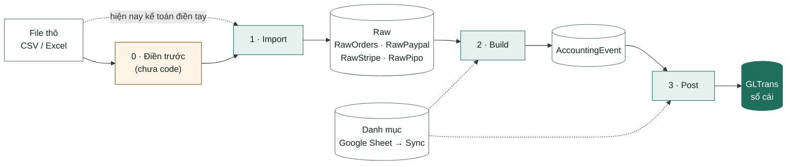

# Tài liệu BA tổng thể – Sky Finance Accounting Engine

| Mục | Nội dung |
|---|---|
| Dự án | Sky Finance – Accounting Engine: web kế toán cho công ty dropshipping |
| Phiên bản | 1.0 |
| Ngày | 2026-09-25 |
| Căn cứ | Tài liệu yêu cầu gốc [Accounting Engine – Raw Source đến GLTrans](1.Accounting_Engine_Functional_Handover.md), Draft 1.0, ngày 2026-05-23 |
| Phạm vi | Toàn bộ luồng từ file thô đến sổ cái của 4 nguồn Orders, PayPal, Stripe, PingPong; danh mục; vận hành |
| Người đọc | Kế toán, quản lý dự án, đội phát triển |

Tài liệu giữ **đúng số thứ tự 21 mục cấp 1 của tài liệu gốc** để đối chiếu 1–1 (mục con có thể khác, vd mục 5 thêm bước Điền trước), thêm mục 22 (Master data và Google Sheet), mục 23 (Hạn chế, vấn đề đã biết, câu hỏi mở) và phụ lục. Trạng thái của từng mục so với tài liệu gốc (Đã làm / Làm khác / Chưa làm) xem ở Phụ lục C.

## Mục lục

- [1. Tổng quan và phạm vi](#1-tổng-quan-và-phạm-vi)
- [2. Nguyên tắc thiết kế tổng thể](#2-nguyên-tắc-thiết-kế-tổng-thể)
- [3. Danh sách chức năng và màn hình](#3-danh-sách-chức-năng-và-màn-hình)
- [4. Company và Accounting Period](#4-company-và-accounting-period)
- [5. Upload / Import / Re-import dữ liệu nguồn](#5-upload--import--re-import-dữ-liệu-nguồn)
- [6. Manual Entry](#6-manual-entry)
- [7. Build AccountingEvent](#7-build-accountingevent)
- [8. Accounting Event Review](#8-accounting-event-review)
- [9. Posting Engine: Single và Bulk](#9-posting-engine-single-và-bulk)
- [10. JournalType và JournalLineRule](#10-journaltype-và-journallinerule)
- [11. FX Resolve (quy đổi tỷ giá)](#11-fx-resolve-quy-đổi-tỷ-giá)
- [12. Partner / Seller Mapping](#12-partner--seller-mapping)
- [13. Bank Mapping](#13-bank-mapping)
- [14. GLTrans](#14-gltrans)
- [15. Unpost / Unbuild / Unpost + Unbuild](#15-unpost--unbuild--unpost--unbuild)
- [16. Run Accounting Cycle](#16-run-accounting-cycle)
- [17. Dashboard](#17-dashboard)
- [18. Log / Audit / Exception](#18-log--audit--exception)
- [19. Output hệ thống](#19-output-hệ-thống)
- [20. Phân quyền chức năng](#20-phân-quyền-chức-năng)
- [21. Bảng dữ liệu](#21-bảng-dữ-liệu)
- [22. Master data và đồng bộ Google Sheet](#22-master-data-và-đồng-bộ-google-sheet)
- [23. Hạn chế, vấn đề đã biết, câu hỏi mở](#23-hạn-chế-vấn-đề-đã-biết-câu-hỏi-mở)
- [Phụ lục A. Tài khoản đang dùng](#phụ-lục-a-tài-khoản-đang-dùng)
- [Phụ lục B. Số liệu kiểm chứng](#phụ-lục-b-số-liệu-kiểm-chứng)
- [Phụ lục C. Trạng thái so với tài liệu gốc](#phụ-lục-c-trạng-thái-so-với-tài-liệu-gốc)
- [Phụ lục D. Tài liệu liên quan](#phụ-lục-d-tài-liệu-liên-quan)

---

## 1. Tổng quan và phạm vi

### 1.1 Mục đích

Hệ thống nhận file dữ liệu thô của 4 nguồn (file đơn hàng và sao kê PayPal, Stripe, PingPong), chuyển thành **bút toán chờ ghi sổ (AccountingEvent)**, rồi ghi vào **sổ cái (GLTrans)**. Quy tắc ghi sổ không viết cứng trong phần mềm mà lấy từ các bảng danh mục kế toán khai trên Google Sheet.

Tài liệu này mô tả toàn bộ yêu cầu nghiệp vụ và cách hệ thống đang chạy, đối chiếu từng mục với tài liệu gốc. Dùng làm tài liệu lưu trữ của dự án và căn cứ để phát triển tiếp.

### 1.2 Phạm vi và trạng thái

| Nhóm chức năng | Nội dung | Trạng thái |
|---|---|---|
| Nguồn dữ liệu | Import, Import lại cho Orders, PayPal, Stripe, PingPong | Đã làm |
| Xử lý dữ liệu thô | Tự điền cột phân loại trước khi Import (PREFILL) | Đặc tả xong, chưa code |
| Nguồn dữ liệu | Nguồn AccountingSource, Manual Entry | Chưa làm |
| Build | Sinh AccountingEvent cho 4 nguồn | Đã làm |
| Review | Tra cứu, kiểm tra AccountingEvent | Đã làm (một phần) |
| Post | Ghi sổ Single và Bulk | Làm khác (thử lại event lỗi) |
| Tỷ giá | Quy đổi tiền tệ | Làm khác |
| Điều chỉnh vận hành | Unpost, Unbuild, Unpost + Unbuild | Đã làm (chưa khóa kỳ, chưa audit) |
| Điều chỉnh vận hành | Run Accounting Cycle | Làm khác |
| Danh mục | JournalType, JournalLineRule, Partners, CoA, tỷ giá, Bank Mapping | Làm khác (sửa trên Google Sheet, web chỉ xem) |
| Danh mục | Company, GatewayCompanyMapping | Làm khác (Company rút gọn) |
| Danh mục | Accounting Period (khóa kỳ) | Chưa làm |
| Log, exception | Nhật ký import/build/post, danh sách lỗi | Làm khác (Missing FX / Missing Mapping / Skipped gộp vào một màn Exceptions; nhật ký Import chưa lưu người upload, công ty, kỳ) |
| Log | Audit log thao tác người dùng | Chưa làm |
| Dashboard | Theo dõi vận hành | Làm khác |
| Output | Export Excel | Làm khác (chỉ GL và event) |
| Phân quyền | Đăng nhập, vai trò | Chưa làm |

### 1.3 Thuật ngữ

| Thuật ngữ | Nghĩa |
|---|---|
| Nguồn (DataSource) | Loại dữ liệu đầu vào: `ORDERS`, `PAYPAL`, `STRIPE`, `PIPO` (PingPong), `AccountingSource` (chưa làm) |
| Raw | Dữ liệu thô sau Import: mỗi dòng file là một dòng trong bảng `RawOrders`, `RawPaypal`, `RawStripe` hoặc `RawPipo` |
| Import → Build → Post | 3 bước chính: nạp file vào Raw → sinh AccountingEvent → ghi sổ cái |
| AccountingEvent (event) | Bút toán chờ ghi sổ: đã có ngày, kỳ, số tiền, tài khoản, đối tượng; chưa tách vế Nợ/Có và chưa gom chứng từ |
| GLTrans | Sổ cái. Mỗi dòng là một vế Nợ hoặc một vế Có |
| Loại nghiệp vụ (JournalType) | Một dòng danh mục `JournalType`, định danh bằng mã `JournalTypeCode`, vd `PP_RESERVE_HOLD` |
| Tên gốc | Cột `JournalType` của danh mục: tên loại giao dịch như nhà cung cấp ghi, vd `Reserve Hold` |
| Rule | Một dòng danh mục `JournalLineRule`: quy định một cặp Nợ/Có của một loại nghiệp vụ |
| Single / Bulk | Cách gom chứng từ khi Post. Single: mỗi event một chứng từ. Bulk: gom nhiều event vào một chứng từ |
| DocNum | Số chứng từ: `ASI-…` (Single) hoặc `ASB-…` (Bulk) |
| PostingGroupKey | Khóa gom chứng từ Bulk |
| Khóa dòng (SourceKey) | Mã nhận diện một dòng Raw, không phụ thuộc cột kế toán điền tay. Orders dùng `ItemCode` |
| RowHash | Dấu vân tay nội dung một dòng Raw, dùng để biết dòng có thay đổi khi Import lại |
| Đối tượng (partner) | Bên liên quan ghi trên sổ cái: seller, nhà cung cấp, người mua chung (`INDIVIDUALS`), PayPal, tài khoản nội bộ… |
| From Source / Fixed | Cách lấy đối tượng của loại nghiệp vụ. From Source: lấy từ dữ liệu nguồn. Fixed = X: luôn là đối tượng X |
| Ký hiệu store | Tên store viết hoa, bỏ tiền tố nền tảng (`FFT-`, `WFF-`, `VICBEA-`, `MESI PAY-`) và bỏ chữ `FFT ` ở đầu. Vd `FFT-FFT NAC` → `NAC` |
| StoreId | Mã store do Bettamax (hệ thống quản lý store) cấp; nằm ở cột `PartnerTaxID` của seller trong danh mục |
| ComCode / FncCurr | Mã công ty ghi sổ / đồng tiền hạch toán của công ty |
| InputCurr | Đồng tiền của giao dịch |
| Sync | Nút trên trang Master: nạp lại 6 bảng danh mục từ Google Sheet |
| Exception | Cảnh báo hoặc lỗi được ghi lại khi Build/Post, xem ở trang Exceptions |

---

## 2. Nguyên tắc thiết kế tổng thể

### 2.1 Luồng xử lý lõi

- Không bao giờ ghi thẳng từ file vào sổ cái.
- Mỗi bước có nhật ký riêng (ImportBatch, BuildBatch, PostingBatch) và làm lại được bằng Unpost / Unbuild. Mọi dòng sổ cái truy ngược được về dòng dữ liệu gốc.

### 2.2 Build tách khỏi Post

| Bước | Làm gì | Không làm gì |
|---|---|---|
| Build | Đọc Raw, sinh AccountingEvent. Chụp lại tài khoản và đối tượng từ danh mục lên event | Không ghi sổ cái |
| Post | Lấy event hợp lệ, tách thành dòng Nợ/Có theo JournalLineRule, quy đổi tỷ giá, gom chứng từ, ghi sổ cái | Không đọc lại Raw |

- Single hay Bulk chỉ quyết định ở bước Post, theo cột `Classify` của JournalType.
- Vì tài khoản và đối tượng được chụp lên event lúc Build, sửa tài khoản trên JournalType chỉ có tác dụng với event được **Build lại**. Thêm / tắt rule hoặc đổi `AmountSource` cũng phải Build lại, vì mỗi rule sinh 1 event và số tiền được lấy lúc Build.
- Được đọc lại mỗi lần Post: CoA, tỷ giá, `Classify` và phần cách ghi của rule (tài khoản Nợ/Có theo vai trò, hệ số, xử lý số âm, đối tượng, diễn giải).

### 2.3 Điều khiển bằng bảng cấu hình

| Bảng | Vai trò | Sửa ở đâu |
|---|---|---|
| `JournalType` | Loại nghiệp vụ: nguồn + tên gốc → mã; tài khoản theo vai trò; cách lấy đối tượng; Single/Bulk | Google Sheet → Sync |
| `JournalLineRule` | Các cặp Nợ/Có của từng loại nghiệp vụ: lấy số tiền nào, tài khoản nào, xử lý số âm, đối tượng, diễn giải | Google Sheet → Sync |
| `Partners` | Danh mục đối tượng: seller, nhà cung cấp, đối tượng cố định | Google Sheet → Sync |
| `CoA` | Hệ thống tài khoản. Chỉ ghi sổ vào tài khoản có trong bảng này | Google Sheet → Sync |
| `Exrate` | Tỷ giá theo kỳ | Google Sheet → Sync |
| `MappingBankAccount` | Số tài khoản ngân hàng/ví → tài khoản sổ cái | Google Sheet → Sync |
| `Company` | Công ty ghi sổ và đồng tiền hạch toán | Trang Master |
| `GatewayCompanyMapping` | Tên cổng thanh toán trên file order → công ty | Trang Master |

Đổi cấu hình thì các lần Build/Post sau dùng cấu hình mới (xem 2.2 để biết bảng nào có hiệu lực ở bước nào).

**Khác tài liệu gốc:** gốc có 2 bảng tỷ giá `ExchangeRateResolveRule` + `ExchangeRateMaster`; hiện chỉ có 1 bảng `Exrate` (mục 11). Bảng `PartnerSourceMapping` chưa có (mục 12).

### 2.4 Xử lý số âm

- Số tiền trên AccountingEvent được phép âm, giữ nguyên dấu của dữ liệu nguồn.
- Số tiền trên sổ cái (InputDr/InputCr, AccountedDr/AccountedCr) được phép âm.
- Hệ thống không tự đảo Nợ/Có chỉ vì số âm. Cách xử lý do cột `NegativeMode` của từng rule quyết định: `SIGNED`, `REVERSE` hoặc `ERROR` (mục 10.2).
- Hiện tại: Orders dùng `SIGNED`; PayPal, Stripe, PingPong dùng `REVERSE`, nên mọi dòng sổ cái của 3 nguồn này mang số dương.
- Tổng hợp kế toán (bảng cân đối phát sinh…) phải cộng số có dấu, không lấy trị tuyệt đối.

### 2.5 Làm tròn và so khớp

- Tiền làm tròn 2 chữ số thập phân, làm tròn nửa lên, tại 3 thời điểm: khi Build, sau khi nhân hệ số, sau khi quy đổi tỷ giá.
- So khớp mã (ComCode, mã loại nghiệp vụ, mã đối tượng…) bỏ khoảng trắng đầu/cuối và không phân biệt hoa thường.

---

## 3. Danh sách chức năng và màn hình

| Nhóm | Màn hình theo tài liệu gốc | Trang thực tế | Chức năng hiện có | Trạng thái |
|---|---|---|---|---|
| Dashboard | Dashboard vận hành | Dashboard (`/`) | Thẻ theo nguồn, số raw/event/dòng GL, kiểm tra cân Nợ–Có, exception theo mức, 5 lần chạy gần nhất; nút Chạy full cycle, Xóa dữ liệu test | Làm khác |
| Nguồn dữ liệu | Raw Data Hub | Raw Orders (`/raw/orders`), Raw PayPal / Stripe / PIPO (`/raw/paypal`, `/raw/stripe`, `/raw/pipo`) | Upload file, xem raw, lọc, lịch sử import | Làm khác (Build đặt ở trang Events; chưa export raw) |
| Nguồn dữ liệu | Manual Entry | – | – | Chưa làm |
| Accounting Event | Accounting Event Review | Events (`/events`) | Build, Unbuild, Unpost + Unbuild, xem chi tiết, Export Excel | Đã làm (một phần) |
| GL & Posting | Posting Console | Posting (`/posting`) | Post tất cả / Single / Bulk, Unpost theo phạm vi hoặc theo lần Post, lịch sử Post | Làm khác (chưa xem trước khi Post, chỉ có kết quả sau khi chạy) |
| GL & Posting | GL Inquiry | GL (`/gl`) | Tra cứu, tổng hợp theo tài khoản, xem chứng từ (dòng sổ cái → event → dòng Raw), Export Excel | Đã làm (xem dòng Raw gốc mới có cho Orders) |
| GL & Posting | Clear/Rebuild Console | Gộp vào Events và Posting | Unpost, Unbuild, Unpost + Unbuild | Làm khác |
| Danh mục | Company | Master, tab Company | Thêm, sửa | Làm khác (không có cây công ty) |
| Danh mục | Accounting Period | – | – | Chưa làm |
| Danh mục | CoA, Partners, JournalType, JournalLineRule, Exchange Rate, Bank Mapping | Master, các tab tương ứng | Chỉ xem; sửa trên Google Sheet rồi Sync | Làm khác |
| Danh mục | Partner/Seller Mapping | – | Điền trước (PREFILL) sẽ thay thế một phần | Chưa làm |
| Danh mục | (không có trong gốc) | Master, tab GatewayCompanyMapping | Thêm, sửa, xóa | Đã làm |
| Kiểm soát | Import Log | Tab Lịch sử import ở trang Raw | Xem lỗi từng dòng | Đã làm |
| Kiểm soát | Build/Post Batch Log | Lịch sử Post ở trang Posting; 5 lần Build gần nhất ở Dashboard | – | Làm khác |
| Kiểm soát | Missing FX / Missing Mapping, Skipped / Unmatched | Exceptions (`/exceptions`) | Tổng hợp theo bước × mức × loại, lọc, xem chi tiết | Làm khác (gộp 1 màn) |

---

## 4. Company và Accounting Period

### 4.1 Company

Bảng Company hiện có 4 cột: `ComCode`, `CompanyName`, `FunctionalCurrency` (FncCurr), `IsActive`. Thêm và sửa trên trang Master, không xóa.

| ComCode | Tên | FncCurr |
|---|---|---|
| MESSIPAY | MessiPay Partner | USD |
| ONTARIO | Ontario Operations | CAD |
| VICBEA | Vicbea Operations | VND |
| ZENIROXPAY | Zenibox PayPal Partner — ZeniroxPay | USD |

**Chưa làm (yêu cầu gốc):** cây công ty cha–con.

| Trường | Yêu cầu |
|---|---|
| `ParentComCode` | Mã công ty cha |
| `CompanyType` | `REPORTING_NODE`: công ty cha dạng vỏ, chỉ để xem tổng hợp, không upload/build/post. `POSTING_ENTITY`: pháp nhân có dữ liệu ghi sổ. `ADJUSTMENT_ENTITY`: đơn vị điều chỉnh, ghi sổ theo phân quyền |
| `IsPostingEnabled` | Có cho ghi sổ không |
| `IncludeInParentReport` | Có cộng vào số liệu công ty cha không |

### 4.2 GatewayCompanyMapping

- Map tên cổng thanh toán (cột `PaymentGatewayName` của file order) sang ComCode. So không phân biệt hoa thường.
- Hiện có 24 dòng: 13 tên cổng → ZENIROXPAY, 11 tên → ONTARIO. Chưa cổng nào map sang MESSIPAY, VICBEA.
- Thêm mapping với ComCode chưa có thì hệ thống tự tạo Company mới, đồng tiền USD.
- Chỉ Orders dùng bảng này. PayPal, Stripe, PingPong lấy ComCode từ cột trong file.

### 4.3 Accounting Period

Hiện chưa có khóa kỳ: kỳ đã ghi sổ vẫn Unpost và ghi lại được.

**Yêu cầu gốc:**

| Trường | Mô tả |
|---|---|
| `ComCode` | Kỳ quản lý theo công ty |
| `Period` | YYYYMM |
| `Status` | `OPEN` hoặc `LOCKED` |
| `LockedBy`, `LockedAt`, `UnlockReason` | Thông tin khóa / mở khóa |

Kỳ `LOCKED` phải chặn mọi thao tác làm thay đổi dữ liệu của kỳ: upload/import, thay raw, sửa raw, build, post, unpost, unbuild, unpost + unbuild.

---

## 5. Upload / Import / Re-import dữ liệu nguồn

### 5.1 Danh sách nguồn

| DataSource | Nguồn | File | Dòng được ghi sổ (lọc ở bước Build) | Trạng thái |
|---|---|---|---|---|
| `ORDERS` | Đơn hàng | File order (.csv, .txt, .xlsx) | `ItemStatus = FULFILLED` và có ngày giao | Đã làm |
| `PAYPAL` | Sao kê PayPal | .csv, hoặc sheet `Bank_Paypal` trong .xlsx | `Currency = USD` | Đã làm |
| `STRIPE` | Sao kê Stripe | .csv, hoặc sheet `Bank_Stripe` | `Currency = USD` | Đã làm |
| `PIPO` | Sao kê PingPong | .csv, hoặc sheet `Bank_Pipo` | `Status = Success` | Đã làm |
| `AccountingSource` | Nguồn kế toán tổng hợp / nhập tay; gốc yêu cầu sửa được dữ liệu trên web theo quyền | – | – | Chưa làm |

Import lưu **mọi dòng** của file; việc bỏ qua dòng không đủ điều kiện làm ở bước Build và có ghi lý do.

### 5.2 Bước 0: Xử lý dữ liệu thô (Điền trước – PREFILL)

**Hiện nay:** trước khi Import sao kê PayPal, Stripe, PingPong, kế toán phải tự thêm và điền tay 5 cột `JournalType`, `StoreName`, `PartnerCode`, `ComCode`, `BankAccoutNumber` (tên cột giữ đúng như trên Google Sheet). Stripe và PingPong bắt buộc điền `JournalType`, vì hệ thống chỉ tự suy được 2 loại Stripe (`charge`, `reserved_funds`) và không suy được loại PingPong nào.

**Yêu cầu:** thêm bước Điền trước chạy **trước Import**:

- Tự điền các cột trên và cột mới `PartnerTaxID` theo quy tắc từng nguồn: PayPal tra cột `Description`, Stripe tra cột `Type`, PingPong xét `Type` + `From/To` + `Note`; seller xác định theo email seller + ký hiệu store.
- `ComCode` lấy từ tên file `<Nguồn>_<ComCode>.csv`, vd `Paypal_ZENIROXPAY.csv`.
- Dòng không điền được vào **danh sách dòng lỗi**, xuất ra file kèm lý do để kế toán kiểm tra.
- Đối tượng chưa có trong danh mục thì hệ thống đề xuất; kế toán duyệt, thêm vào Google Sheet rồi Sync.
- Orders: kiểm tra seller của các dòng sẽ được ghi sổ và đề xuất seller còn thiếu.

**Tài liệu chi tiết:**
- Đặc tả nghiệp vụ: [BRD_PREFILL.md](BRD_PREFILL.md) · bản trực tuyến: https://claude.ai/artifact/EsasrVgxfNrsiJN3hhs58Q
- Bản chi tiết cho đội phát triển: [BA_PREFILL_SOURCES.md](../BA_PREFILL_SOURCES.md)

### 5.3 File đầu vào

| Nguồn | Số cột | Cột bắt buộc | Cột kế toán điền tay (hiện tại) |
|---|---:|---|---|
| Orders | 46 | `OrderId`, `ItemCode`, `ItemStatus`, `Quantity`, `UnitPrice`, `PaymentGatewayName` | Không có |
| PayPal | 23 | `Date`, `Transaction ID`, `Currency`, `Gross`, `ComCode` | `JournalType`, `StoreName`, `PartnerCode`, `ComCode`, `BankAccoutNumber` |
| Stripe | 30 | `Date`, `id`, `Type`, `Amount`, `Currency`, `ComCode` | Như PayPal |
| PingPong | 17 | `Time`, `Amount`, `TransactionId`, `Currency`, `Status`, `ComCode` | Như PayPal |

- Tên cột so khớp không phân biệt hoa thường và khoảng trắng.
- Thiếu một cột bắt buộc → **cả file bị từ chối**, không nhận dòng nào.
- Số tiền dạng chữ có đuôi tiền tệ (vd `1.01USD` của PingPong) vẫn đọc được.
- Không nên mở rồi lưu lại file thô bằng Excel: Excel có thể đảo ngày/tháng và làm tròn mã giao dịch dài.

### 5.4 Nhận diện dòng

| Nguồn | Khóa dòng | Ví dụ |
|---|---|---|
| Orders | `ItemCode` | – |
| PayPal | `Transaction ID` + `Date` + `Time` | `06L351017M6526445\|2025-11-17\|05:30:35`. Phải ghép ngày giờ vì cặp giữ tiền / hủy giữ tiền dùng chung `Transaction ID` |
| Stripe | `id` | `txn_3SVBh2K3ZXYJSkRp1IOqhT0v` |
| PingPong | `TransactionId` | `TR01202512091023373387775` |

- **Khóa dòng không phụ thuộc cột kế toán điền tay.** Nhờ vậy sửa tay rồi Import lại không bị coi là giao dịch mới, tránh ghi sổ trùng.
- **RowHash** là dấu vân tay toàn bộ nội dung dòng (kể cả cột điền tay), dùng để biết dòng có thay đổi.

### 5.5 Import lại (Re-import)

| Tình huống | Hệ thống xử lý |
|---|---|
| Khóa dòng chưa có | Thêm mới, trạng thái chưa build |
| Đã có, nội dung giống hệt | Bỏ qua |
| Đã có, nội dung đổi, dòng chưa build | Thay thế, đưa về chưa build |
| Nội dung đổi, dòng đã build | Từ chối dòng: "Unbuild trước khi import lại" |
| Orders: nội dung đổi, dòng còn nằm trong event đã ghi sổ | Từ chối: "Unpost + Unbuild công ty X kỳ P trước" |
| Khóa dòng trùng trong cùng file | Lỗi dòng |
| Thiếu khóa dòng, ngày không đọc được | Lỗi dòng |

- Import chỉ thêm hoặc thay từng dòng theo khóa dòng, **không bao giờ xóa** dòng Raw: dòng có ở lần Import trước mà không còn trong file mới vẫn được giữ và vẫn được Build.
- Unpost / Unbuild không xóa Raw, chỉ đưa dòng về chưa build. Cách duy nhất xóa Raw là nút "Xóa dữ liệu test" ở Dashboard: xóa toàn bộ Raw, event, sổ cái, nhật ký (giữ danh mục), không có bước xem trước.

**Khác tài liệu gốc:** gốc yêu cầu Import lại thay thế toàn bộ Raw trong phạm vi (nguồn + công ty / kỳ) và không cho thay ở kỳ khóa. Hiện chỉ thay từng dòng theo khóa dòng và chưa chặn kỳ khóa.

### 5.6 Nhật ký Import (ImportBatch)

- Mỗi lần Import lưu: nguồn, tên file, thời gian, trạng thái, tổng số dòng, số dòng thành công (thêm mới + thay thế gộp chung), bỏ qua, lỗi, và chi tiết lỗi (tối đa 500 dòng lỗi đầu). Số thêm mới / thay thế tách riêng chỉ hiện trong hộp kết quả ngay sau khi Import.
- Trạng thái: `SUCCESS` (không lỗi), `PARTIAL` (có dòng lỗi nhưng vẫn có dòng được nhận hoặc bỏ qua), `FAILED` (thiếu cột bắt buộc, hoặc mọi dòng đều lỗi). File không đọc được (sai đuôi file, .xlsx thiếu sheet của nguồn, file hỏng) bị báo lỗi ngay, không tạo nhật ký.
- Xem ở tab Lịch sử import của trang Raw; mở từng dòng để xem lỗi.

**Khác tài liệu gốc:**
- Import không theo phạm vi ComCode/kỳ; ImportBatch không lưu ComCode, kỳ, người upload.
- Chưa chặn Import vào kỳ đã khóa (chưa có khóa kỳ) và vào công ty không được ghi sổ (gốc: chỉ công ty có `IsPostingEnabled` và không phải `REPORTING_NODE`).

---

## 6. Manual Entry

**Yêu cầu gốc:** màn hình nhập liệu kế toán thủ công. Dữ liệu nhập tay vẫn phải đi qua Build và Post, không ghi thẳng sổ cái.

| Yêu cầu | Mô tả |
|---|---|
| Nháp | Lưu nháp trước khi gửi |
| Gửi | Sau khi gửi, dữ liệu vào nguồn AccountingSource để Build |
| Sửa | Theo quyền, khi chưa build/post và kỳ còn mở |
| Lưu vết | Người tạo, thời điểm tạo, người sửa, thời điểm sửa |
| Build/Post | Theo cùng quy tắc với AccountingSource |

Danh mục JournalType đã có sẵn 16 loại nghiệp vụ của nguồn AccountingSource.

---

## 7. Build AccountingEvent

### 7.1 Nguyên tắc chung

- Build đọc Raw theo phạm vi công ty + nguồn + khoảng kỳ, sinh event trạng thái `NEW`. Build không ghi sổ cái.
- Mỗi rule đang dùng của loại nghiệp vụ sinh **một event** (số thứ tự event = RuleSeq). Rule bị bỏ qua khi số tiền bằng 0 hoặc thiếu tài khoản (mục 10.2).
- **Build lại:**
  - Event chưa ghi sổ được thay bằng bản mới; event không còn được sinh ra thì bị xóa.
  - Event đã ghi sổ được giữ nguyên. Nếu dữ liệu nguồn hoặc cấu hình đã đổi, hệ thống cảnh báo `POSTED_SOURCE_CHANGED`; muốn cập nhật phải Unpost → Build → Post.
  - Dòng đã ghi sổ dưới một khóa khác (đổi công ty, ngày giao, RuleSeq) bị chặn với lỗi `POSTED_KEY_CHANGED`.
- Dòng không đủ điều kiện được đánh dấu bỏ qua hoặc lỗi, có lý do, ghi vào danh sách exception.
- Trạng thái dòng Raw: `NOT_BUILT` (chưa build) → `BUILT` / `SKIPPED` / `ERROR`.

**Bản ghi AccountingEvent**

**Khóa duy nhất của event:** ComCode + DataSource + JournalTypeCode + TransactionID + EventSeq.

| Trường | Ý nghĩa |
|---|---|
| `TransactionID` | Orders: `ORD-{OrderId}-{yyyyMMdd ngày giao}`. Ngân hàng: mã giao dịch gốc |
| `EventSeq`, `PairCode`, `AmountSource` | Rule đã sinh ra event (mục 10.2) |
| `PostingDate`, `Period` | Ngày ghi sổ, kỳ YYYYMM |
| `OrderID`, `RefNum`, `SourceID` | Tham chiếu về dữ liệu gốc |
| `InputCurr`, `FncCurr` | Tiền giao dịch, tiền hạch toán |
| `Amount` | Số tiền có dấu, **chưa nhân hệ số** |
| `BankAccountNumber`, `BankGLAccount`, `ContraAccount`, `TransAccount`, `FeeAccount` | Tài khoản chụp từ danh mục lúc Build |
| `PartnerCode`, `PartnerTaxID`, `PartnerName` | Đối tượng của event |
| `PostStatus`, `PostedDocNum`, `PostingGroupKey`, `PostBatchID`, `PostedAt` | Kết quả Post |
| `ErrorStage`, `ErrorMessage` | Lỗi ở bước Build hay Post, nội dung lỗi |
| `ItemCodes` | Orders: danh sách dòng hàng tạo nên event, dùng chống ghi sổ trùng |

| PostStatus | Nghĩa | Post có lấy? |
|---|---|---|
| `NEW` | Chờ ghi sổ | Có |
| `POSTED` | Đã vào sổ cái | Không. Sai thì Unpost, event về `NEW` |
| `ERROR` (bước Build) | Vd không tìm được seller | Không |
| `ERROR` (bước Post) | Vd thiếu tỷ giá, tài khoản không có trong CoA | Có, tự thử lại mỗi lần Post |
| `SKIPPED` | Bỏ qua lúc Post (số tiền 0, thiếu tài khoản có cờ bỏ qua) | Không. Unpost không đưa về `NEW`; Build lại phạm vi đó thì event được thay bằng bản mới (`NEW`), hoặc bị xóa nếu không còn sinh ra |

### 7.2 Build AccountingSource

**Yêu cầu gốc:**

| Bước | Quy tắc |
|---|---|
| 1 | Đọc AccountingSource theo ComCode / kỳ / loại nghiệp vụ |
| 2 | Chuẩn hóa mã nghiệp vụ, ngày ghi sổ, kỳ, tiền tệ, số tiền, đối tượng, số tài khoản ngân hàng |
| 3 | Chọn tài khoản: tài khoản nhập trên nguồn → MappingBankAccount → mặc định của JournalType |
| 4 | Tra đối tượng theo `PartnerCode` trong Partners |
| 5 | Lấy các rule đang dùng của loại nghiệp vụ, sinh event |
| 6 | Trùng khóa event: event chưa ghi sổ thì thay; đã ghi sổ thì chặn |

### 7.3 Build Orders

| Bước | Quy tắc |
|---|---|
| 1 | Chỉ lấy dòng `ItemStatus = FULFILLED` và có `FulfilledAt`. Dòng khác: `SKIPPED` (`NOT_FULFILLED`) |
| 2 | Công ty: `PaymentGatewayName` → GatewayCompanyMapping → ComCode; Company → FncCurr. Thiếu: lỗi `MISSING_COMCODE` / `MISSING_COMPANY` |
| 3 | Ngày ghi sổ = `FulfilledAt`; kỳ = YYYYMM của ngày đó. Tiền giao dịch cố định USD (file không có cột tiền tệ) |
| 4 | Gom theo công ty + `OrderId` + ngày giao |
| 5 | Tính 4 khoản: PRODUCT = Σ `Quantity × UnitPrice`; SHIPADD = Σ (`ShippingFee` + `AdditionalCost`); TAX = Σ `TaxFee`; SELLER_PROFIT = Σ `Profit` |
| 6 | Mỗi khoản khác 0 sinh 1 event. Khoản bằng 0 bỏ qua (`AMOUNT_ZERO`) |
| 7 | Seller (chỉ khoản lợi nhuận chia seller): tra theo `TaxID` trên đơn → `SellerEmail` → tên store. Không tìm được: event `ERROR` (`MISSING_PARTNER`), không ghi sổ; các event doanh thu của cùng đơn vẫn `NEW` |

| Nghiệp vụ | Nợ | Có | Đối tượng | Gom |
|---|---|---|---|---|
| `ORD_REV_PRODUCT_FULFILLED` – doanh thu tiền hàng | 13122001 Người mua trả tiền trước | 51112001 Doanh thu bán hàng | `INDIVIDUALS` | Bulk |
| `ORD_REV_SHIPADD_FULFILLED` – doanh thu ship + phụ phí | 13122001 | 51131001 Doanh thu dịch vụ – Shipping | `INDIVIDUALS` | Bulk |
| `ORD_REV_TAX_FULFILLED` – thuế thu hộ | 13122001 | 33302001 Thuế phải nộp CA | `INDIVIDUALS` | Bulk |
| `ORD_SELLER_PROFIT_FULFILLED` – lợi nhuận chia seller | 63202001 Giá vốn – SellerCost | 33102001 Phải trả Seller | Seller | Bulk |

Chứng từ: doanh thu và thuế gom 1 chứng từ cho mỗi công ty × nghiệp vụ × ngày; lợi nhuận seller gom 1 chứng từ cho mỗi công ty × seller × ngày.

Chi tiết từng cột và ví dụ: [MAPPING_ORDERS_TO_GLTRANS.md](../Mapping/MAPPING_ORDERS_TO_GLTRANS.md).

**Khác tài liệu gốc:** gốc yêu cầu tra seller qua bảng PartnerSourceMapping; hiện tra theo quy tắc riêng và còn lỗi nhận diện store (mục 12).

### 7.4 Build PayPal

| Bước | Quy tắc |
|---|---|
| 1 | Chỉ lấy `Currency = USD`; dòng khác: `SKIPPED` (`SOURCE_ROW_SKIPPED`) |
| 2 | ComCode lấy từ cột `ComCode`, phải có trong Company. Ngày ghi sổ = `Date` |
| 3 | Loại nghiệp vụ: lấy mã ở cột `JournalType` điền tay; trống thì tra `Description` theo tên gốc trong danh mục. Không có: `MISSING_JOURNAL_TYPE` |
| 4 | Tài khoản ngân hàng: `BankAccoutNumber` (trống thì `PAYPAL1`) → MappingBankAccount → mặc định của JournalType |
| 5 | Số tiền: GROSS = `Gross`, FEE = `Fee`, NET = `Net`. `Fee` âm khi PayPal thu phí; đổi dấu bằng hệ số −1 lúc Post |
| 6 | Đối tượng: loại Fixed lấy theo danh mục. Loại From Source đọc cột `PartnerCode` (+ `StoreName`); không tìm thấy thì cảnh báo, vẫn ghi sổ với TaxID trống |
| 7 | Một dòng sinh tối đa 3 event: tiền gốc (Gross), chuyển tiếp sang doanh thu/chi phí, phí (Fee) |

| Nhóm | Loại nghiệp vụ tiêu biểu | Bút toán thường gặp | Gom |
|---|---|---|---|
| Thu tiền khách | `PP_EXPRESS_CHECKOUT_PAYMENT`, `PP_DIRECT_CREDIT_CARD_PAYMENT` | Nợ 11202051 PayPal / Có 13122001 | Bulk |
| Phí giao dịch | Rule phí của các loại trên | Nợ 64202010 Phí cổng thanh toán / Có 11202051; đối tượng `PAYPAL` | Theo loại |
| Hoàn tiền, đảo, chargeback | `PP_PAYMENT_REFUND`, `PP_PAYMENT_REVERSAL`, `PP_CHARGEBACK`… | Nợ 13122001 / Có 11202051 | Single |
| Phí đứng riêng | `PP_CHARGEBACK_FEE`, `PP_DISPUTE_FEE`, `PP_PARTNER_FEE`… | Qua 33102005 Phải trả PSP rồi vào chi phí 642020xx | Single / Bulk |
| Giữ / nhả tiền | `PP_RESERVE_HOLD`, `PP_RESERVE_RELEASE`, các loại hold | Chuyển giữa 11202051 và 11202052 PayPal – Held | Bulk / Single |
| Trả nhà cung cấp | `PP_MASS_PAY_PAYMENT` | Nợ 33102002 Phải trả Supplier / Có 11202051 | Single |
| Rút tiền | `PP_USER_INITIATED_WITHDRAWAL` | Nợ 11301001 Tiền đang chuyển / Có 11202051 | Single |

Đủ 32 loại và ví dụ: [MAPPING_PAYPAL_TO_GLTRANS.md](../Mapping/MAPPING_PAYPAL_TO_GLTRANS.md). Bảng tra `Description` → mã: [BRD_PREFILL.md](BRD_PREFILL.md) mục 3.

**Khác tài liệu gốc:** gốc tra theo cột `Type`; hiện ưu tiên cột điền tay, dự phòng bằng `Description`. Tên gốc gộp nhiều mô tả bằng dấu phẩy (`PP_PROTECTION_BONUS_PAYOUT`) chưa được tách nên không khớp.

### 7.5 Build PingPong (PIPO)

| Bước | Quy tắc |
|---|---|
| 1 | Chỉ lấy `Status = Success`; dòng khác: `SKIPPED`. Không lọc theo tiền tệ |
| 2 | ComCode từ cột `ComCode`. Ngày ghi sổ = phần ngày của `Time` |
| 3 | Loại nghiệp vụ: **bắt buộc** điền cột `JournalType` (tên gốc trong danh mục chính là mã nên không tự suy được) |
| 4 | Tài khoản ngân hàng: `PINGPONG1` → 11202061 PingPong |
| 5 | Số tiền: FEE = trị tuyệt đối của `Fee`. AMOUNT = `Amount`; riêng `BANK_PAYMENT_*` và `BANK_INTERNAL_TRANSFER_TO` có phí thì AMOUNT = `Amount` trừ phí (giữ dấu), vì `Amount` của PingPong đã gồm phí |
| 6 | Đối tượng: mọi loại đều From Source, đọc cột `PartnerCode`; không tìm thấy thì cảnh báo, vẫn ghi sổ |

| Loại nghiệp vụ | Nghĩa | Bút toán | Gom |
|---|---|---|---|
| `BANK_INTERNAL_TRANSFER_FROM` | Nhận tiền từ ví khác của công ty | Nợ 11202061 / Có 11301001 | Single |
| `BANK_INTERNAL_TRANSFER_TO` | Chuyển sang ngân hàng / thẻ của công ty | Nợ 11301001 / Có 11202061; phí: Nợ 64200020 / Có 11202061 | Single |
| `BANK_PAYMENT_SELLER` | Trả seller | Nợ 33102001 Phải trả Seller / Có 11202061 | Single |
| `BANK_PAYMENT_SUPPLIER` | Trả nhà cung cấp | Nợ 33111002 Phải trả NCC / Có 11202061 | Single |
| `BANK_PAYMENT_SALARY`, `BANK_PAYMENT_COSTSUP`, `BANK_PAYMENT_OTHER` | Trả lương, chi phí fulfillment, chi khác | Nợ 33402001 / 33102002 / 13889001, Có 11202061 | Single |
| `BANK_RECEIPT_CUSTOMER`, `BANK_RECEIPT_OTHER` | Thu tiền khách, thu khác | Nợ 11202061 / Có 13111001 / 13889001 | Single |
| `BANK_BANK_FEE` | Phí ngân hàng đứng riêng | Qua 33111002 rồi vào 64200020 | Single |

Chi tiết: [MAPPING_PIPO_TO_GLTRANS.md](../Mapping/MAPPING_PIPO_TO_GLTRANS.md).

**Khác tài liệu gốc:**
- Gốc yêu cầu khử trùng theo ComCode + mã nghiệp vụ + TransactionID, giữ dòng mới nhất. Hiện `TransactionId` là khóa dòng duy nhất; trùng trong cùng file là lỗi dòng.
- Gốc cho sửa trên web các cột `JournalType`, `PartnerCode`, `PartnerName`, `BankGLAccount`, `ContraAccount`, `TransAccount`, `BankAccountNumber`, `Note`: chưa làm. Cột tài khoản trên dòng nguồn hiện không được dùng.
- Mã `BANK_*` dùng chung bộ rule với nguồn AccountingSource (rule tra theo mã, không kèm nguồn).

### 7.6 Build Stripe

| Bước | Quy tắc |
|---|---|
| 1 | Chỉ lấy `Currency = USD` (so không phân biệt hoa thường) |
| 2 | ComCode từ cột `ComCode`. Ngày ghi sổ = `Date`; trống thì `Created (UTC)` |
| 3 | Loại nghiệp vụ: cột `JournalType` điền tay; trống thì tra `Type` theo tên gốc (hiện chỉ khớp `charge`, `reserved_funds`) |
| 4 | Tài khoản ngân hàng: `Stripe1` → 11202081 Stripe |
| 5 | Số tiền: AMOUNT = `Amount` (có dấu), FEE = `Fee` (luôn dương), NET = `Net` |
| 6 | Đối tượng: cả 7 loại đều Fixed, cột `PartnerCode` của file không được dùng |

| `Type` | Loại nghiệp vụ | Bút toán | Gom |
|---|---|---|---|
| `charge` | `STRIPE_RECEIPT_CUSTOMER` | Nợ 11202081 / Có 13122001; phí: Nợ 64202014 / Có 11202081 | Bulk |
| `refund` | `STRIPE_REFUND` | Nợ 13122001 / Có 11202081 | Single |
| `payout` | `STRIPE_PAYOUT` | Nợ 11301001 Tiền đang chuyển / Có 11202081 | Single |
| `stripe_fee` | `STRIPE_FEE` | Qua 33102005 rồi vào 64202015 Phí Stripe đứng riêng | Bulk |
| `adjustment` | `STRIPE_ADJUSTMENT` | Nợ 13122001 / Có 11202081 (+ phí) | Single |
| `reserved_funds` | `STRIPE_RESERVE` | Chuyển giữa 11202081 và 11202082 Stripe – Reserve | Bulk |

Chi tiết: [MAPPING_STRIPE_TO_GLTRANS.md](../Mapping/MAPPING_STRIPE_TO_GLTRANS.md).

**Khác tài liệu gốc (phương án PA1):** gốc chọn danh mục ghi đúng tên loại gốc của Stripe (`charge`, `refund`, `payout`, `stripe_fee`, `adjustment`) và `charge` → `STRIPE_CHARGE`. Hiện danh mục ghi tên dạng `Stripe Charge`, `Stripe Refund`…; dự án thêm 2 mã `STRIPE_RECEIPT_CUSTOMER` (`charge`) và `STRIPE_RESERVE` (`reserved_funds`) chỉ có trong hệ thống, chưa có trên Google Sheet. Cần chốt (mục 23.4).

---

## 8. Accounting Event Review

Trang Events (`/events`).

| Nhóm | Yêu cầu gốc | Hiện có |
|---|---|---|
| Bộ lọc | ComCode, kỳ, nguồn, loại nghiệp vụ, PostStatus, TransactionID, OrderID, RefNum, PostBatchID, ngày ghi sổ | ComCode, nguồn, khoảng kỳ, loại nghiệp vụ, PostStatus, ô tìm kiếm |
| Bảng | Danh sách event với các trường chính | Bảng tổng hợp loại nghiệp vụ × PostStatus (số event, tổng tiền) và danh sách event |
| Chi tiết | Thông tin event, nguồn, tài khoản/đối tượng, thông tin Post, lưu vết | Khung chi tiết: event, rule sẽ áp dụng khi Post, dòng Raw gốc, dòng sổ cái |
| Thao tác | Xem, xem dòng Raw, export, xem thông tin Post | Build, Unbuild, Unpost + Unbuild (có xem trước), Export Excel |

**Khác tài liệu gốc:** bộ lọc loại nghiệp vụ chỉ liệt kê mã của Orders; xem dòng Raw gốc mới có cho Orders; chưa lọc theo TransactionID/RefNum/PostBatchID riêng.

---

## 9. Posting Engine: Single và Bulk

### 9.1 Nguyên tắc chung

- Event được Post: `NEW`, và `ERROR` phát sinh ở bước Post (tự thử lại mỗi lần Post, vd sau khi đã bổ sung tỷ giá).
- `Classify` đọc từ JournalType lúc Post. `Classify` trống hoặc sai thì event không bao giờ được chọn và đứng `NEW` mãi.
- **Chặn trùng dòng hàng (Orders):** một dòng hàng đã ghi sổ hoặc đang chờ Post ở event khác **ngày giao hoặc khác công ty** thì event bị giữ lại với lỗi `DUPLICATE_ITEM`. Các event cùng đơn, cùng ngày giao, cùng công ty (PRODUCT / SHIPADD / TAX / SELLER_PROFIT) không chặn nhau. Event Orders không có danh sách dòng hàng cũng bị giữ, phải Build lại.
- "Post tất cả" chạy Single trước rồi Bulk; mỗi loại là một lần Post (PostingBatch) riêng.
- Mỗi lần Post ghi trong một giao dịch dữ liệu: có lỗi thì hủy toàn bộ lần Post đó.
- Thành công: event chuyển `POSTED`, lưu số chứng từ, lần Post, khóa gom, thời điểm Post.
- Mỗi event sinh **đúng 1 dòng Nợ và 1 dòng Có** theo rule của nó (thứ tự xử lý ở mục 10.3).

**Khác tài liệu gốc:** gốc chỉ Post event `NEW`, và có xem trước (preview) trước khi Post; hiện chỉ có kết quả sau khi chạy.

### 9.2 Post Single

- Mỗi event là một chứng từ: `ASI-{yyyyMMdd ngày ghi sổ}-{mã event}`.
- Dòng sổ cái có tham chiếu `ReferenceTxnID` (= TransactionID), `OrderID`, `RefNum`.
- Diễn giải: `{MemoTemplate} | {TransactionID}`.
- Một giao dịch có phí sinh 2 event, nên ra 2 chứng từ Single riêng.

### 9.3 Post Bulk

- **Khóa gom chứng từ** (PostingGroupKey): ComCode | loại nghiệp vụ | ngày | InputCurr | FncCurr | mã đối tượng | TaxID đối tượng | số tài khoản ngân hàng. Đối tượng ở đây là đối tượng của event.
- Trong một chứng từ, các dòng cùng PairCode + vế + tài khoản + đối tượng + tỷ giá được cộng thành một dòng.
- Số chứng từ: `ASB-{yyyyMMdd}-{mã event nhỏ nhất trong nhóm}`.
- Dòng Bulk không mang `OrderID`, `ReferenceTxnID`. Diễn giải: `{MemoTemplate} | {n} events`.
- Ví dụ: PayPal Express Checkout ngày 18/11/2025 có 11 giao dịch → 22 event (tiền gốc + phí) → **1 chứng từ 4 dòng**: Nợ 11202051 716,30 · Có 13122001 716,30 · Nợ 64202010 29,50 · Có 11202051 29,50.
- Chỉ gom các event trong cùng lần Post. Post lần sau cho cùng ngày sẽ tạo thêm chứng từ mới có cùng khóa gom (mục 23.3).

**Khác tài liệu gốc:** gốc gom theo cả tài khoản trong một khóa; hiện chia 2 tầng (khóa gom chứng từ không có tài khoản, tài khoản nằm ở khóa cộng dòng). Kết quả tương đương.

### 9.4 Kiểm tra cân

Mỗi chứng từ phải có tổng Nợ quy đổi = tổng Có quy đổi. Lệch thì hủy toàn bộ lần Post đó, lần Post báo `FAILED`.

---

## 10. JournalType và JournalLineRule

Hai bảng này quyết định mọi bút toán:

- **JournalType** là "đầu" của nghiệp vụ: loại giao dịch nào của nguồn nào, dùng các tài khoản nào (theo 4 vai trò Bank / Contra / Trans / Fee), đối tượng là ai, gom chứng từ Single hay Bulk.
- **JournalLineRule** là "thân": mỗi dòng rule là **một cặp Nợ/Có**, chọn vai trò tài khoản nào bên Nợ, bên Có, lấy số tiền nào, xử lý số âm thế nào. Mỗi loại nghiệp vụ có 1–3 rule.

Ba cặp chuẩn đang dùng cho các nguồn ngân hàng:

| RuleSeq | PairCode | Nợ (khi số dương) | Có (khi số dương) | Số tiền | Dùng để |
|---|---|---|---|---|---|
| 10 | `BANK_CONTRA` | Bank | Contra | GROSS / AMOUNT | Tiền vào / ra tài khoản ngân hàng, ví |
| 20 | `CONTRA_TRANS` | Contra | Trans | GROSS / AMOUNT | Chuyển tiếp từ tài khoản trung gian sang doanh thu / chi phí |
| 30 | `FEE_BANK` | Fee | Bank | FEE | Phí giao dịch |

Orders chỉ có 1 rule (RuleSeq 20, `CONTRA_TRANS`). Loại nghiệp vụ nào thiếu tài khoản của một cặp thì cặp đó tự bỏ qua (cột SkipIf, mục 10.2), nhờ vậy nhiều loại nghiệp vụ dùng chung được một bộ rule.

### 10.1 JournalType – từng cột

| Cột | Ý nghĩa | Giá trị trong danh mục | Hệ thống xử lý | Trống hoặc sai |
|---|---|---|---|---|
| `DataSource` | Nguồn áp dụng | `ORDERS`, `PAYPAL`, `STRIPE`, `PIPO`, `AccountingSource` | Cùng `JournalTypeCode` tạo thành khóa tra loại nghiệp vụ | Sai nguồn: Build báo `MISSING_JOURNAL_TYPE`. Chưa nguồn nào dùng `AccountingSource` |
| `JournalType` (tên gốc) | Tên loại giao dịch như nhà cung cấp ghi | vd `Reserve Hold`, `charge`, `reserved_funds` | Dùng để tra khi dòng nguồn để trống cột `JournalType` (PayPal theo `Description`, Stripe và PingPong theo `Type`). Cũng là diễn giải mặc định | Nhiều tên gộp bằng dấu phẩy hiện không được tách nên không khớp. Tên gốc PingPong trùng mã nên không bao giờ khớp |
| `JournalTypeCode` | Mã nghiệp vụ chuẩn | 69 dòng, 59 mã (10 mã `BANK_*` có ở cả PingPong và AccountingSource) | Nối sang JournalLineRule. Mã điền tay trên dòng nguồn phải có với đúng `DataSource` | Trống: dòng danh mục bị bỏ. Không có rule đang dùng: `MISSING_RULE` |
| `BankAccount` | Tài khoản ngân hàng / ví | 11202051 PayPal, 11202081 Stripe, 11202061 PingPong; Orders để trống | Nguồn ngân hàng ưu tiên MappingBankAccount theo công ty + số tài khoản; không có mới lấy cột này | Trống: rule dùng vai trò Bank bị bỏ |
| `ContraAccount` | Tài khoản đối ứng (công nợ, trung gian) | 13122001, 33102001, 33102002, 33102005, 33111002, 11202052, 11202082, 11301001… | Chụp lên event lúc Build | Trống: rule dùng vai trò Contra bị bỏ. ⚠️ Tiêu đề cột này trên Google Sheet đang ghi nhầm `11202052`; hệ thống đọc theo vị trí (cột thứ 6) nên vẫn đúng. **Không chèn thêm cột phía trước cột này** |
| `TransAccount` | Tài khoản doanh thu / chi phí | 51112001, 51131001, 33302001, 63202001, 642020xx, 64200020, 71100001 | Chụp lên event | Trống (đa số loại PayPal): rule 20 bị bỏ |
| `FeeAccount` | Tài khoản chi phí phí | 64202010 PayPal, 64202014 Stripe, 64200020 PingPong | Chụp lên event | Trống: rule phí bị bỏ |
| `Partner` | Cách lấy đối tượng của event | `Fixed = X` (Individuals, PAYPAL, STRIPE, Reserve Hold, Tax…), `From Source` | **Fixed = X:** đối tượng X, tra TaxID trong Partners (không có thì giữ mã, TaxID trống, không báo lỗi). **From Source:** Orders tra seller; nguồn ngân hàng đọc cột `PartnerCode` (+ `StoreName`) của dòng | Giá trị khác: event không có đối tượng, không báo lỗi. From Source không tìm được: Orders → event `ERROR`, không ghi sổ; ngân hàng → cảnh báo, vẫn ghi sổ với TaxID trống |
| `Classify` | Gom chứng từ | `Single`, `Bulk` | Đọc lúc Post | Trống hoặc sai: event đứng `NEW` mãi, không báo lỗi |
| `GroupRule` | Mô tả cách gom | vd `PostingDate,Currency,CompanyCode,JournalType` | **Không dùng.** Khóa gom cố định như mục 9.3 | – |

### 10.2 JournalLineRule – từng cột

Danh mục hiện có 140 rule. Dưới đây là từng cột, **mỗi giá trị gặp trong cột thì hệ thống làm gì**.

**`JournalTypeCode`** – rule thuộc loại nghiệp vụ nào. Tra theo mã, **không kèm nguồn**: mã trùng nhau giữa 2 nguồn (vd `BANK_*` của PingPong và AccountingSource) dùng chung rule.

**`RuleSeq`** – số thứ tự cặp bút toán.

| Giá trị | Hệ thống xử lý |
|---|---|
| 10, 20, 30 (hiện có) | Mỗi rule đang dùng sinh 1 event, số thứ tự event (`EventSeq`) = `RuleSeq`. Khi Post, tìm lại rule theo mã + `RuleSeq` |
| Trống | Coi là 10 |
| Trùng trong cùng một mã | Không được phép (không kiểm tra tự động): khi Post chỉ rule đầu tiên được dùng |

`RuleSeq` nằm trong khóa event: đổi `RuleSeq` của rule đã có event ghi sổ sẽ gây lỗi `POSTED_KEY_CHANGED` khi Build lại.

**`PairCode`** – nhãn của cặp: `BANK_CONTRA`, `CONTRA_TRANS`, `FEE_BANK`. Chỉ là nhãn, không quyết định tài khoản. Dùng để tách dòng khi cộng chứng từ Bulk (hai cặp cùng tài khoản, cùng vế vẫn là 2 dòng). Không lưu trên sổ cái.

**`NormalDrAccountSource` / `NormalCrAccountSource`** – tài khoản bên Nợ / bên Có **khi số tiền dương**.

| Giá trị | Tài khoản được lấy |
|---|---|
| `BANK_ACCOUNT` | Tài khoản ngân hàng của event (MappingBankAccount, không có thì `JournalType.BankAccount`) |
| `CONTRA_ACCOUNT` | `JournalType.ContraAccount` |
| `TRANS_ACCOUNT` | `JournalType.TransAccount` |
| `FEE_ACCOUNT` | `JournalType.FeeAccount` |
| Trống hoặc giá trị khác | Coi như thiếu tài khoản (xem các cột SkipIf) |

- Tài khoản lấy từ bản đã chụp trên event lúc Build.
- Hai tài khoản phải có trong CoA; không có thì lỗi `ACCOUNT_NOT_IN_COA`, không ghi sổ. Hệ thống chưa kiểm tra trạng thái (còn dùng hay không) của tài khoản trong CoA.
- Chế độ `REVERSE` có thể đảo hai vế khi số âm (xem `NegativeMode`).

**`AmountSource`** – lấy số tiền nào của dữ liệu nguồn. Chỉ dùng ở bước Build.

| Nguồn | Giá trị | Số tiền |
|---|---|---|
| Orders | `PRODUCT` | Σ `Quantity × UnitPrice` |
| Orders | `SHIPADD` | Σ (`ShippingFee` + `AdditionalCost`) |
| Orders | `TAX` | Σ `TaxFee` |
| Orders | `SELLER_PROFIT` (hoặc `PROFIT`) | Σ `Profit` |
| PayPal | `GROSS` / `FEE` / `NET` | Cột `Gross` / `Fee` / `Net`, giữ dấu (`Fee` âm khi bị thu phí) |
| Stripe | `AMOUNT` / `FEE` / `NET` | Cột `Amount` / `Fee` (dương) / `Net` |
| PingPong | `AMOUNT` / `FEE` / `NET` | `Amount` (trừ phí với `BANK_PAYMENT_*`, `BANK_INTERNAL_TRANSFER_TO`) / trị tuyệt đối `Fee` / `Net` |
| Mọi nguồn | Giá trị không thuộc nguồn đó, hoặc trống | Lỗi `UNKNOWN_AMOUNT_SOURCE`, không sinh event |

**`AmountFactor`** – hệ số nhân số tiền, **chỉ áp dụng lúc Post** (event giữ số gốc).

| Giá trị | Hệ thống xử lý |
|---|---|
| 1 (đa số) | Giữ nguyên |
| −1 (các rule phí PayPal) | Đổi dấu. Vd phí PayPal `Fee` = −1.87 × −1 = +1.87 → Nợ 64202010 / Có 11202051 |
| Trống | Coi là 1 |

**`NegativeMode`** – xử lý khi số tiền **sau khi nhân hệ số** bị âm. Số dương không bị ảnh hưởng. Ví dụ bên dưới dùng cặp Nợ A / Có B, số tiền −12.50:

| Giá trị | Hệ thống xử lý | Kết quả |
|---|---|---|
| `SIGNED` | Giữ vế, ghi số âm ở cả 2 dòng | Nợ A −12.50 · Có B −12.50 |
| `REVERSE` | Đảo vế, lấy trị tuyệt đối | Nợ B 12.50 · Có A 12.50 |
| `ERROR` | Không ghi sổ, lỗi `NEGATIVE_AMOUNT`, thử lại mỗi lần Post | – |
| Trống | Dùng cột phụ `ReverseIfNegative`: 1 → `REVERSE`, 0 → `SIGNED` | – |
| Giá trị khác (gõ sai) | Coi như `SIGNED`, **không báo lỗi** | – |

Hiện tại: 4 rule Orders và các rule `SUP_*`, `SELLER_COST` dùng `SIGNED`; toàn bộ rule PayPal, Stripe, PingPong dùng `REVERSE`.

**`SkipIfAmountZero`** – bỏ qua khi số tiền bằng 0.

| Giá trị | Hệ thống xử lý |
|---|---|
| 1 (toàn bộ danh mục) | Build: số tiền = 0 thì không sinh event (`AMOUNT_ZERO`, INFO). Post: số tiền sau nhân hệ số = 0 thì event `SKIPPED` |
| 0 hoặc trống | Vẫn sinh event và ghi 2 dòng sổ cái 0 đồng |

**`SkipIfDrAccountNull` / `SkipIfCrAccountNull`** – bỏ qua khi thiếu tài khoản bên Nợ / bên Có.

| Giá trị | Hệ thống xử lý |
|---|---|
| 1 (toàn bộ danh mục) | Build: thiếu tài khoản thì không sinh event (`MISSING_ACCOUNT`: Orders mức WARNING, ngân hàng mức INFO). Nếu tới lúc Post mới thiếu thì event `SKIPPED` |
| 0 hoặc trống | Build vẫn sinh event; Post báo lỗi `MISSING_ACCOUNT` (ERROR) |

Đây là cơ chế cho phép một bộ 3 rule dùng chung: loại nghiệp vụ không có `TransAccount` thì rule 20 tự bỏ, không có `FeeAccount` hoặc phí = 0 thì rule 30 tự bỏ.

**`PartnerMode` + `FixedPartner`** – đối tượng ghi trên 2 dòng sổ cái của cặp này.

| `PartnerMode` | `FixedPartner` | Đối tượng trên dòng sổ cái |
|---|---|---|
| `HEADER` | trống | Đối tượng của event (theo cột `Partner` của JournalType) |
| `FIXED` | có mã, vd `PAYPAL`, `STRIPE`, `BANK` | Mã đó; TaxID tra trong Partners. Mã không có trong Partners: giữ mã, TaxID trống, không báo lỗi |
| `FIXED` | trống | Đối tượng của event |
| Trống hoặc khác | – | Đối tượng của event |

- Chỉ đổi đối tượng trên dòng sổ cái; khóa gom chứng từ Bulk vẫn dùng đối tượng của event.
- Hiện có 93 rule `HEADER`, 47 rule `FIXED` (PAYPAL 31, STRIPE 10, `BANk` 6). `BANk` gõ sai chữ hoa/thường nhưng vẫn ra `BANK` vì so không phân biệt hoa thường; đối tượng `BANK` chưa có TaxID.

**`ApplyPartnerToDrLine` / `ApplyPartnerToCrLine`** – có gắn đối tượng lên dòng Nợ / dòng Có không.

| Giá trị | Hệ thống xử lý |
|---|---|
| 1 (toàn bộ danh mục) hoặc trống | Dòng đó mang đối tượng |
| 0 | Dòng đó để trống đối tượng |

Áp dụng **sau khi** `REVERSE` đảo vế, nên cờ theo vế cuối cùng (Nợ/Có thực tế), không theo tài khoản.

**`MemoTemplate`** – diễn giải trên sổ cái.

| Giá trị | Hệ thống xử lý |
|---|---|
| Có nội dung | Dùng **nguyên văn**; không có biến thay thế (viết `{…}` sẽ in ra nguyên chữ). Diễn giải dòng sổ cái: Single `{Memo} \| {TransactionID}`, Bulk `{Memo} \| {n} events` |
| Trống | Dùng diễn giải của event (tên loại nghiệp vụ, `Note` hoặc `Description` của dòng nguồn), cuối cùng là mã nghiệp vụ |

**`IsActive`** – rule có được dùng không.

| Giá trị | Hệ thống xử lý |
|---|---|
| 1 (toàn bộ danh mục) hoặc trống | Dùng |
| 0 | Build không sinh event từ rule này. Event đã build trước đó khi Post báo `MISSING_RULE` (ERROR); cần Build lại |

**`ReverseIfNegative`** (cột phụ) – chỉ dùng khi `NegativeMode` trống. Hiện mọi rule đều có `NegativeMode` nên cột này không có tác dụng.

### 10.3 Thứ tự xử lý một event khi Post

| Bước | Việc | Nếu không đạt |
|---|---|---|
| 1 | Tìm rule đang dùng theo mã nghiệp vụ + `RuleSeq` (= `EventSeq`) | `MISSING_RULE` (ERROR) |
| 2 | Lấy tài khoản Nợ/Có theo `NormalDr/CrAccountSource` | Cờ SkipIf = 1 → `SKIPPED`; = 0 → `MISSING_ACCOUNT` (ERROR) |
| 3 | Kiểm tra 2 tài khoản có trong CoA | `ACCOUNT_NOT_IN_COA` (ERROR) |
| 4 | Số tiền = `Amount` × `AmountFactor`, làm tròn 2 số lẻ | – |
| 5 | Số tiền = 0 | `SKIPPED` (khi `SkipIfAmountZero` = 1) |
| 6 | Số tiền âm → xử lý theo `NegativeMode` | `ERROR` → `NEGATIVE_AMOUNT` |
| 7 | Đối tượng dòng theo `PartnerMode` / `FixedPartner`, gắn lên dòng theo `ApplyPartnerTo…` | – |
| 8 | Quy đổi tỷ giá (mục 11) | `MISSING_FX` (ERROR) |
| 9 | Diễn giải theo `MemoTemplate` | – |
| 10 | Sinh 1 dòng Nợ + 1 dòng Có, gom chứng từ theo `Classify` (mục 9) | – |

Ở bước Build, rule đã được lọc trước theo 3 điều kiện: `AmountSource` hợp lệ, số tiền khác 0, đủ tài khoản. Vì vậy `SKIPPED` lúc Post chỉ xảy ra khi danh mục bị sửa giữa Build và Post.

### 10.4 Ví dụ đầy đủ

Công ty ZENIROXPAY hạch toán USD nên tỷ giá luôn là 1.

**Ví dụ 1 – Orders, lợi nhuận chia seller (`ORD_SELLER_PROFIT_FULFILLED`)**

| Cấu hình | Giá trị |
|---|---|
| JournalType | Contra 33102001, Trans 63202001, Partner `From Source`, `Bulk` |
| Rule | RuleSeq 20, `CONTRA_TRANS`, Nợ `TRANS_ACCOUNT` / Có `CONTRA_ACCOUNT`, `SELLER_PROFIT`, hệ số 1, `SIGNED`, `HEADER` |

- Đơn `MTUBV-181125-51MRR`, giao ngày 20/11/2025, cổng "ZeniroxPay Inc." → ZENIROXPAY, `Profit` 28.42, seller `cong2672000@gmail.com` → partner `FFT-FFT ARG`, TaxID `VA4ZH4IIFMUTCFCXF1GY`.
- Event: TransactionID `ORD-MTUBV-181125-51MRR-20251120`, EventSeq 20, Amount 28.42. Cùng đơn còn sinh event PRODUCT 34.99 và SHIPADD 4.99; TAX = 0 bị bỏ qua.
- Post: Nợ 63202001 / Có 33102001, 28.42, seller trên cả 2 dòng.
- Bulk: seller này có 11 event trong ngày → 1 chứng từ `ASB-20251120-…`, 2 dòng Nợ 63202001 397,04 / Có 33102001 397,04, diễn giải "Orders Fulfilled Seller Profit Bulk | CONTRA_TRANS | 11 events".
- Nếu công ty là ONTARIO (CAD): tỷ giá kỳ 202511 CAD/USD nhân 1,4055 → 28.42 quy đổi thành 39,94.

**Ví dụ 2 – PayPal, khách thanh toán (`PP_EXPRESS_CHECKOUT_PAYMENT`)**

| Cấu hình | Giá trị |
|---|---|
| JournalType | Bank 11202051, Contra 13122001, Trans trống, Fee 64202010, Partner `Fixed = Individuals`, `Bulk` |
| Rule 10 | `BANK_CONTRA`, `GROSS`, hệ số 1, `REVERSE`, `HEADER` |
| Rule 20 | `CONTRA_TRANS`, bị bỏ khi Build vì Trans trống |
| Rule 30 | `FEE_BANK`, Nợ `FEE_ACCOUNT` / Có `BANK_ACCOUNT`, `FEE`, hệ số **−1**, `REVERSE`, `FIXED PAYPAL` |

- Dòng sao kê 17/11/2025, `06L351017M6526445`, Gross 44.88, Fee −1.87, Net 43.01. Cột `PartnerCode` bị bỏ qua vì đối tượng là Fixed.
- Event: seq 10 Amount 44.88; seq 30 Amount −1.87 (giữ dấu).
- Post:
  - Seq 10: Nợ 11202051 / Có 13122001, 44.88, đối tượng `INDIVIDUALS`.
  - Seq 30: −1.87 × −1 = +1.87, không đảo: Nợ 64202010 / Có 11202051, 1.87, đối tượng `PAYPAL`.
- Bulk: 1 chứng từ `ASB-20251117-…` 4 dòng, mỗi dòng diễn giải "… | 2 events". Tiền vào PayPal ròng 43.01 = Net.
- So sánh hoàn tiền (`PP_PAYMENT_REFUND`, Single): Gross −44.88 đảo thành Nợ 13122001 / Có 11202051; phí +1.87 × −1 = −1.87 đảo thành Nợ 11202051 / Có 64202010. Ra 2 chứng từ `ASI-` riêng.

**Ví dụ 3 – Stripe, khách thanh toán (`charge` → `STRIPE_RECEIPT_CUSTOMER`)**

| Cấu hình | Giá trị |
|---|---|
| JournalType | Bank 11202081, Contra 13122001, Fee 64202014, Partner `Fixed = Individuals`, `Bulk` |
| Rule 10 | `BANK_CONTRA`, `AMOUNT`, hệ số 1, `HEADER` |
| Rule 30 | `FEE_BANK`, `FEE`, hệ số 1, `FIXED STRIPE` |

- Dòng `txn_3SVBh2K3ZXYJSkRp1IOqhT0v`, 19/11/2025, Amount 64.98, Fee 2.70.
- Post: Nợ 11202081 / Có 13122001, 64.98, `INDIVIDUALS`; Nợ 64202014 / Có 11202081, 2.70, `STRIPE`.
- Bulk: ngày đó có 28 giao dịch → 1 chứng từ 4 dòng: Nợ 11202081 1.768,50 · Có 13122001 1.768,50 · Nợ 64202014 73,82 · Có 11202081 73,82.

**Ví dụ 4 – PingPong, trả seller (`BANK_PAYMENT_SELLER`)**

| Cấu hình | Giá trị |
|---|---|
| JournalType | Bank 11202061, Contra 33102001, Trans trống, Fee 64200020, Partner `From Source`, `Single` |
| Rule 10 | `BANK_CONTRA`, `AMOUNT`, `REVERSE`, `HEADER` |
| Rule 30 | `FEE_BANK`, `FEE`, hệ số 1, `FIXED BANK` |

- Dòng `TR01202512091023373387775`, 09/12/2025, Amount −4.716,07, Fee 0, PartnerCode `cong2672000@gmail.com`.
- Chỉ sinh event seq 10 (phí = 0 nên rule 30 bỏ qua). −4.716,07 bị đảo vế: Nợ 33102001 / Có 11202061, 4.716,07, seller trên cả 2 dòng. Chứng từ `ASI-20251209-…`.
- Minh họa trường hợp có phí (không có trong dữ liệu mẫu): Amount −101.01, Fee 1.01 → AMOUNT −100.00, FEE 1.01 → 2 chứng từ: Nợ 33102001 / Có 11202061 100.00 (seller) và Nợ 64200020 / Có 11202061 1.01 (đối tượng `BANK`). Tổng ghi Có 11202061 = 101.01.

### 10.5 Thêm hoặc sửa một nghiệp vụ

1. Trên Google Sheet, thêm hoặc sửa dòng JournalType: đúng `DataSource`, tài khoản có trong CoA, cột `Partner`, cột `Classify`.
2. Thêm rule: `RuleSeq` không trùng trong mã; chọn vai trò tài khoản Nợ/Có; `AmountSource` đúng với nguồn; `NegativeMode`.
3. Nguồn ngân hàng: kiểm tra MappingBankAccount đã có dòng cho công ty.
4. Đưa các dòng chỉ có trong hệ thống lên Sheet trước, rồi bấm Sync (mục 22).
5. Nếu nghiệp vụ đã có số liệu ghi sổ: Unpost → Build → Post. Kiểm tra trang Exceptions.

Hiệu lực của thay đổi:

| Thay đổi | Có tác dụng khi |
|---|---|
| Tài khoản, đối tượng trên JournalType | Build lại |
| Rule (vai trò tài khoản, hệ số, `NegativeMode`, đối tượng, diễn giải), `Classify`, CoA, tỷ giá | Lần Post sau (event chưa ghi sổ); event đã ghi sổ phải Unpost |
| Thêm / tắt rule, đổi `AmountSource` | Build lại |
| `RuleSeq` | Build lại; nếu đã ghi sổ sẽ báo `POSTED_KEY_CHANGED` |

---

## 11. FX Resolve (quy đổi tỷ giá)

**Cách hệ thống đang quy đổi:**

1. Tiền giao dịch = tiền hạch toán của công ty: tỷ giá 1, phép nhân.
2. Khác tiền: tìm trong bảng `Exrate` dòng đang dùng có kỳ = kỳ của event, `ReportCurrency` = FncCurr, `TransCurrency` = InputCurr, tỷ giá > 0. Nhiều dòng thì lấy dòng có `ExrateDate` mới nhất.
3. `RateType` = `DIV`: chia cho tỷ giá; giá trị khác: nhân.
4. Làm tròn 2 số lẻ sau quy đổi.
5. Không tìm được tỷ giá: lỗi `MISSING_FX`; bổ sung tỷ giá rồi Post lại.
6. Dòng sổ cái lưu `XRate` và `RateType`.

Ví dụ: công ty ONTARIO (CAD), event 28.42 USD kỳ 202511 → tỷ giá CAD/USD nhân 1,4055 → 39,94 CAD.

**Bảng Exrate:** `Period`, `ExrateDate`, `ReportCurrency`, `TransCurrency`, `RateType` (MUL/DIV), `Exrate`, `SourceNote`, `IsActive`. Hiện có 63 dòng: USD/CAD, CAD/USD, VND/USD theo tháng từ 202501 đến 202608, và vài dòng khác của kỳ 202503.

Dữ liệu hiện tại đều là công ty ZENIROXPAY, giao dịch USD, nên tỷ giá luôn là 1.

**Khác tài liệu gốc (chưa làm):**
- Bảng quy tắc chọn tỷ giá `ExchangeRateResolveRule` theo công ty + khoảng kỳ hiệu lực: nhóm tỷ giá (Conversion), loại (Average, Buying, Selling, UserDefined), tần suất (Daily / Monthly).
- Bảng tỷ giá có chiều công ty, nhóm, loại, tần suất, ngày tỷ giá; tra theo ngày giao dịch khi tần suất Daily. Mỗi dòng có mã (`ExchangeRateId`), nguồn (Manual / Import / API / System), trạng thái `Active` / `Inactive` / `Locked`; tỷ giá phải > 0.
- Sổ cái lưu đủ thông tin tỷ giá đã dùng: nhóm, loại, tần suất, ngày tỷ giá, mã dòng tỷ giá.

---

## 12. Partner / Seller Mapping

### 12.1 Mục tiêu (tài liệu gốc)

Mỗi seller có **mã duy nhất**, trỏ đúng **một store** trên nền tảng và đối chiếu được với từng khoản payout lợi nhuận. TaxID ghi sổ lấy từ bảng này, để số phát sinh và số thanh toán cho seller cùng một đối tượng, công nợ seller mới đúng.

### 12.2 Danh mục Partners hiện tại

- 1.948 dòng. Cột chính: `PartnerType` (Seller, Supplier, OTHER…), `PartnerCode`, `PartnerName`, `PartnerTaxID`, `BankType`, `IsActive`.
- Seller: `PartnerCode` = email đăng nhập store; `PartnerName` = `{tiền tố nền tảng}-{tên store}`, vd `FFT-FFT NAC`, `VICBEA-Lausan`; `PartnerTaxID` = StoreId của Bettamax.
- Đối tượng cố định dùng cho loại Fixed: `INDIVIDUALS`, `PAYPAL`, `STRIPE`, `BANK`, `Reserve Hold`…
- Tài khoản nội bộ của công ty: `Paypal ZeniroxPay`, `Stripe ZeniroxPay`, `Pingpong ZeniroxPay`, `MasterCard ZENIROXPAY`, `Royal Bank`.

### 12.3 Cách xác định đối tượng hiện tại

| Trường hợp | Cách làm | Không tìm được |
|---|---|---|
| Orders, lợi nhuận seller | Theo `TaxID` trên đơn → `SellerEmail` (ưu tiên loại Seller) → lọc theo tên store | Event `ERROR` (`MISSING_PARTNER`), không ghi sổ |
| Nguồn ngân hàng, loại From Source | Theo cột `PartnerCode` kế toán điền (+ `StoreName` khi một email có nhiều store) | Cảnh báo, vẫn ghi sổ với TaxID trống. Nhiều kết quả: lấy partner đầu tiên có TaxID (có thể sai store) |
| Loại Fixed | Theo JournalType / JournalLineRule | Giữ mã, TaxID trống |

### 12.4 Vấn đề đã biết

- So tên store chưa nhận tiền tố `VICBEA-` và khớp nhầm store `FFT-OLD X`. Trong 2.388 lỗi `MISSING_PARTNER` của Orders, 2.385 lỗi do nguyên nhân này, chỉ 3 lỗi là thiếu partner thật.
- Cột `TaxID` trên file order là mã thuế **người mua** tự gõ, nhưng đang được ưu tiên số 1 khi tìm seller.
- Bảng `PartnerSourceMapping` của tài liệu gốc chưa làm. Yêu cầu gốc: map mã seller / partner của từng nguồn về `PartnerCode` chuẩn, gồm các cột `DataSource`, `SourceKey` (khóa trên dữ liệu nguồn), `PartnerCode`, `MatchPriority` (ưu tiên khi nhiều dòng khớp), `IsActive`; loại đối tượng gồm Seller / Supplier / Customer / PSP.

### 12.5 Hướng xử lý

- Bước Điền trước (mục 5.2): xác định seller theo **email seller + ký hiệu store**, so bằng nhau hoàn toàn; đề xuất partner còn thiếu. Xem [BRD_PREFILL.md](BRD_PREFILL.md) mục 2.
- Yêu cầu Bettamax thêm cột StoreId vào file order; khi có, ưu tiên xác định seller theo StoreId.
- Bước Build dùng cùng quy tắc xác định seller với bước Điền trước.

---

## 13. Bank Mapping

Bảng `MappingBankAccount`: `ComCode`, `BankAccountNumber`, `InputCurr`, `GLAccountCode`, `BankName`, `IsActive`. File sao kê ghi cột này là `BankAccoutNumber`.

- **Thứ tự chọn tài khoản ngân hàng:** MappingBankAccount theo công ty + số tài khoản → mặc định `BankAccount` của JournalType.
- **Số tài khoản mặc định** khi cột `BankAccoutNumber` trống: `PAYPAL1` → 11202051, `Stripe1` → 11202081, `PINGPONG1` → 11202061.
- `InputCurr` của bảng chỉ dùng khi dòng nguồn không có tiền tệ.
- Hiện có 14 dòng: ZENIROXPAY 8, ONTARIO 6. **MESSIPAY và VICBEA chưa có**: file của 2 công ty này sẽ dùng tài khoản mặc định của JournalType mà không báo lỗi.
- Orders không dùng bảng này.

**Khác tài liệu gốc:**
- Gốc ưu tiên tài khoản nhập trên dòng nguồn trước MappingBankAccount; hiện chưa dùng.
- Gốc yêu cầu thiếu MappingBankAccount phải ghi vào danh sách Missing Mapping; hiện không báo lỗi mà dùng thẳng tài khoản mặc định của JournalType.
- Gốc lấy tiền tệ giao dịch PayPal từ MappingBankAccount; hiện ưu tiên cột `Currency` của dòng.

---

## 14. GLTrans

Người dùng không sửa trực tiếp sổ cái; mọi thay đổi đi qua Unpost → (Unbuild) → Build → Post.

| Nhóm | Cột | Ghi chú |
|---|---|---|
| Định danh | `ID`, `ComCode`, `DataSource`, `JournalTypeCode`, `DocNum`, `PostingGroupKey`, `PostBatchID` | `PostingGroupKey` chỉ có ở Bulk. Mỗi `DocNum` luôn cân Nợ = Có |
| Tham chiếu | `ReferenceTxnID`, `OrderID`, `RefNum` | Chỉ có ở Single |
| Ngày, kỳ | `TransDate`, `DocDate`, `Period` | `TransDate` = `DocDate` = ngày ghi sổ của event |
| Hạch toán | `AccountCode`, `BankAccountNumber`, `PartnerCode`, `PartnerTaxID` | – |
| Tiền | `InputCurr`, `FncCurr`, `InputDr`, `InputCr`, `XRate`, `RateType`, `AccountedDr`, `AccountedCr` | Có thể âm với rule `SIGNED` |
| Diễn giải, vế | `Description`, `BalanceImpact` | `BalanceImpact` = `Debit` / `Credit`, là vế thực tế sau khi đảo |
| Dự phòng | `IsReversal`, `ReverseID`, `IsReval`, `Segment` | Chưa dùng |
| Hệ thống | `AddDate`, `ModifiedDate` | – |

Truy ngược: dòng sổ cái → chứng từ → event (qua `DocNum` = `PostedDocNum` của event) → dòng Raw.
- Orders tra theo `OrderID`: màn chứng từ hiện mọi dòng của đơn (kể cả dòng chưa giao hoặc giao ngày khác); màn event lọc thêm ngày giao = ngày ghi sổ.
- PayPal / Stripe / PingPong chưa có màn truy về Raw; tra tay qua `SourceID` = `{nguồn}|{khóa dòng}`.

**Khác tài liệu gốc:** không có cột liên kết thẳng tới AccountingEvent; không lưu đủ thông tin tỷ giá (mục 11); không có người tạo.

---

## 15. Unpost / Unbuild / Unpost + Unbuild

| Thao tác | Phạm vi | Kết quả |
|---|---|---|
| Unpost | Công ty + nguồn + khoảng kỳ, hoặc một lần Post | Xóa dòng sổ cái theo **cả chứng từ**; event `POSTED` về `NEW`, xóa thông tin Post; lần Post không còn dòng nào chuyển `UNPOSTED`. Event `SKIPPED` và `ERROR` giữ nguyên; dòng Raw vẫn `BUILT` |
| Unbuild | Công ty + nguồn + khoảng kỳ | Xóa event chưa ghi sổ; event `POSTED` được giữ và báo số lượng; xóa exception bước Build trong phạm vi. Dòng Raw: **Orders** về `NOT_BUILT` khi không còn event nào chứa nó; **PayPal / Stripe / PingPong** về `NOT_BUILT` **toàn bộ** trong phạm vi, kể cả dòng còn event đã ghi sổ (xem cảnh báo dưới) |
| Unpost + Unbuild | Như trên | Unpost rồi Unbuild trong cùng một giao dịch dữ liệu |

- Mọi thao tác đều **xem trước số lượng** bị ảnh hưởng rồi mới chạy.
- Event `SKIPPED`: chỉ cần Build lại phạm vi đó; Build thay mọi event chưa ghi sổ bằng bản mới `NEW`.

> ⚠️ **PayPal / Stripe / PingPong: khi phạm vi có event đã ghi sổ, dùng Unpost + Unbuild, không dùng Unbuild riêng.** Unbuild riêng đưa cả dòng đã ghi sổ về chưa build, nên chốt chặn khi Import lại không còn tác dụng với các dòng đó; sửa cột điền tay (vd `JournalType`) rồi Import và Build lại có thể sinh event mới và **ghi sổ trùng**. Ngoài ra, Unbuild để trống ô nguồn chỉ đưa dòng Raw Orders về chưa build; dòng Raw ngân hàng vẫn `BUILT` dù event đã bị xóa (mục 23.3).

**Khác tài liệu gốc:** chưa chặn kỳ khóa; chưa ghi audit log.

---

## 16. Run Accounting Cycle

**Hiện có:** nút "Chạy full cycle (Build + Post)" trên Dashboard: Build Orders cho toàn bộ dữ liệu, thành công thì Post tất cả (Single → Bulk) event `NEW` của **mọi nguồn**. Không build PayPal, Stripe, PingPong; không chọn phạm vi; không có nhật ký từng bước.

**Yêu cầu gốc:**

| Thứ tự | Bước |
|---|---|
| 1 | Build AccountingSource |
| 2 | Build Orders |
| 3 | Build PIPO |
| 4 | Build PayPal |
| 5 | Build Stripe |
| 6 | Post Single |
| 7 | Post Bulk |

- Chọn từng bước hoặc chạy cả chu trình.
- Nhật ký từng bước: `RUNNING`, `SUCCESS`, `FAILED`, `SKIPPED`; lỗi thì hiện bước lỗi và nội dung lỗi.
- Phạm vi: danh sách công ty, từ kỳ – đến kỳ, nguồn / loại nghiệp vụ.
- Xem trước nếu làm được; tối thiểu có tóm tắt kết quả sau khi chạy.

---

## 17. Dashboard

**Hiện có:** 4 bước của luồng; thẻ theo nguồn (số dòng Raw theo trạng thái Build, số event, số dòng sổ cái); 4 thẻ tổng (Raw order – chỉ đếm Orders, Raw nguồn khác xem ở thẻ theo nguồn; event theo PostStatus; dòng sổ cái / chứng từ kèm kiểm tra cân Nợ–Có, exception theo mức); 5 lần Import / Build / Post gần nhất; nút Chạy full cycle và Xóa dữ liệu test.

| KPI theo tài liệu gốc | Hiện trạng |
|---|---|
| Raw Imported | Có |
| AccountingEvent Built | Có |
| Ready to Post | Có (event `NEW`) |
| Posted Events | Có |
| GL Lines | Có |
| Missing FX | Chưa tách riêng; xem ở trang Exceptions |
| Missing Mapping | Chưa tách riêng; xem ở trang Exceptions |
| Failed Batch | Một phần: 5 lần chạy gần nhất |

Chưa có bộ lọc theo phạm vi (công ty, kỳ).

---

## 18. Log / Audit / Exception

### 18.1 Nhật ký

| Nhật ký | Nội dung |
|---|---|
| ImportBatch | Mỗi lần Import: nguồn, tên file, số dòng theo kết quả, lỗi từng dòng, trạng thái |
| BuildBatch | Mỗi lần Build: phạm vi, tóm tắt kết quả, trạng thái `RUNNING` / `SUCCESS` / `FAILED` |
| PostingBatch | Mỗi lần Post: Single hoặc Bulk, số chứng từ và dòng, trạng thái `SUCCESS` / `FAILED` / `UNPOSTED` |
| ExceptionLog | Mỗi cảnh báo / lỗi của Build và Post: bước, mức, loại, dòng liên quan, nội dung, lần chạy. Riêng Build PayPal / Stripe / PingPong: gom theo loại + mức + công ty thành 1 dòng (kèm số dòng và tối đa 3 mã mẫu, không có kỳ); chi tiết từng dòng xem cột BuildMessage ở trang Raw |

### 18.2 Danh sách loại exception

Mức: **INFO** – bình thường, để biết · **WARNING** – vẫn chạy nhưng cần xem · **ERROR** – dòng/event không được ghi sổ.

| Mã | Bước | Mức | Nghĩa | Cách xử lý |
|---|---|---|---|---|
| `NOT_FULFILLED` | Build | INFO | Đơn chưa giao hoặc thiếu ngày giao | Bình thường |
| `SOURCE_ROW_SKIPPED` | Build | INFO | Dòng ngân hàng bị lọc (khác USD; PingPong khác Success) | Bình thường |
| `INVALID_SOURCE_ROW` | Build | ERROR | Dòng không đọc được ngày ghi sổ… | Sửa file, Import lại |
| `MISSING_COMCODE` | Build | ERROR | Cổng thanh toán chưa map (Orders) hoặc cột ComCode trống (ngân hàng) | Thêm mapping, Build lại |
| `MISSING_COMPANY` | Build | ERROR | ComCode không có trong Company | Thêm Company |
| `MISSING_JOURNAL_TYPE` | Build | ERROR | Không xác định được loại nghiệp vụ | Điền mã, hoặc thêm JournalType |
| `MISSING_RULE` | Build / Post | ERROR | Loại nghiệp vụ không có rule đang dùng | Thêm rule, Build lại |
| `UNKNOWN_AMOUNT_SOURCE` | Build | ERROR | `AmountSource` của rule không thuộc nguồn này | Sửa rule |
| `AMOUNT_ZERO` | Build / Post | INFO | Số tiền bằng 0, rule có cờ bỏ qua | Bình thường |
| `MISSING_PARTNER` | Build | Orders: ERROR · ngân hàng: WARNING | Không tìm được đối tượng. Orders không ghi sổ; ngân hàng vẫn ghi sổ, TaxID trống | Bổ sung Partners, Sync, Build lại |
| `MISSING_ACCOUNT` | Build / Post | Build: WARNING (Orders), INFO (ngân hàng) · Post: INFO nếu có cờ bỏ qua, ngược lại ERROR | Rule trỏ tới tài khoản trống | Bình thường nếu cố ý; nếu không, bổ sung tài khoản trên JournalType |
| `ACCOUNT_NOT_IN_COA` | Post | ERROR | Tài khoản không có trong CoA | Sửa CoA hoặc JournalType |
| `NEGATIVE_AMOUNT` | Post | ERROR | Số âm với `NegativeMode = ERROR` | Kiểm tra dữ liệu hoặc đổi chế độ |
| `MISSING_FX` | Post | ERROR | Thiếu tỷ giá của kỳ / cặp tiền | Thêm tỷ giá, Post lại |
| `POSTED_SOURCE_CHANGED` | Build | WARNING | Event đã ghi sổ nhưng dữ liệu nguồn / cấu hình đã đổi, hoặc không còn được sinh ra | Unpost → Build → Post |
| `POSTED_KEY_CHANGED` | Build | ERROR | Dòng hàng đã ghi sổ dưới khóa khác (đổi công ty, ngày giao, RuleSeq) | Unpost công ty / kỳ cũ → Build → Post |
| `DUPLICATE_ITEM` | Post | ERROR | Dòng hàng đã / đang ghi sổ ở event khác | Build lại phạm vi rộng hơn, rồi Post |
| `INVALID_FULFILLED_DATE` | – | – | Đã khai báo, chưa dùng | – |

### 18.3 Trang Exceptions

Tổng hợp theo bước × mức × loại (bấm để lọc), danh sách chi tiết 100 dòng mỗi trang, lọc theo bước, mức, loại, công ty, tìm theo mã dòng / nội dung.

**Khác tài liệu gốc:**
- Chưa có **Operation Audit Log**. Gốc yêu cầu lưu vết bắt buộc các thao tác: upload/import, thay raw, Build, Post, Unpost, Unbuild, Unpost + Unbuild, sửa JournalType, sửa JournalLineRule, sửa tỷ giá, sửa mapping đối tượng, khóa / mở khóa kỳ.
- Missing FX, Missing Mapping, Skipped / Unmatched gộp chung vào ExceptionLog, lọc theo loại; chưa có màn riêng.

---

## 19. Output hệ thống

| Output theo tài liệu gốc | Hiện có |
|---|---|
| Kết quả Import | Có: số dòng theo kết quả, danh sách lỗi |
| Kết quả Build | Một phần: tóm tắt sau Build chỉ có tổng số, chưa chia theo loại nghiệp vụ / PairCode như gốc yêu cầu; trang Events có bảng loại nghiệp vụ × PostStatus |
| Kết quả Post | Có: sổ cái, lần Post, số chứng từ, khóa gom |
| Export | **Sổ cái** ra Excel: 33 cột, dòng tổng, theo bộ lọc đang chọn. **Event** ra Excel: 36 cột. Chưa có export Raw, nhật ký, exception |
| Truy ngược | Sổ cái → chứng từ → event → dòng Raw, mới có cho Orders. Chưa có: truy về dòng Raw của PayPal, Stripe, PingPong và về lần Import |

---

## 20. Phân quyền chức năng

Hiện không có đăng nhập; ai mở được web thì làm được mọi thao tác.

**Yêu cầu gốc (tối thiểu):**

| Chức năng | Kế toán (Accountant) | Kế toán trưởng (Chief Accountant) | Admin | Người soát xét (Reviewer) |
|---|---|---|---|---|
| Xem | Có | Có | Có | Có |
| Export | Có | Có | Có | Có |
| Upload / Import | Có | Có | Có | Không |
| Manual Entry | Có | Có | Có | Không |
| Build | Có | Có | Có | Không |
| Post | Không / giới hạn | Có | Có | Không |
| Unpost | Không | Có | Có | Không |
| Unbuild | Có nếu chưa post | Có | Có | Không |
| Unpost + Unbuild | Không | Có | Có | Không |
| Sửa danh mục / rule | Không | Có | Có | Không |
| Khóa / mở khóa kỳ | Không | Có | Có | Không |

---

## 21. Bảng dữ liệu

Thay cho phụ lục bảng tham chiếu của tài liệu gốc. Hệ thống có 18 bảng, **không có khóa ngoại**; các bảng liên kết theo giá trị và được giữ khớp bằng Unpost / Unbuild.

| Nhóm | Bảng | Vai trò | Khóa nhận diện | Ghi bởi |
|---|---|---|---|---|
| Danh mục | `Partners` | Đối tượng | `PartnerID` | Sync |
| Danh mục | `JournalType` | Loại nghiệp vụ | `DataSource` + `JournalTypeCode` | Sync |
| Danh mục | `JournalLineRule` | Cặp Nợ/Có | `JournalTypeCode` + `RuleSeq` | Sync |
| Danh mục | `CoA` | Hệ thống tài khoản | `AccountCode` | Sync |
| Danh mục | `Exrate` | Tỷ giá | `Period` + cặp tiền | Sync |
| Danh mục | `MappingBankAccount` | Số tài khoản → tài khoản sổ cái | `ComCode` + `BankAccountNumber` | Sync |
| Danh mục | `Company` | Công ty ghi sổ | `ComCode` | Trang Master |
| Danh mục | `GatewayCompanyMapping` | Cổng thanh toán → công ty | `PaymentGatewayName` (duy nhất) | Trang Master |
| Dữ liệu thô | `ImportBatch` | Nhật ký Import | `ImportBatchID` | Import |
| Dữ liệu thô | `RawOrders` | Dòng đơn hàng | `ItemCode` (duy nhất) | Import; Build / Unbuild cập nhật trạng thái |
| Dữ liệu thô | `RawPaypal`, `RawStripe`, `RawPipo` | Dòng sao kê | `SourceKey` (duy nhất) | Import; Build / Unbuild cập nhật trạng thái |
| Kết quả | `BuildBatch` | Nhật ký Build | `BuildBatchID` | Build |
| Kết quả | `AccountingEvent` | Bút toán chờ ghi sổ | 5 cột (mục 7.1, duy nhất) | Build tạo / thay / xóa; Post, Unpost cập nhật; Unbuild xóa |
| Kết quả | `PostingBatch` | Nhật ký Post | `PostBatchID` | Post; Unpost cập nhật |
| Kết quả | `GLTrans` | Sổ cái | `ID`; nhóm theo `DocNum` | Post tạo; Unpost xóa |
| Kết quả | `ExceptionLog` | Cảnh báo, lỗi | – | Build, Post; Unbuild xóa phần Build |

Danh sách cột đầy đủ: [DEVELOPER_GUIDE.md](../DEVELOPER_GUIDE.md) mục 4.2.

---

## 22. Master data và đồng bộ Google Sheet

- **6 bảng lấy từ Google Sheet:** `Partners`, `JournalType`, `JournalLineRule`, `CoA`, `Exrate`, `MappingBankAccount`. Trên web chỉ xem (trang Master).
- **Nút Sync:** tải cả 6 bảng, kiểm tra (bảng nào trống thì dừng), rồi **xóa toàn bộ và nạp lại** cả 6 bảng trong một giao dịch dữ liệu. Đồng thời **ghi đè 6 file dữ liệu mẫu (seed)** bằng dữ liệu Sheet, nên dòng chỉ có trong hệ thống mất cả ở hệ thống lẫn ở file mẫu.
- **2 bảng sửa trên web:** `Company`, `GatewayCompanyMapping`. Hai bảng này không có trên Sheet; hệ thống chạy trên nhiều máy thì sau khi sửa phải xuất ra file dữ liệu mẫu (seed) để máy khác nhận.

| Bảng | Số dòng hiện có |
|---|---:|
| Partners | 1.948 |
| JournalType | 69 (PayPal 32, AccountingSource 16, PingPong 10, Stripe 7, Orders 4) |
| JournalLineRule | 140 |
| CoA | 223 |
| Exrate | 63 |
| MappingBankAccount | 14 |
| Company | 4 |
| GatewayCompanyMapping | 24 |

> ⚠️ **Trước khi bấm Sync.** Một số dòng chỉ có trong hệ thống, **chưa có trên Google Sheet**, và sẽ bị xóa khi Sync: 45 dòng tỷ giá (ID 19–63), 12 seller (PartnerID 1931–1942), 2 loại nghiệp vụ Stripe (`STRIPE_RECEIPT_CUSTOMER`, `STRIPE_RESERVE`), 10 dòng JournalType của PingPong, tài khoản MasterCard 11202091 và các dòng khác ghi ở [DEVELOPER_GUIDE.md](../DEVELOPER_GUIDE.md) mục 13.1. Phải đưa các dòng này lên Sheet trước.

---

## 23. Hạn chế, vấn đề đã biết, câu hỏi mở

### 23.1 Giả định và hạn chế

- Orders: tiền giao dịch cố định USD (file không có cột tiền tệ).
- Stripe: ngày ghi sổ lấy cột `Date`.
- PingPong: không lọc theo tiền tệ; dữ liệu hiện 100% USD.
- Tài khoản 11301001 "Rút PayPal về Bank VN – đang chuyển" đang làm trung gian chung cho rút tiền PayPal, payout Stripe và chuyển tiền PingPong, dù CoA có tài khoản riêng 11303001 "Rút PayPal về PingPong – đang chuyển".
- 1 dòng PayPal `General Currency Conversion` được để lỗi `MISSING_JOURNAL_TYPE` có chủ đích, chờ kế toán chọn mã.
- Build, Post, Export chạy trực tiếp trong lúc người dùng chờ: Build file Orders đầy đủ mất khoảng 23 giây lần đầu, 50–78 giây khi Build lại (phải thay toàn bộ event). Không bấm 2 lần.

### 23.2 Lỗi cấu hình trong danh mục

| Vấn đề | Hậu quả |
|---|---|
| Tiêu đề cột `ContraAccount` của JournalType ghi nhầm `11202052` | Vẫn đọc đúng theo vị trí; chèn cột phía trước sẽ đọc sai |
| `PP_CANCEL_HOLD_DISPUTE_RESOLUTION` thiếu `ContraAccount` | Dòng nhả tiền giữ sau tranh chấp được đánh dấu `BUILT` nhưng không sinh bút toán tiền gốc (theo sổ cũ phải ghi vào 11202052) |
| `FixedPartner` ghi `BANk` | Vẫn ra `BANK`; đối tượng `BANK` chưa có TaxID |
| Diễn giải rule 183 (`BANK_INTERNAL_TRANSFER_TO`, rule phí) ghi nhầm "Bank Payment CostSup" | Diễn giải sai trên sổ cái |
| `PP_USER_INITIATED_CURRENCY_CONVERSION` chỉ có rule 10 | Không ghi phí nếu có |

### 23.3 Lỗi phần mềm đã biết

| # | Vấn đề | Hậu quả |
|---|---|---|
| 1 | File .xlsx có ô tiêu đề trống giữa các cột | Import lỗi hệ thống |
| 2 | Gọi Unpost / Unbuild từ ngoài giao diện với nội dung yêu cầu hỏng hoặc mã lần Post không phải số | Chạy thật trên toàn bộ dữ liệu |
| 5 | Post Bulk lần sau cho cùng ngày | Thêm chứng từ mới có cùng khóa gom |
| 6 | Không kiểm tra trạng thái tài khoản trong CoA | Có thể ghi vào tài khoản đã ngừng dùng |
| 7 | `NegativeMode`, `RateType` gõ sai không báo lỗi | Xử lý như `SIGNED` / phép nhân |
| 8 | Unbuild và Build xác định công ty khác nhau | Một số dòng Raw không được đưa về chưa build |
| 9 | Exception bước Post không được dọn khi Build lại / Unbuild | Danh sách lỗi còn dòng cũ |
| 10 | Ngày dạng ISO có hậu tố `Z` bị lệch múi giờ; chưa đọc được `DD/MM/YYYY` | Sai ngày ghi sổ |
| 11 | Một số bộ lọc không chuẩn hóa ComCode / kỳ | Lọc sai khi gõ chữ thường |
| 14 | Build / Post / Export chạy trực tiếp | Chặn thao tác khác; bấm 2 lần chạy chồng |
| 15 | Tắt ngang khi đang chạy | Lần chạy kẹt trạng thái `RUNNING` (dữ liệu vẫn toàn vẹn) |
| 16 | Export toàn bộ event | Rất chậm, tốn bộ nhớ |
| 17 | Dòng `FULFILLED` thiếu ngày giao chỉ báo INFO | Dễ bị bỏ sót |
| 18 | So tên store không nhận `VICBEA-`, khớp nhầm `FFT-OLD` | 2.385 lỗi `MISSING_PARTNER` Orders; ngân hàng có thể ghi sai store |
| 19 | Tìm seller theo cột `TaxID` của người mua | Có thể gán nhầm đối tượng |
| 20 | Tên gốc gộp bằng dấu phẩy không được tách | `PP_PROTECTION_BONUS_PAYOUT` không tự suy được |
| mới | Unbuild PayPal / Stripe / PingPong đưa cả dòng đã ghi sổ về chưa build | Import lại không chặn dòng đã ghi sổ; có thể ghi sổ trùng (mục 15) |
| mới | Unbuild để trống ô nguồn chỉ đưa dòng Raw Orders về chưa build | Dòng Raw ngân hàng vẫn `BUILT` dù event đã bị xóa |

Số thứ tự theo [DEVELOPER_GUIDE.md](../DEVELOPER_GUIDE.md) mục 13.3; các mục đã sửa không liệt kê. Dòng "mới" phát hiện khi lập tài liệu này, chưa có trong DEVELOPER_GUIDE.

### 23.4 Câu hỏi mở

| # | Câu hỏi |
|---|---|
| 1 | `AdditionalCost` đang cộng vào doanh thu ship, nhưng dữ liệu cho thấy khách không trả khoản này. Đây là doanh thu hay chi phí? |
| 2 | Stripe theo phương án PA1 của tài liệu gốc (`charge` → `STRIPE_CHARGE`, danh mục ghi đúng tên loại gốc) hay giữ `STRIPE_RECEIPT_CUSTOMER` / `STRIPE_RESERVE` và đưa lên Google Sheet? |
| 3 | Đơn ghi store `ACZ`, `HBC` thuộc partner `FFT-FFT …` hay `FFT-OLD …`? Có ngừng dùng các partner `OLD`? |
| 4 | PayPal `General Currency Conversion`: thêm mã mới hay gộp vào `PP_USER_INITIATED_CURRENCY_CONVERSION`? |
| 5 | Bổ sung `ContraAccount` 11202052 cho `PP_CANCEL_HOLD_DISPUTE_RESOLUTION`? |
| 6 | Tài khoản trung gian chuyển tiền nội bộ: dùng chung 11301001 hay tách theo luồng (vd 11303001)? |
| 7 | Bổ sung MappingBankAccount và tài khoản nội bộ cho MESSIPAY, VICBEA trước khi nhận file của 2 công ty này? |

Câu hỏi riêng của bước Điền trước: [BA_PREFILL_SOURCES.md](../BA_PREFILL_SOURCES.md) mục 9.

---

## Phụ lục A. Tài khoản đang dùng

| Nhóm | Tài khoản | Tên |
|---|---|---|
| Ngân hàng, ví | 11202051 | PayPal – Available (USD) |
| Ngân hàng, ví | 11202052 | PayPal – Held/Reserve/Review (USD) |
| Ngân hàng, ví | 11202061 | PingPong – Available (USD) |
| Ngân hàng, ví | 11202081 | Stripe – Available (USD) |
| Ngân hàng, ví | 11202082 | Stripe – Pending/Reserve (USD) |
| Ngân hàng, ví | 11202091 | MasterCard – Available (USD) |
| Tiền đang chuyển | 11301001 | Rút PayPal về Bank VN – đang chuyển |
| Phải thu | 13111001 | Phải thu khách hàng (VN) |
| Phải thu | 13122001 | Người mua trả tiền trước – Global/CA (tài khoản trung gian nối nguồn thanh toán với Orders) |
| Phải thu | 13889001 | Phải thu khác ngắn hạn |
| Phải trả | 33102001 | Phải trả Seller – Share profit/Payout |
| Phải trả | 33102002 | Phải trả Supplier – COGS/fulfillment |
| Phải trả | 33102005 | Phải trả PSP / payment gateway |
| Phải trả | 33111002 | Phải trả NCC (USA) |
| Phải trả | 33402001 | Lương phải trả – CA |
| Thuế | 33302001 | Thuế phải nộp CA |
| Doanh thu | 51112001 | Doanh thu bán hàng – Global |
| Doanh thu | 51131001 | Doanh thu dịch vụ – Shipping cost |
| Thu nhập khác | 71100001 | Thu nhập khác |
| Giá vốn | 63202001 | Giá vốn – SellerCost |
| Chi phí tài chính | 63500001 | Lỗ chênh lệch tỷ giá đã thực hiện |
| Chi phí | 64200020 | Chi phí QLDN – Phí ngân hàng/chuyển tiền |
| Chi phí | 64202010 | Chi phí QLDN – Payment gateway / transaction fees |
| Chi phí | 64202011 | Chi phí QLDN – Dispute |
| Chi phí | 64202012 | Chi phí QLDN – Chargeback |
| Chi phí | 64202013 | Chi phí QLDN – Partner fees |
| Chi phí | 64202014 | Chi phí QLDN – Stripe transaction fee |
| Chi phí | 64202015 | Chi phí QLDN – Stripe standalone fee |

## Phụ lục B. Số liệu kiểm chứng

Kết quả chạy trên 4 file dữ liệu thật. Dùng để đối chiếu mỗi khi thay đổi quy tắc: lệch mà không cố ý đổi nghiệp vụ là lỗi.

| Nguồn | Dòng | Event | Chứng từ | Dòng sổ cái | Tổng Nợ = Tổng Có | Ghi chú |
|---|---:|---:|---:|---:|---:|---|
| Orders | 55.111 | 156.233 | 3.397 | 6.794 | 4.013.848,04 | 2.388 event lỗi thiếu seller |
| PayPal | 142.659 | 198.243 | 4.778 | 10.260 | 6.986.394,87 | 1 dòng lỗi có chủ đích |
| Stripe | 1.413 | 2.712 | 287 | 928 | 123.799,26 | – |
| PingPong | 952 | 968 | 968 | 1.936 | 3.223.254,07 | 3 dòng bỏ qua (Status khác Success) |

## Phụ lục C. Trạng thái so với tài liệu gốc

| Trạng thái | Nghĩa |
|---|---|
| **Đã làm** | Hệ thống chạy đúng yêu cầu gốc |
| **Làm khác** | Có chức năng nhưng khác yêu cầu gốc; đoạn "Khác tài liệu gốc" ghi điểm khác |
| **Chưa làm** | Chưa có. Nội dung trong mục là yêu cầu gốc, giữ lại để làm sau |
| **Đặc tả xong, chưa code** | Đã có tài liệu nghiệp vụ, chưa lập trình |

| Mục | Trạng thái | Ghi chú |
|---|---|---|
| 2.1 Luồng xử lý lõi | Đã làm | Bước 0 Điền trước: đặc tả xong, chưa code |
| 2.2 Build tách khỏi Post | Đã làm | – |
| 2.3 Điều khiển bằng bảng cấu hình | Làm khác | Khác tên và cấu trúc một số bảng |
| 2.4 Xử lý số âm | Đã làm | – |
| 3 Danh sách chức năng và màn hình | Theo từng dòng | Xem cột Trạng thái của bảng mục 3 |
| 4.1 Company | Làm khác | Chưa có cây công ty cha–con |
| 4.2 GatewayCompanyMapping | Đã làm | Bổ sung so với tài liệu gốc |
| 4.3 Accounting Period | Chưa làm | – |
| 5.2 Điền trước (PREFILL) | Đặc tả xong, chưa code | – |
| 5.5 Import lại | Làm khác | Chỉ thay từng dòng, không thay cả phạm vi |
| 5.6 Nhật ký Import | Làm khác | Chưa lưu công ty, kỳ, người upload |
| 6 Manual Entry | Chưa làm | – |
| 7.1 Nguyên tắc Build | Đã làm | Chưa lọc theo loại nghiệp vụ |
| 7.2 Build AccountingSource | Chưa làm | – |
| 7.3 Build Orders | Đã làm | – |
| 7.4 Build PayPal | Làm khác | Ưu tiên cột JournalType điền tay |
| 7.5 Build PingPong | Làm khác | Chưa sửa cột trên web; khử trùng theo khóa dòng |
| 7.6 Build Stripe | Làm khác | Chưa theo phương án PA1 |
| 8 Accounting Event Review | Đã làm (một phần) | – |
| 9 Posting Engine | Làm khác | Thử lại event lỗi; chưa xem trước khi Post |
| 10 JournalType và JournalLineRule | Đã làm | – |
| 11 FX Resolve | Làm khác | Một bảng Exrate, tỷ giá theo tháng |
| 12 Partner / Seller Mapping | Làm khác | Chưa có PartnerSourceMapping |
| 13 Bank Mapping | Làm khác | Chưa dùng tài khoản trên dòng nguồn; thiếu mapping không báo lỗi |
| 14 GLTrans | Đã làm | – |
| 15 Unpost / Unbuild | Đã làm | Chưa khóa kỳ, chưa audit |
| 16 Run Accounting Cycle | Làm khác | Chỉ Build Orders rồi Post |
| 17 Dashboard | Làm khác | – |
| 18 Log / Audit / Exception | Làm khác | Chưa có audit log |
| 19 Output hệ thống | Làm khác | Chỉ export sổ cái và event |
| 20 Phân quyền | Chưa làm | – |
| 22 Master data và Google Sheet | Đã làm | – |

## Phụ lục D. Tài liệu liên quan

| Tài liệu | Nội dung |
|---|---|
| [1.Accounting_Engine_Functional_Handover.md](1.Accounting_Engine_Functional_Handover.md) | Tài liệu yêu cầu gốc |
| [BRD_PREFILL.md](BRD_PREFILL.md) · [bản trực tuyến](https://claude.ai/artifact/EsasrVgxfNrsiJN3hhs58Q) | Đặc tả nghiệp vụ bước xử lý dữ liệu thô (Điền trước) |
| [BA_PREFILL_SOURCES.md](../BA_PREFILL_SOURCES.md) | Bản đặc tả Điền trước chi tiết cho đội phát triển |
| [MAPPING_ORDERS_TO_GLTRANS.md](../Mapping/MAPPING_ORDERS_TO_GLTRANS.md) | Orders: từng cột, từng bước, ví dụ số thật |
| [MAPPING_PAYPAL_TO_GLTRANS.md](../Mapping/MAPPING_PAYPAL_TO_GLTRANS.md) | PayPal: một dòng sao kê ra Nợ/Có nào |
| [MAPPING_STRIPE_TO_GLTRANS.md](../Mapping/MAPPING_STRIPE_TO_GLTRANS.md) | Stripe: một dòng sao kê ra Nợ/Có nào |
| [MAPPING_PIPO_TO_GLTRANS.md](../Mapping/MAPPING_PIPO_TO_GLTRANS.md) | PingPong: một dòng sao kê ra Nợ/Có nào |
| [DEVELOPER_GUIDE.md](../DEVELOPER_GUIDE.md) | Hướng dẫn kỹ thuật cho đội phát triển |
